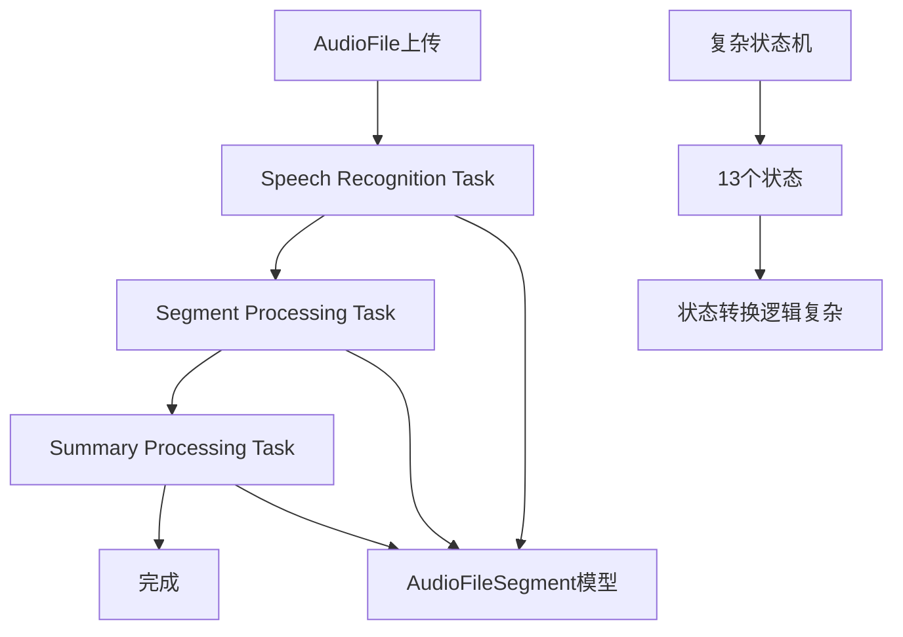
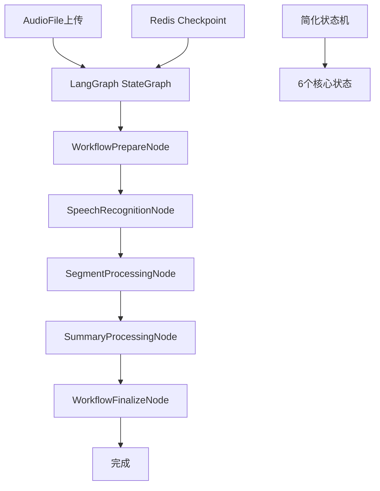
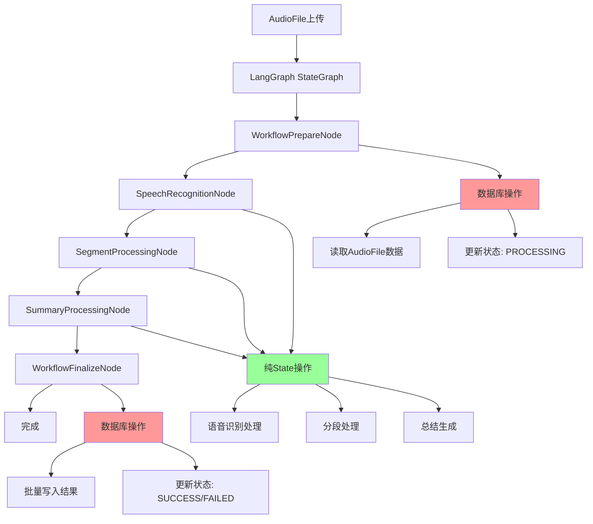
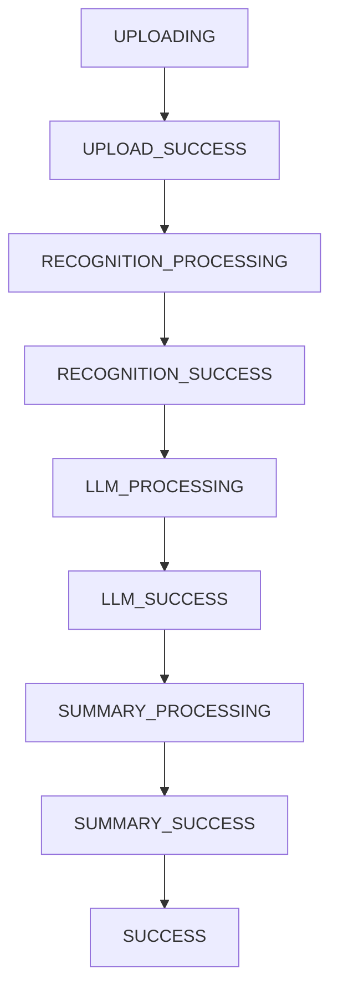
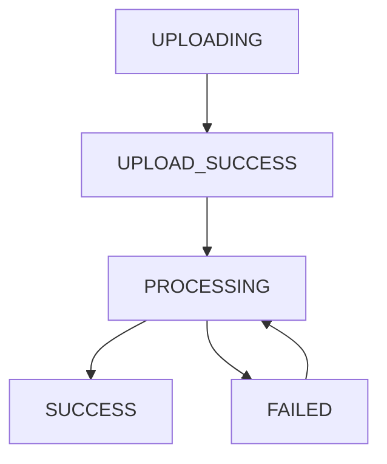

# 从Celery Chain到LangGraph的重构指南

## 概述

本文档详细记录了将Liangyi项目从传统的Celery chain架构重构为LangGraph架构的完整过程。重构围绕三个核心价值展开：

1. **简化状态机，提高可扩展性**：从13个复杂状态简化为6个核心状态，用LangGraph State机制弱化数据库状态机
2. **数据库操作与State解耦**：采用首尾数据库操作模式，中间节点纯State操作，实现职责分离
3. **统一工作流编排调度**：使用LangGraph StateGraph替代Celery chain，提供更强大的任务编排能力

## 重构背景

### 原有架构的问题

**Celery-based架构的痛点：**
- **复杂的状态管理**：13个状态的复杂状态机，可扩展性差
- **分散的任务逻辑**：多个独立的Celery任务，缺乏统一的编排
- **难以调试**：任务执行状态分散，难以追踪完整的执行流程
- **错误处理复杂**：需要手动管理任务重试和状态恢复

### 重构目标

**围绕三个核心价值进行架构重构：**

#### 1. 简化状态机，提高可扩展性
- **状态简化**：从13个复杂状态简化为6个核心状态
- **弱化数据库状态机**：使用LangGraph State机制管理中间状态
- **提高可扩展性**：新节点开发无需关心复杂的状态转换逻辑

#### 2. 数据库操作与State解耦
- **职责分离**：数据库操作集中在首尾节点，中间节点纯State操作
- **避免状态交叉**：消除数据库状态机和LangGraph状态的耦合
- **简化逻辑**：每个节点职责单一，代码更清晰

#### 3. 统一工作流编排调度
- **替代Celery chain**：使用LangGraph StateGraph进行任务编排
- **持久化状态**：Redis checkpoint机制确保状态一致性
- **增强可靠性**：原子操作和自动错误恢复

## 重构的核心思想与演进过程

### 初期重构的困境

在最初的重构尝试中，我们遇到了一个关键问题：**数据库状态机和LangGraph状态机的交叉耦合**。这种设计导致了以下问题：

1. **状态管理混乱**：数据库内的状态值和LangGraph State缓存值互相交叉，难以确定哪个是权威状态
2. **代码逻辑复杂**：加上force参数的处理逻辑，重构后的代码复杂度反而比原来更高
3. **调试困难**：两套状态系统并存，出现问题时难以定位是哪个系统的问题

### 关键洞察：解耦数据库和LangGraph状态

经过深入分析LangGraph的最佳实践，我们意识到**将数据库状态机和LangGraph状态机耦合在一起是错误的**。LangGraph State本身就提供了一套非常强大的状态和缓存管理逻辑，根本不需要与业务逻辑的数据库产生强耦合。

### 最终解决方案：首尾数据库操作模式

基于这个洞察，我们采用了**首尾数据库操作模式**：

- **第一个节点（WorkflowPrepareNode）**：负责数据库原始数据预读取、状态机更新到PROCESSING状态
- **中间节点**：纯LangGraph State操作，不涉及数据库状态机
- **最后一个节点（WorkflowFinalizeNode）**：负责数据最终入库和状态机闭环操作

这种模式的核心优势：
- **职责清晰**：数据库操作集中在首尾，中间节点专注于业务逻辑
- **状态一致**：避免了数据库状态和LangGraph状态的交叉
- **简化逻辑**：force参数只在首尾节点处理，中间节点无需关心

### State抽象的设计演进

在抽象BaseNode和State的过程中，我们也经历了多次迭代：

**第一版：过度通用化（失败）**
- 按节点维度抽象State，追求通用性
- 问题：每个Node需要重复进行数据获取和状态判断，准入条件判断复杂

**第二版：按数据库模型抽象（成功）**
- 直接映射AudioFile模型字段，包含处理结果字段
- 优势：方便数据加载和存储，每个步骤只需判断异常和依赖字段

**最终设计**：简化的准入条件 - 只检查异常和依赖字段，避免复杂的通用化抽象。

### Force逻辑的简化处理

采用**分层处理**的设计原则：工作流层面设置force标志，首尾节点处理force状态，中间节点专注业务逻辑。支持强制重新处理，便于调试和测试。

## 架构对比

### 重构前：Celery Chain架构

**关键组件：**
- `tasks/speech_recognition.py` - 语音识别任务
- `tasks/segment_processing.py` - 分段处理任务
- `tasks/summary_processing.py` - 总结生成任务
- `workflow.py` - Celery chain定义
- `models.py` - 复杂的AudioFile状态机 + AudioFileSegment模型

### 重构后：LangGraph架构

**关键组件**：
- `agents/workflow.py` - LangGraph StateGraph定义
- `agents/nodes/` - 5个专门的Agent节点
- `agents/speechtotext_state.py` - 简化的状态定义
- `agents/checkpoint_manager.py` - Redis checkpoint管理

#### 数据库操作解耦效果

**解耦效果说明：**
- **红色节点**：数据库操作节点（首尾节点）
- **绿色节点**：纯State操作节点（中间节点）
- **职责分离**：数据库操作集中在首尾，中间节点专注业务逻辑

## 核心价值实现

### 1. 简化状态机，提高可扩展性

#### 状态机简化对比

**重构前：13个复杂状态**

**重构后：6个核心状态**

**可扩展性提升**：
- 新节点开发只需关注业务逻辑，无需关心状态转换
- 状态管理逻辑集中在LangGraph State中
- 数据库状态机只负责首尾状态转换

### 2. 数据库操作与State解耦

#### 解耦架构设计

**首尾数据库操作模式**：
- **WorkflowPrepareNode**：数据库预读取 + 状态更新到PROCESSING
- **中间节点**：纯LangGraph State操作，无数据库交互
- **WorkflowFinalizeNode**：数据批量写入 + 状态更新到SUCCESS/FAILED

**解耦优势**：
- 避免数据库状态机和LangGraph状态交叉
- 中间节点代码简洁，专注业务逻辑
- 职责分离清晰，易于维护和测试

### 3. 统一工作流编排调度

#### 工作流编排对比

**重构前：Celery Chain**
- 分散的独立任务
- 手动管理任务依赖
- 难以追踪执行状态

**重构后：LangGraph StateGraph**
- 统一的状态图管理
- 自动的任务编排
- 完整的执行状态追踪

**编排优势**：
- 使用Redis checkpoint持久化状态
- 支持从任意节点重新开始
- 提供完整的错误恢复机制

### Agent节点实现

#### 1. 基础节点类设计

基于核心思想，我们设计了简化的BaseLangGraphNode基类，避免了过度通用化。

**设计原则**：
- 简化的准入条件：只检查异常和依赖字段
- 纯LangGraph State操作：中间节点不涉及数据库状态机
- 统一的错误处理：避免复杂的重试逻辑

**核心方法**：
- `before_start()`: 简化的准备阶段，只检查异常和依赖字段
- `is_already_completed()`: 基于State检查完成状态，避免数据库查询
- `execute_processing()`: 核心处理逻辑，纯业务逻辑
- `update_state()`: 更新State，只更新GraphState，不更新数据库

#### 2. 首尾节点设计

**WorkflowPrepareNode（第一个节点）**：
- **职责**：数据库预读取 + 状态机更新到PROCESSING
- **核心逻辑**：从数据库加载AudioFile数据到State，更新状态机

**WorkflowFinalizeNode（最后一个节点）**：
- **职责**：数据最终入库 + 状态机闭环
- **核心逻辑**：将State中的数据批量写入数据库，更新状态机到SUCCESS/FAILED

#### 3. 中间节点设计

**中间节点（如SpeechRecognitionNode、SegmentProcessingNode、SummaryProcessingNode）**：
- **职责**：纯业务逻辑处理
- **核心特点**：不涉及数据库状态机，只操作LangGraph State

**设计优势**：
- 中间节点代码简洁，专注业务逻辑
- 避免了数据库状态机和LangGraph状态的交叉
- 每个节点职责单一，易于维护和测试

### LangGraph工作流集成

#### 1. StateGraph定义

**工作流结构**：
- 使用`StateGraph(AudioFileState)`创建状态图
- 添加5个节点：准备、语音识别、分段处理、总结、完成
- 设置顺序边：`START → 准备 → 识别 → 分段 → 总结 → 完成 → END`
- 使用Redis checkpointer编译，支持状态持久化

**关键设计**：
- 使用`@lru_cache`缓存编译后的图，提高性能
- 每个节点都有明确的职责和边界
- 支持从任意节点重新开始执行

#### 2. 工作流执行

**执行流程**：
1. 创建初始状态，包含force标志
2. 获取编译后的StateGraph
3. 使用Redis checkpoint配置执行工作流
4. 检查最终状态，返回执行结果

**Force支持**：通过State传递force标志，首尾节点处理force状态，中间节点专注业务逻辑

## 总结

从Celery Chain到LangGraph的重构是一个系统性的架构升级，围绕三个核心价值实现了架构的全面优化。

### 核心价值实现总结

#### 1. 简化状态机，提高可扩展性 ✅
- **状态简化**：从13个复杂状态简化为6个核心状态
- **弱化数据库状态机**：使用LangGraph State管理中间状态
- **提高可扩展性**：新节点开发无需关心复杂的状态转换逻辑

#### 2. 数据库操作与State解耦 ✅
- **首尾数据库操作模式**：数据库操作集中在首尾节点
- **中间纯State操作**：中间节点专注业务逻辑，无数据库交互
- **职责分离**：避免数据库状态机和LangGraph状态交叉耦合

#### 3. 统一工作流编排调度 ✅
- **替代Celery chain**：使用LangGraph StateGraph进行任务编排
- **持久化状态**：Redis checkpoint机制确保状态一致性
- **增强可靠性**：原子操作和自动错误恢复

### 关键洞察

**核心问题**：初期重构时数据库状态机和LangGraph状态机交叉耦合，导致状态管理混乱、代码逻辑复杂。

**解决方案**：采用**首尾数据库操作模式**，实现数据库操作与State的完全解耦，让每个节点职责单一，代码更清晰。

### 重构成果

通过三个核心价值的实现，我们获得了：
- **架构清晰化**：职责分离明确，代码结构更清晰
- **开发效率提升**：新节点开发只需关注业务逻辑
- **可维护性增强**：每个节点职责单一，易于测试和维护
- **可扩展性提升**：添加新处理节点变得非常简单

这次重构不仅解决了原有架构的问题，更重要的是找到了一种**清晰、简洁、可维护**的LangGraph使用模式，为未来的功能扩展提供了强有力的技术支撑。
