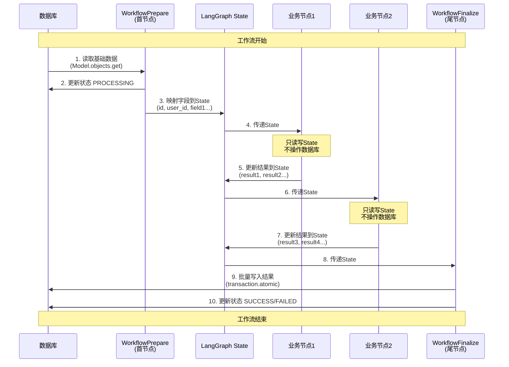

# LangGraph节点修改标准模板

## 📂 前提条件

用户应该已经：
1. 完成基础组件修改（使用 `create_langgraph_base_prompt.md`）
   - ✅ `[feature]_state.py` 已创建
   - ✅ `nodes/base_node.py` 已修改
   - ✅ `checkpoint_manager.py` 已确认
2. agents/nodes目录下应该包含：
   - `workflow_prepare.py`（从speechtotext复制）
   - `workflow_finalize.py`（从speechtotext复制）

## 🎯 AI的任务

修改agents/nodes目录下的首尾节点，使其适配新业务。

---

## 第一步：自动查找nodes目录

**AI执行步骤**：

1. **查找agents目录**（应该已经在第一个模板中找到）
   - 如果未找到，搜索包含 `[feature]_state.py` 的agents目录

2. **查找nodes目录和节点文件**
   - 确认 `[your_app]/agents/nodes/` 目录存在
   - 查找以下文件：
     - `base_node.py` ✓（已在基础组件中修改）
     - `workflow_prepare.py`
     - `workflow_finalize.py`

3. **确认找到的文件**：
   ```
   找到nodes目录：[your_app]/agents/nodes/
   包含文件：
   ├── base_node.py ✓（已修改）
   ├── workflow_prepare.py（待修改）
   └── workflow_finalize.py（待修改）

   继续？
   ```

---

## 第二步：确认已有信息

**AI需要的信息**（应该已经在基础组件模板中收集）：

| 信息项 | 来源 | 示例 |
|--------|------|------|
| agents目录路径 | 已知 | `emailprocessing/agents/` |
| State文件路径 | 已知 | `emailprocessing/agents/email_state.py` |
| State类名 | 已知 | `EmailState` |
| Django模型类名 | 已知 | `Email` |
| 模型字段列表 | 已知（从模型提取） | `subject, sender, body...` |
| 结果字段列表 | 已知（用户提供） | `sentiment, classification...` |

**如果信息不完整，AI应该询问**：
```
请提供以下信息：
1. Django模型类名（如：Email）
2. 模型字段列表
3. 工作流结果字段列表
```

---

## 第三步：节点类型说明

### LangGraph工作流的数据库交互模式

**核心设计原则**：只在首尾节点操作数据库，中间节点只操作State



### 节点分类

| 节点类型 | 作用 | 数据库操作 | 修改方式 |
|---------|------|-----------|---------|
| **WorkflowPrepareNode** | **从数据库读取基础数据到State**<br>- 加载Django模型实例<br>- 映射模型字段到State<br>- 更新状态为PROCESSING | **读取** | 修改字段映射 |
| **WorkflowFinalizeNode** | **统一将State结果写入数据库**<br>- 从State提取所有结果<br>- 批量写入数据库<br>- 更新状态为SUCCESS/FAILED | **写入** | 修改数据同步逻辑 |
| **业务节点** | **纯State处理逻辑**<br>- 读取State数据<br>- 执行业务处理<br>- 更新State结果 | **无** | 新建（可选） |

### 为什么这样设计？

1. **性能优化**：减少数据库IO，只在首尾各访问一次
2. **事务一致性**：所有结果在Finalize节点原子性写入
3. **可恢复性**：中间节点失败可以从checkpoint恢复，无脏数据
4. **清晰分离**：业务逻辑与数据持久化分离

---

## 第四步：修改节点文件

### 任务1：修改 `workflow_prepare.py`

**参考文件**：`speechtotext/agents/nodes/workflow_prepare.py`

**节点作用**：**从数据库读取基础数据到State**
- 根据 `state['id']` 从数据库加载Django模型实例
- 将模型的所有字段映射到State
- 更新数据库状态为PROCESSING（如果不是force模式）

**修改目标**：将AudioFile字段映射替换为用户的Django模型字段映射

#### 修改点清单

| 位置 | 原内容 | 改为 | 说明 |
|------|--------|------|------|
| **导入语句** | `from speechtotext.agents.speechtotext_state import AudioFileState` | `from [your_app].agents.[feature]_state import [StateName]` | 导入新State |
| **导入语句** | `from speechtotext.models import AudioFile` | `from [your_app].models import [ModelName]` | 导入Django模型 |
| **类型注解** | 所有 `AudioFileState` | `[StateName]` | 统一类型注解 |
| **变量名** | `self.audio_file` | `self.[entity]` | 如 `self.email` |
| **变量名** | `audio_file_id` | `[entity]_id` | 如 `email_id` |
| **模型引用** | `AudioFile` | `[ModelName]` | Django模型类名 |
| **execute_processing字段映射** | AudioFile字段映射 | 用户模型字段映射 | **核心修改** |

#### 核心修改：execute_processing中的字段映射

**原字段映射**（删除这些）：
```python
updated_state = {
    **state,
    'id': str(self.audio_file.id),
    'user_id': str(self.audio_file.user_id),
    'display_name': self.audio_file.display_name,
    'file_size': self.audio_file.file_size,
    'duration': self.audio_file.duration,
    'format': self.audio_file.format,
    'storage_path': self.audio_file.storage_path,
    'storage_bucket': self.audio_file.storage_bucket,
    # ... 更多AudioFile特有字段
}
```

**新字段映射**（基于用户的Django模型）：
```python
updated_state = {
    **state,
    'id': str(self.email.id),
    'user_id': str(self.email.user_id),
    'subject': self.email.subject,
    'sender': self.email.sender,
    'body': self.email.body,
    'received_at': (
        self.email.received_at.isoformat()
        if self.email.received_at else None
    ),
    # ... 用户模型的其他字段
}
```

#### 不修改的内容

- `__init__` 方法的结构（只改变量名）
- `can_enter_node` 方法的逻辑
- `before_processing` 方法的逻辑（只改变量名）
- `execute_processing` 的逻辑结构（只改字段映射）
- `after_processing` 方法（根据实际需求调整验证字段）

**验证**：
- [ ] 导入语句已更新
- [ ] 所有类型注解已替换
- [ ] 变量名已统一
- [ ] 字段映射匹配Django模型
- [ ] 状态更新逻辑未改变

---

### 任务2：修改 `workflow_finalize.py`

**参考文件**：`speechtotext/agents/nodes/workflow_finalize.py`

**节点作用**：**统一将State结果写入数据库**
- 判断工作流成功/失败（基于 `node_errors`）
- 如果成功：从State提取所有结果字段，批量写入数据库
- 如果失败：只更新状态为FAILED，不写入结果
- 使用事务确保原子性（`transaction.atomic` + `select_for_update`）

**修改目标**：将AudioFile结果同步逻辑替换为用户的结果字段同步逻辑

#### 修改点清单

| 位置 | 原内容 | 改为 | 说明 |
|------|--------|------|------|
| **导入语句** | `from speechtotext.agents.speechtotext_state import AudioFileState` | `from [your_app].agents.[feature]_state import [StateName]` | 导入新State |
| **导入语句** | `from speechtotext.models import AudioFile` | `from [your_app].models import [ModelName]` | 导入Django模型 |
| **类型注解** | 所有 `AudioFileState` | `[StateName]` | 统一类型注解 |
| **变量名** | `self.audio_file` | `self.[entity]` | 如 `self.email` |
| **变量名** | `audio_file_id` | `[entity]_id` | 如 `email_id` |
| **模型引用** | `AudioFile` | `[ModelName]` | Django模型类名 |
| **_sync_data_to_database方法** | 同步AudioFile结果字段 | 同步用户结果字段 | **核心修改** |

#### 核心修改：_sync_data_to_database方法

**原数据同步**（删除这些）：
```python
def _sync_data_to_database(self, state: AudioFileState) -> None:
    with transaction.atomic():
        audio_file = AudioFile.objects.select_for_update().get(
            id=self.audio_file.id
        )

        # Sync segments
        segments = state.get('segments', [])
        if segments:
            audio_file.segments.all().delete()
            # ... 批量创建segments

        # Sync summary
        summary = state.get('summary', '')
        if summary:
            audio_file.summary = summary

        # Sync translation
        translation = state.get('translation', '')
        if translation:
            audio_file.translation = translation

        audio_file.save()
```

**新数据同步**（基于用户的结果字段）：
```python
def _sync_data_to_database(self, state: EmailState) -> None:
    with transaction.atomic():
        email = Email.objects.select_for_update().get(
            id=self.email.id
        )

        # Sync sentiment
        sentiment = state.get('sentiment', '')
        if sentiment:
            email.sentiment = sentiment

        # Sync classification
        classification = state.get('classification', '')
        if classification:
            email.classification = classification

        # Sync entities
        entities = state.get('entities', [])
        if entities:
            email.entities = entities

        email.save()
```

#### 如果有关联模型（如Segment）

如果结果需要同步到关联模型（如AudioFile的Segment），需要添加：

```python
# Sync to related model
items = state.get('items', [])
if items:
    # Delete existing
    email.items.all().delete()

    # Bulk create new
    item_objects = [
        EmailItem(
            email=email,
            field1=item.get('field1'),
            field2=item.get('field2')
        )
        for item in items
    ]
    EmailItem.objects.bulk_create(item_objects)
```

#### 不修改的内容

- `__init__` 方法的结构（只改变量名）
- `can_enter_node` 方法（返回True）
- `before_processing` 方法的逻辑（只改变量名）
- `execute_processing` 的逻辑结构（判断错误、调用同步）
- `_handle_error` 方法的逻辑（只改变量名）
- `transaction.atomic()` 的使用
- `select_for_update()` 的使用

**验证**：
- [ ] 导入语句已更新
- [ ] 所有类型注解已替换
- [ ] 变量名已统一
- [ ] 数据同步逻辑匹配结果字段
- [ ] 原子事务逻辑未改变

---

### 任务3：创建业务节点（可选）

**参考文件**：参考speechtotext的业务节点模式

**节点类型**：中间节点，纯State操作，无数据库交互

#### 业务节点模板结构

```python
"""
[NodeClass] for [feature] processing.
"""

import logging
from typing import Dict, Any

from [your_app].agents.nodes.base_node import BaseLangGraphNode
from [your_app].agents.[feature]_state import [StateName]

logger = logging.getLogger(__name__)


class [NodeClass](BaseLangGraphNode):
    """
    [节点功能描述]
    """

    def __init__(self):
        super().__init__("[node_name]")

    def execute_processing(self, state: [StateName]) -> [StateName]:
        """
        核心处理逻辑
        """
        entity_id = state.get("id")
        self.logger.info(f"Starting [node_name] for {entity_id}")

        # 处理逻辑
        result = self._do_processing(state)

        # 使用不可变更新
        updated_state = {
            **state,
            'result_field1': result['field1'],
            'result_field2': result['field2']
        }

        self.logger.info(f"Completed [node_name] for {entity_id}")
        return updated_state

    def _do_processing(self, state: [StateName]) -> Dict[str, Any]:
        """
        具体处理逻辑
        """
        # 实现业务逻辑
        return {
            'field1': 'value1',
            'field2': 'value2'
        }
```

**关键点**：
- 继承 `BaseLangGraphNode`
- 只操作State，不操作数据库
- 使用 `{**state, ...}` 进行不可变更新
- 清晰的日志输出

---

## 第五步：完成检查

**文件检查**：
- [ ] `workflow_prepare.py` 已修改
- [ ] `workflow_finalize.py` 已修改
- [ ] 业务节点已创建（如果需要）

**代码质量检查**：
- [ ] 所有导入语句正确
- [ ] 所有类型注解统一
- [ ] 变量名统一
- [ ] 字段映射正确
- [ ] 遵循PEP 8规范（每行≤73字符）
- [ ] 注释使用英文且在代码上方

**业务逻辑检查**：
- [ ] WorkflowPrepare加载正确的模型字段
- [ ] WorkflowFinalize同步正确的结果字段
- [ ] 事务和锁逻辑未被修改
- [ ] 错误处理逻辑完整

---

## 📋 AI工作流程

```
1. 自动查找nodes目录和节点文件
   - 查找 workflow_prepare.py 和 workflow_finalize.py
   - 找不到时询问用户
2. 确认已有信息（State类名、模型、字段等）
   - 如果信息不全，询问用户
3. 展示修改计划（列出2个任务的修改点）
4. 用户确认后，执行任务：
   - 任务1：修改 workflow_prepare.py（字段映射）
   - 任务2：修改 workflow_finalize.py（数据同步）
   - 任务3：创建业务节点（可选）
5. 执行完成检查
6. 提示后续步骤
```

---

## 🔄 完成后提示

```
✅ 节点修改完成！

已修改文件：
- [your_app]/agents/nodes/workflow_prepare.py（首节点）
- [your_app]/agents/nodes/workflow_finalize.py（尾节点）
- [业务节点]（如果已创建）

接下来使用：create_langgraph_workflow_prompt.md
需要修改：
1. workflow.py（工作流编排）
   - 连接所有节点
   - 配置checkpoint
   - 实现执行函数

需要继续修改工作流吗？
```

---

## 📌 关键原则

1. **基于实际模型**：字段映射必须基于Django模型，不要猜测
2. **保持框架逻辑**：事务、锁、错误处理逻辑不要改
3. **只改映射部分**：WorkflowPrepare和Finalize的核心是字段映射
4. **业务节点独立**：业务节点只操作State，不操作数据库
5. **验证严格**：每个任务后执行验证清单

---

## 🔍 常见场景

### 场景1：简单模型（只有基础字段）
- WorkflowPrepare：映射模型字段到State
- WorkflowFinalize：同步结果字段到模型

### 场景2：有关联模型（如Segment）
- WorkflowPrepare：只映射主模型字段
- WorkflowFinalize：同步主模型字段 + 批量创建关联模型

### 场景3：需要复杂处理
- WorkflowPrepare：基础映射
- 业务节点：处理复杂逻辑
- WorkflowFinalize：同步所有结果
