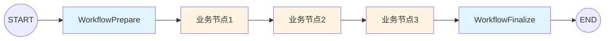
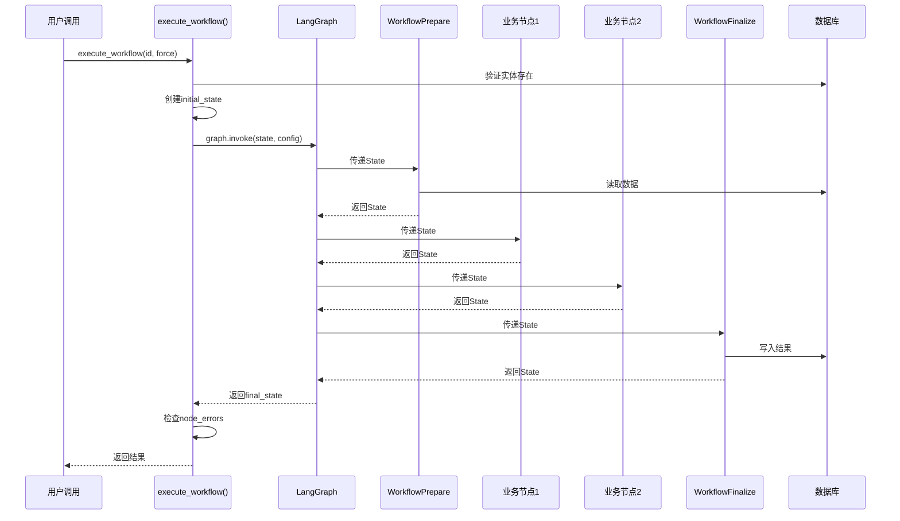

# LangGraph工作流编排修改标准模板

## 📂 前提条件

用户应该已经：
1. 完成基础组件修改（使用 `create_langgraph_base_prompt.md`）
   - ✅ `[feature]_state.py` 已创建
   - ✅ `nodes/base_node.py` 已修改
2. 完成节点修改（使用 `create_langgraph_node_prompt.md`）
   - ✅ `workflow_prepare.py` 已修改
   - ✅ `workflow_finalize.py` 已修改
   - ✅ 业务节点已创建（可选）

## 🎯 AI的任务

修改 `workflow.py` 文件，编排所有节点形成完整的工作流。

---

## 第一步：自动查找workflow文件

**AI执行步骤**：

1. **查找workflow.py**
   - 在agents目录下查找 `workflow.py`
   - 应该与State文件在同一目录

2. **确认找到的文件**：
   ```
   找到工作流文件：[your_app]/agents/workflow.py ✓

   继续？
   ```

3. **如果找不到，询问用户**：
   ```
   未找到workflow.py文件，请提供路径
   ```

---

## 第二步：确认已有信息

**AI需要的信息**（应该已经在前面的模板中收集）：

| 信息项 | 来源 | 示例 |
|--------|------|------|
| State文件路径 | 已知 | `emailprocessing/agents/email_state.py` |
| State类名 | 已知 | `EmailState` |
| 功能名称 | 已知 | `email_processing` |
| Django模型类名 | 已知 | `Email` |
| 已实现的节点列表 | 需确认 | `workflow_prepare, extract_entities, workflow_finalize` |

**AI需要询问**：
```
请确认你的业务节点列表（不包括workflow_prepare和workflow_finalize）：
1. 节点文件名（如：extract_entities.py）
2. 节点类名（如：ExtractEntitiesNode）
3. 节点在图中的名称（如：extract_entities_node）

示例：
- sentiment_analysis.py → SentimentAnalysisNode → sentiment_analysis_node
- classification.py → ClassificationNode → classification_node
```

---

## 第三步：工作流结构说明

### LangGraph工作流编排



### 工作流文件结构

`workflow.py` 文件包含两个核心函数：

1. **`create_[feature]_graph()`**：创建并编译工作流图
   - 定义所有节点
   - 定义节点连接关系
   - 配置checkpointer
   - 返回编译后的图

2. **`execute_[feature]_workflow()`**：执行工作流
   - 创建初始State
   - 配置checkpoint参数
   - 调用graph.invoke()
   - 处理结果和错误

---

## 第四步：修改workflow.py

**参考文件**：`speechtotext/agents/workflow.py`

### 任务1：修改图创建函数 `create_[feature]_graph()`

#### 修改点清单

| 位置 | 原内容 | 改为 | 说明 |
|------|--------|------|------|
| **函数名** | `create_audio_file_graph` | `create_[feature]_graph` | 如 `create_email_processing_graph` |
| **导入State** | `from speechtotext.agents.speechtotext_state import AudioFileState` | `from [your_app].agents.[feature]_state import [StateName]` | 导入新State |
| **导入节点** | `from speechtotext.agents.nodes.[node] import [NodeClass]` | `from [your_app].agents.nodes.[node] import [NodeClass]` | 导入所有业务节点 |
| **StateGraph类型** | `StateGraph(AudioFileState)` | `StateGraph([StateName])` | 使用新State类型 |
| **节点添加** | AudioFile的业务节点 | 用户的业务节点 | **核心修改** |
| **节点连接** | AudioFile的节点连接 | 用户的节点连接 | **核心修改** |

#### 核心修改1：导入语句

**原导入**（删除这些）：
```python
from speechtotext.agents.speechtotext_state import AudioFileState
from speechtotext.agents.nodes.workflow_prepare import WorkflowPrepareNode
from speechtotext.agents.nodes.speech_recognition import SpeechRecognitionNode
from speechtotext.agents.nodes.text_segmentation import TextSegmentationNode
from speechtotext.agents.nodes.summarization import SummarizationNode
from speechtotext.agents.nodes.workflow_finalize import WorkflowFinalizeNode
```

**新导入**（基于用户的节点）：
```python
from emailprocessing.agents.email_state import EmailState
from emailprocessing.agents.nodes.workflow_prepare import WorkflowPrepareNode
from emailprocessing.agents.nodes.sentiment_analysis import SentimentAnalysisNode
from emailprocessing.agents.nodes.classification import ClassificationNode
from emailprocessing.agents.nodes.workflow_finalize import WorkflowFinalizeNode
```

#### 核心修改2：节点添加和连接

**原节点连接**（删除这些）：
```python
workflow = StateGraph(AudioFileState)

# Add nodes
workflow.add_node("workflow_prepare_node", WorkflowPrepareNode())
workflow.add_node("speech_recognition_node", SpeechRecognitionNode())
workflow.add_node("text_segmentation_node", TextSegmentationNode())
workflow.add_node("summarization_node", SummarizationNode())
workflow.add_node("workflow_finalize_node", WorkflowFinalizeNode())

# Add edges
workflow.add_edge(START, "workflow_prepare_node")
workflow.add_edge("workflow_prepare_node", "speech_recognition_node")
workflow.add_edge("speech_recognition_node", "text_segmentation_node")
workflow.add_edge("text_segmentation_node", "summarization_node")
workflow.add_edge("summarization_node", "workflow_finalize_node")
workflow.add_edge("workflow_finalize_node", END)
```

**新节点连接**（基于用户的节点）：
```python
workflow = StateGraph(EmailState)

# Add nodes
workflow.add_node("workflow_prepare_node", WorkflowPrepareNode())
workflow.add_node("sentiment_analysis_node", SentimentAnalysisNode())
workflow.add_node("classification_node", ClassificationNode())
workflow.add_node("workflow_finalize_node", WorkflowFinalizeNode())

# Add edges
workflow.add_edge(START, "workflow_prepare_node")
workflow.add_edge("workflow_prepare_node", "sentiment_analysis_node")
workflow.add_edge("sentiment_analysis_node", "classification_node")
workflow.add_edge("classification_node", "workflow_finalize_node")
workflow.add_edge("workflow_finalize_node", END)
```

#### 不修改的内容

- `@lru_cache(maxsize=1)` 装饰器
- `create_checkpointer()` 调用
- `workflow.compile()` 调用
- 函数结构和返回值

**验证**：
- [ ] 函数名已更新
- [ ] 导入语句已更新
- [ ] StateGraph类型已更新
- [ ] 所有业务节点已添加
- [ ] 节点连接顺序正确
- [ ] workflow_prepare在最前，workflow_finalize在最后

---

### 任务2：修改执行函数 `execute_[feature]_workflow()`

#### 修改点清单

| 位置 | 原内容 | 改为 | 说明 |
|------|--------|------|------|
| **函数名** | `execute_audio_file_workflow` | `execute_[feature]_workflow` | 如 `execute_email_processing_workflow` |
| **参数名** | `audio_file_id: str` | `[entity]_id: str` | 如 `email_id: str` |
| **模型导入** | `from speechtotext.models import AudioFile` | `from [your_app].models import [ModelName]` | 导入Django模型 |
| **模型引用** | `AudioFile` | `[ModelName]` | 如 `Email` |
| **变量名** | `audio_file` | `[entity]` | 如 `email` |
| **create_state调用** | `create_audio_file_state` | `create_[feature]_state` | 调用State创建函数 |
| **config配置** | thread_id和checkpoint_ns | 更新为新功能名 | **核心修改** |
| **graph调用** | `create_audio_file_graph()` | `create_[feature]_graph()` | 调用图创建函数 |

#### 核心修改1：初始State创建

**原代码**：
```python
from speechtotext.models import AudioFile
from speechtotext.agents.speechtotext_state import create_audio_file_state

# Validate entity
audio_file = AudioFile.objects.get(id=audio_file_id)

# Create initial state
initial_state = create_audio_file_state(
    audio_file_id,
    str(audio_file.user_id),
    force
)
```

**新代码**：
```python
from emailprocessing.models import Email
from emailprocessing.agents.email_state import create_email_processing_state

# Validate entity
email = Email.objects.get(id=email_id)

# Create initial state
initial_state = create_email_processing_state(
    email_id,
    str(email.user_id),
    force
)
```

#### 核心修改2：Checkpoint配置

**原配置**：
```python
config = {
    "configurable": {
        "thread_id": f"workflow_{audio_file_id}",
        "checkpoint_ns": "audio_processing"
    }
}
```

**新配置**：
```python
config = {
    "configurable": {
        "thread_id": f"workflow_{email_id}",
        "checkpoint_ns": "email_processing"
    }
}
```

#### 核心修改3：Graph调用

**原调用**：
```python
graph = create_audio_file_graph()
result = graph.invoke(initial_state, config=config)
```

**新调用**：
```python
graph = create_email_processing_graph()
result = graph.invoke(initial_state, config=config)
```

#### 不修改的内容

- 函数整体结构
- 错误处理逻辑（try-except）
- 结果检查逻辑（node_errors检查）
- 返回值结构
- 日志输出格式
- 执行时间统计

**验证**：
- [ ] 函数名已更新
- [ ] 参数名已更新
- [ ] 模型导入和引用已更新
- [ ] create_state调用已更新
- [ ] config配置已更新
- [ ] graph调用已更新
- [ ] 错误处理逻辑未改变

---

## 第五步：完成检查

**文件检查**：
- [ ] `workflow.py` 已修改

**代码质量检查**：
- [ ] 所有导入语句正确
- [ ] 所有类型注解统一
- [ ] 变量名统一
- [ ] 节点连接顺序正确
- [ ] config配置正确
- [ ] 遵循PEP 8规范（每行≤73字符）
- [ ] 注释使用英文且在代码上方

**业务逻辑检查**：
- [ ] 所有业务节点已添加到图中
- [ ] 节点连接顺序符合业务逻辑
- [ ] workflow_prepare → 业务节点 → workflow_finalize
- [ ] checkpoint配置正确（thread_id, checkpoint_ns）

---

## 📋 AI工作流程

```
1. 自动查找workflow.py文件
   - 在agents目录下查找
   - 找不到时询问用户
2. 确认已有信息（State、模型、节点列表）
3. 询问业务节点信息
   - 节点文件名、类名、图中名称
4. 展示修改计划（列出2个任务的修改点）
5. 用户确认后，执行任务：
   - 任务1：修改 create_[feature]_graph()
   - 任务2：修改 execute_[feature]_workflow()
6. 执行完成检查
7. 提示测试步骤
```

---

## 🔄 完成后提示

```
✅ 工作流编排完成！

已修改文件：
- [your_app]/agents/workflow.py
  - create_[feature]_graph(): 定义了N个节点和它们的连接
  - execute_[feature]_workflow(): 配置了初始State和checkpoint

工作流节点顺序：
START → WorkflowPrepare → [业务节点列表] → WorkflowFinalize → END

接下来需要：
1. 测试工作流执行
2. 验证checkpoint恢复功能
3. 检查所有节点是否正确执行

测试命令：
python manage.py shell
>>> from [your_app].agents.workflow import execute_[feature]_workflow
>>> result = execute_[feature]_workflow('[entity_id]')
>>> print(result)
```

---

## 📌 关键原则

1. **节点顺序很重要**：确保业务逻辑顺序正确
2. **首尾节点固定**：始终是 Prepare → 业务节点 → Finalize
3. **config必须正确**：thread_id和checkpoint_ns用于状态恢复
4. **使用create_state**：不要手动构造initial_state
5. **保持结构不变**：只改节点和配置，不改执行逻辑

---

## 🔍 常见场景

### 场景1：简单顺序流程
```
Prepare → 节点1 → 节点2 → Finalize
```

### 场景2：多步骤处理
```
Prepare → 提取 → 分析 → 分类 → 汇总 → Finalize
```

### 场景3：只有首尾节点
```
Prepare → Finalize
（所有逻辑在Prepare或Finalize中处理）
```

---

## 📊 节点连接可视化


