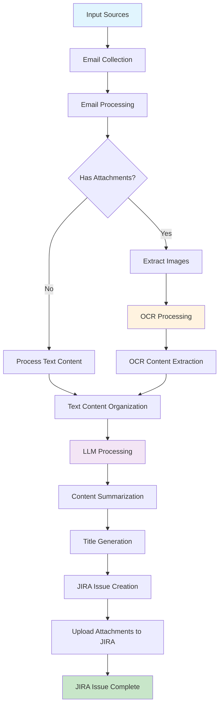

# About Devify

## What is Devify?

### Purpose

Devify is a comprehensive **toolkit for AI-driven development lifecycle management**. It is designed to accelerate R&D workflows and address pain points that typically require substantial manual effort. Devify brings together a suite of tools that leverage artificial intelligence to automate and optimize various stages of the software development lifecycle. The project was initiated to fulfill internal needs for smarter, more efficient, and streamlined development processes.

### Vision

By integrating advanced AI technologies, Devify aims to:
- Automate repetitive and time-consuming tasks in the development lifecycle
- Reduce manual workload for engineering teams
- Enable faster and more reliable delivery of features and fixes

### Key Features

Below is a list of the main tools and components included in this project:

- **Threadline Core Feature:** Automatically organizes and structures chat records (including WeChat, WhatsApp, email, etc.) to streamline requirements gathering and task creation. As an extension, these organized records can be sent to JIRA issues or other platforms as needed.

#### Threadline AI Agent

Threadline AI Agent was born out of a common pain point in daily project management: many issues and solutions are discussed and resolved within WeChat groups, but this valuable knowledge is often lost because it is not systematically captured in the product knowledge base. Since WeChat does not provide a direct API to access all conversation content, and relying solely on delivery personnel to manually document these discussions is unreliable, we sought an alternative approach.

Our solution leverages the fact that WeChat allows users to forward chat records via email. By simply sending relevant chat logs to a designated internal mailbox, we can then utilize large language models and image recognition technologies to process the content.  After appropriate analysis and summarization, the processed information is automatically submitted to JIRA, enabling the initial accumulation of project knowledge with minimal manual intervention.

In fact, this approach is not limited to WeChat chat records.  It can be extended to many other scenarios as well. In the future, we will continue to broaden the boundaries of this model.

### Technical Overview

This project is a robust AI workflow and agent system, architected with Django and powered by Celery for efficient orchestration of diverse tasks. It streamlines business processes by integrating advanced AI capabilities, including large language models (LLMs), OCR, and speech technologies. All system management and configuration are currently handled through Django’s built-in Admin Portal, enabling rapid development and easy maintenance. In future releases, dedicated user-facing interfaces will be introduced to further enhance accessibility and user experience, with the ultimate goal of evolving into a SaaS platform for broader adoption.

Notably, the AI workflow and process control in this project are implemented using a custom state machine tailored to business requirements, rather than relying on existing frameworks such as LangChain or Dify. This approach ensures that the workflow logic remains flexible, maintainable, and closely aligned with real-world use cases.

## How to run Devify?

Devify supports both development and production environments using Docker. Please note the following differences:

- **Development Mode (`docker-compose.dev.yml`):**
  - Local source code is mounted into the container.
  - The application runs in Django development mode.
  - Any code changes on your host machine will automatically
    trigger a reload of the service inside the container.
  - This setup is ideal for rapid development and debugging.

- **Production Mode (`docker-compose.yml`):**
  - The application runs using Gunicorn as the WSGI server,
    providing better performance and stability.
  - Source code is not mounted; the container uses a built image.
  - This setup is recommended for deployment and production use.

### Service Architecture

Both modes include the following services:

- **devify-api**: Django API server (Django dev server in dev mode, Gunicorn in production)
- **devify-worker**: Celery worker for background task processing
- **devify-scheduler**: Celery beat scheduler for periodic tasks
- **mysql**: MariaDB database server
- **redis**: Redis cache and message broker
- **nginx**: Reverse proxy server (production mode only)
- **flower**: Celery monitoring dashboard (development mode only)

### Key Differences

**Development Mode:**
- Uses `development` command to start Django's built-in server
- Includes Flower dashboard for Celery monitoring
- Source code is mounted for live reloading
- Exposes Django admin on port 8000

**Production Mode:**
- Uses `gunicorn` command for production-grade WSGI server
- Includes Nginx reverse proxy with SSL support
- Optimized for performance and stability
- Health checks and restart policies enabled

### Environment Preparation

This step is required for both development and production environments.

```
cp env.sample .env
```

This environment values should be provided:

```
# Database Configuration
DB_ENGINE=mysql
MYSQL_ROOT_PASSWORD=root_password
MYSQL_PORT=3306
MYSQL_USER=devify
MYSQL_PASSWORD=devifyPass
MYSQL_DATABASE=devify

# Celery Configuration
CELERY_BROKER_URL=redis://redis:6379
CELERY_RESULT_BACKEND=redis://redis:6379
CELERY_CONCURRENCY=4
CELERY_MAX_TASKS_PER_CHILD=1000
CELERY_MAX_MEMORY_PER_CHILD=256000
CELERY_LOG_LEVEL=INFO

# Server Configuration (Production)
WORKERS=1
THREADS=1
NGINX_HTTP_PORT=10080
NGINX_HTTPS_PORT=10443

AZURE_OPENAI_API_BASE=https://your-azure-openai-endpoint.openai.azure.com/
AZURE_OPENAI_API_KEY=your-azure-openai-api-key
AZURE_OPENAI_DEPLOYMENT=your-azure-openai-deployment
AZURE_OPENAI_API_VERSION=your-azure-openai-api-version

# OCR
AZURE_DOCUMENT_INTELLIGENCE_KEY="your-azure-document-intelligence-key"
AZURE_DOCUMENT_INTELLIGENCE_ENDPOINT="https://your-azure-document-intelligence-endpoint.cognitiveservices.azure.com/"
```

### Run in Development Mode

```
docker-compose -f docker-compose.dev.yml build
docker-compose -f docker-compose.dev.yml up -d
```

Django API services is running in http://your_host:8000

Check output:

```
docker logs -f devify-api
```

### Run in Production Mode

```
docker-compose -f docker-compose.yml build
docker-compose -f docker-compose.yml up -d
```

### Service Access

**Development Mode:**
- Django API: http://localhost:8000
- Django Admin: http://localhost:8000/admin/
- Flower Dashboard: http://localhost:5555

**Production Mode:**
- Nginx HTTP: http://localhost:10080
- Nginx HTTPS: https://localhost:10443
- Health Check: http://localhost:10080/health

### Container Management

**View logs:**
```bash
# API service
docker logs -f devify-api

# Worker service
docker logs -f devify-worker

# Scheduler service
docker logs -f devify-scheduler
```

**Execute commands:**
```bash
# Enter API container
docker exec -it devify-api bash

# Run Django management commands
docker exec -it devify-api python manage.py migrate
docker exec -it devify-api python manage.py collectstatic
```

## Threadline Settings

Before using Threadline features, you should initialize the required settings for all users. This can be done via a management command inside the API container. The command will automatically create default records for all necessary THREADLINE settings (`email_config`, `email_filter_config`, `jira_config`, `prompt_config`) for each user if they do not already exist.

To simplify configuration, all required settings should be added here. Below are the key-value pairs you need to set before using the system. The table describes the key design, and the values should be saved in JSON format.

| Key                  | Description                                                      | Required | Example Key Fields/Notes                |
|----------------------|------------------------------------------------------------------|----------|-----------------------------------------|
| email_config         | Email server connection and authentication settings               | Yes      | See below                              |
| email_filter_config  | Email filtering and processing rules                              | Yes      | See below                              |
| jira_config          | JIRA integration and default issue creation settings              | Yes      | See below                              |
| prompt_config        | AI prompt templates for email/attachment/summary processing       | Yes      | See below                              |

> **Note:**
> All values must be valid JSON.
> If you add new fields to the models or settings, update this table accordingly.

**How to initialize THREADLINE settings:**

1. **Enter the API container:**

   ```bash
   docker exec -it devify-api python manager.py init_threadline_settings --user admin
   ```

**Note:**
- The initialization command is idempotent and safe to run multiple times.
- All values are stored in JSON format and should be customized according to your actual email, JIRA, and AI integration requirements.

2. **Edit the settings in Django Admin:**

   After initialization, log in to the Django Admin panel and navigate to the **Settings** section. You can then edit the values for each key (`email_config`, `email_filter_config`, `jira_config`, `prompt_config`) as needed for your environment.

   > **Tip:**
   > You can also update these settings directly in the database if required.

3. **Log in to Django Admin**
   - Visit [http://localhost:8000/admin](http://localhost:8000/admin) in your browser.
   - Log in with your admin credentials.
   - Username: admin
   - Password: adminpassword

4. **Navigate to the Settings Model**
   - In the sidebar, find and click on **Settings** under THREADLINE

### Email Configuration(email_config)

| Key               | Type     | Description                                 | Example                        |
|-------------------|----------|---------------------------------------------|--------------------------------|
| host              | string   | SMTP server hostname                        | "smtp.feishu.cn"               |
| imap_host         | string   | IMAP server hostname                        | "imap.feishu.cn"               |
| smtp_ssl_port     | integer  | SMTP SSL port (default: 465)                | 465                            |
| smtp_starttls_port| integer  | SMTP StartTLS port (default: 587)           | 587                            |
| imap_ssl_port     | integer  | IMAP SSL port (default: 993)                | 993                            |
| username          | string   | Email username                              | "your-email@domain.com"        |
| password          | string   | Email password                              | "your-email-password"          |
| use_ssl           | boolean  | Enable SSL                                  | true                           |
| use_starttls      | boolean  | Enable StartTLS                             | false                          |

```
{
  "imap_host": "your-imap-server-hostname",
  "smtp_ssl_port": 465,
  "smtp_starttls_port": 587,
  "imap_ssl_port": 993,
  "username": "your-email-username",
  "password": "your-email-password",
  "use_ssl": true,
  "use_starttls": false
}
```

### Email Filter Config(email_filter_config)

| Key              | Type     | Description                                                        | Example                |
|------------------|----------|--------------------------------------------------------------------|------------------------|
| folder           | string   | The email folder to fetch messages from, usually "INBOX"           | "INBOX"                |
| filters          | array    | List of IMAP search criteria to apply when fetching emails         | ["UNSEEN", "SINCE \"24-Jul-2025\""] |
| exclude_patterns | array    | Patterns to exclude emails, e.g., subjects containing keywords     | ["spam", "newsletter"] |
| max_age_days     | integer  | Maximum age of emails to process, in days                          | 7                      |

**Available IMAP Search Criteria for `filters` array:**

| Category         | Criteria                    | Description                                    | Example                                    |
|------------------|-----------------------------|------------------------------------------------|--------------------------------------------|
| **Time-based**   | `SINCE`                     | Emails received after specified date          | `"SINCE \"24-Jul-2025\""`                  |
|                  | `BEFORE`                    | Emails received before specified date         | `"BEFORE \"25-Jul-2025\""`                 |
|                  | `ON`                        | Emails received on specified date             | `"ON \"24-Jul-2025\""`                     |
| **Status**       | `UNSEEN`                    | Unread emails                                 | `"UNSEEN"`                                 |
|                  | `SEEN`                      | Read emails                                   | `"SEEN"`                                   |
|                  | `FLAGGED`                   | Flagged emails                                | `"FLAGGED"`                                |
|                  | `UNFLAGGED`                 | Unflagged emails                              | `"UNFLAGGED"`                              |
| **Sender/Recipient** | `FROM`                  | Emails from specific sender                   | `"FROM \"sender@example.com\""`            |
|                  | `TO`                        | Emails to specific recipient                  | `"TO \"recipient@example.com\""`           |
|                  | `CC`                        | Emails CC'd to specific address               | `"CC \"cc@example.com\""`                  |
| **Content**      | `SUBJECT`                   | Emails with subject containing keyword        | `"SUBJECT \"important\""`                  |
|                  | `BODY`                      | Emails with body containing keyword           | `"BODY \"urgent\""`                        |
|                  | `TEXT`                      | Emails with subject or body containing keyword | `"TEXT \"meeting\""`                       |

**Example configuration:**

```json
{
  "folder": "INBOX",
  "filters": [
    "UNSEEN",
    "SINCE \"24-Jul-2025\"",
    "FROM \"admin@example.com\""
  ],
  "exclude_patterns": [
    "spam",
    "newsletter"
  ],
  "max_age_days": 7
}
```

**Note:**
- The `filters` array can contain multiple IMAP search criteria (combined with AND logic)
- Date format should be "DD-MMM-YYYY" (e.g., "24-Jul-2025")
- The system automatically adds time-based filtering using `last_email_fetch_time` for incremental fetching

### JIRA Config(jira_config)

| Key                | Type     | Description                                      | Example                      |
|--------------------|----------|--------------------------------------------------|------------------------------|
| url                | string   | JIRA server URL                                  | "https://jira.example.com"   |
| username           | string   | JIRA account username                            | "jira-user"                  |
| api_token          | string   | JIRA API token or password                       | "your-api-token"             |
| project_key        | string   | JIRA project key                                 | "PRJ"                        |
| default_issue_type | string   | Default issue type for new issues                | "Task"                       |
| default_priority   | string   | Default priority for new issues                  | "High"                       |
| epic_link          | string   | Epic link key (optional)                         | "PRJ-1234"                   |
| assignee           | string   | Default assignee username (optional)             | "jira-assignee"              |

```
{
  "url": "your-jira-url",
  "username": "your-jira-username",
  "api_token": "your-api-token-or-password",
  "project_key": "your-project-key",
  "default_issue_type": "your-default-issue-type",
  "default_priority": "your-default-priority",
  "epic_link": "your-epic-link-key",
  "assignee": "your-assignee-username"
}
```

### Prompt Config (prompt_config)

| Config Key              | Description                                                                                   | Required |
|------------------------|-----------------------------------------------------------------------------------------------|----------|
| `email_content_prompt` | Organizes email/chat content for LLM processing.                                              | Yes      |
| `ocr_prompt`           | Processes OCR text from images for LLM summarization.                                         | Yes      |
| `summary_prompt`       | Summarizes email and attachment content for JIRA issue creation.                              | Yes      |
| `summary_title_prompt` | Generates a structured and concise JIRA issue title.                                          | Yes      |

**Example:**
```json
{
  "email_content_prompt": "Sort chat logs in chronological order (oldest to newest). Format each message as: [Time] [Sender]: Message Content. Place each image on a separate line using markup (e.g., !image-filename.png!). Keep the original time, sender, and content. Supplement semantics if necessary, but do not change the original meaning.",
  "ocr_prompt": "Extract key information from raw OCR text, remove irrelevant or redundant content, supplement semantics, and organize it into a concise and complete description. Highlight operational context, abnormal phenomena, and error messages to help locate and document issues.",
  "summary_prompt": "Based on chat logs, background information, user feedback, and screenshots, clarify task responsibilities, determine where the issue occurred, and perform issue classification and analysis. Output three parts: (1) phenomenon description and preliminary cause analysis (including environment information, issue phenomenon, and reproduction process; reference screenshots and chat for completeness; clearly mark any assumptions), (2) TODO list of core issues and potential requirements (mark assumptions), (3) if the input contains '--- ATTACHMENT OCR CONTENT ---', analyze the OCR content, as it may contain key error messages or configuration information. If information is unclear, mark as 'To be confirmed' and strictly summarize based on the provided content.",
  "summary_title_prompt": "Summarize a clear and specific issue title based on the provided chat logs and background information. The title should directly reflect the main problem to be solved or the key requirement, using a concise verb-object structure. Avoid vague or generic terms. Focus on what needs to be addressed or resolved. Limit the title to 200 characters for clarity and easy identification."
}
```

### Webhook Notifications

Threadline supports webhook notifications to keep you informed about email processing status. Configure webhook settings in Django Admin under **Settings**.

#### Webhook Configuration Keys

| Key                | Type     | Description                                      | Example                      | Required |
|--------------------|----------|--------------------------------------------------|------------------------------|----------|
| `url`              | string   | Webhook endpoint URL                             | `"https://open.feishu.cn/open-apis/bot/v2/hook/xxx"` | Yes |
| `events`           | array    | List of events to notify                         | `["JIRA_SUCCESS", "OCR_FAILED", "SUMMARY_FAILED"]` | No |
| `timeout`          | integer  | Request timeout in seconds                       | `10`                         | No |
| `retries`          | integer  | Number of retry attempts                         | `3`                          | No |
| `headers`          | object   | Custom headers for webhook requests              | `{"Authorization": "Bearer xxx"}` | No |
| `language`         | string   | Notification message language                    | `"zh-hans"` or `"en"`        | No |
| `provider`         | string   | Webhook provider type                            | `"feishu"`                   | No |

> **Note:** Whether the webhook is enabled is controlled by the `is_active` field of the `webhook_config` setting in Django Admin. There is no need for an `enabled` field inside the JSON config.

#### Supported Providers

Currently, the following webhook providers are supported:

- **`feishu`** (default): Feishu/Lark interactive card messages with Markdown format

#### Supported Events

The following email processing status events can be configured for notifications:

- **`FETCHED`**: New email received
- **`OCR_SUCCESS`**: OCR processing completed successfully
- **`OCR_FAILED`**: OCR processing failed
- **`SUMMARY_SUCCESS`**: LLM processing completed successfully
- **`SUMMARY_FAILED`**: LLM processing failed
- **`JIRA_SUCCESS`**: JIRA issue created successfully
- **`JIRA_FAILED`**: JIRA issue creation failed

#### Example Webhook Configuration

```json
{
  "url": "https://open.feishu.cn/open-apis/bot/v2/hook/xxx",
  "events": ["JIRA_SUCCESS", "OCR_FAILED", "SUMMARY_FAILED"],
  "timeout": 10,
  "retries": 3,
  "headers": {},
  "language": "zh-hans",
  "provider": "feishu"
}
```
#### Feishu Card Message Format

When using the `feishu` provider, notifications are sent as interactive cards with:

- **Color-coded headers**: Green (success), Red (failure), Blue (processing), Grey (other)
- **Markdown content**: Formatted with time, subject, sender, stage, and details
- **JIRA integration**: Includes issue key and URL when available
- **Internationalization**: Supports Chinese and English message content

#### Testing Webhook Configuration

Use the management command to test your webhook configuration:

```bash
# Test with default parameters
python manage.py test_webhook --user your_username

# Test with specific email and status
python manage.py test_webhook --user your_username --email-id 123 --old-status fetched --new-status jira_success

# Test with status transition only
python manage.py test_webhook --user your_username --old-status processing --new-status jira_success
```
### How to Configure the Scheduler in Django Admin

To enable automated email processing and JIRA issue creation, you need to configure the scheduler in Django Admin. Follow these steps:

3. **Configure the Scheduler Task**
   - In Django Admin, go to the **Periodic Tasks** section (provided by `django-celery-beat`).
   - Click **Add** to create a new periodic task.
   - In the **Task** field, select the task you want to schedule (for example, your email/JIRA processing task).
   - Set the **Interval** or **Crontab** schedule as needed (e.g., every 5 minutes).
   - Fill in any required arguments or keyword arguments for your task.
   - Optionally, add a description for clarity.
   - Ensure the **Enabled** checkbox is selected.

4. **Save the Task**
   - Click **Save** to activate the periodic task.

5. **Verify**
   - The periodic task will now run automatically according to your schedule (e.g., scanning emails, triggering LLM, submitting to JIRA).
   - You can edit, disable, or delete the task at any time in the **Periodic Tasks** section.

> **Tip:**
> Managing periodic tasks directly in the **Periodic Tasks** section is recommended for most use cases. No need to configure scheduler settings separately if you use `django-celery-beat`.

> **Important:**
> You must configure the following two periodic tasks in Django Admin (Periodic Tasks section):
>
> 1. **schedule_email_processing_tasks**
>    - This is the main scheduler task. It periodically polls the email/message status and triggers the appropriate processing tasks (such as OCR, LLM summarization, and JIRA submission) based on the current state machine.
>
> 2. **reset_stuck_processing_emails**
>    - This task is responsible for detecting and resetting any email/message tasks that have been stuck in a pending or processing state for too long (timeout recovery). It helps ensure the system can recover from unexpected failures or timeouts.
>
> Both tasks are essential for robust, automated email-to-JIRA processing. Make sure both are scheduled to run at appropriate intervals (e.g., every 5 minutes for the main scheduler, every 10-30 minutes for the stuck task reset).

## Required Periodic Tasks

You **must** configure the following periodic tasks in Django Admin (**Periodic Tasks** section, provided by `django-celery-beat`):

1. **schedule_email_processing_tasks**
   - Main scheduler task. Periodically checks for emails in `FETCHED` status and triggers the complete processing chain (OCR → LLM → JIRA).
   - Uses the new chain-based approach for better workflow management and error handling.
   - **Recommended interval:** every 5 minutes.

2. **reset_stuck_processing_emails**
   - Detects and resets emails stuck in processing states for longer than the specified timeout.
   - Automatically resets stuck emails to appropriate previous states for retry:
     - `OCR_PROCESSING` → `FETCHED`
     - `SUMMARY_PROCESSING` → `OCR_SUCCESS`
     - `JIRA_PROCESSING` → `SUMMARY_SUCCESS`
   - **Recommended interval:** every 10–30 minutes.
   - **Default timeout:** 30 minutes (configurable via `timeout_minutes` parameter)

> **Note:** The email scanning is now handled automatically by the processing chain, so you no longer need a separate email scanning task.

> **Tip:**
> You can edit, disable, or delete these tasks at any time in the **Periodic Tasks** section.

## EmailMessage State Machine & Exception Handling

- The `EmailMessage` model uses a single state field to track the processing stage:
  - `FETCHED` → `OCR_PROCESSING` → `OCR_SUCCESS` → `SUMMARY_PROCESSING` → `SUMMARY_SUCCESS` → `JIRA_PROCESSING` → `JIRA_SUCCESS`
  - Failed states (`OCR_FAILED`, `SUMMARY_FAILED`, `JIRA_FAILED`) can retry by transitioning back to their respective processing states
- The system now uses a **chain-based approach** where the main scheduler (`schedule_email_processing_tasks`) automatically triggers the complete processing chain for emails in `FETCHED` status
- Each processing stage (OCR, LLM, JIRA) automatically transitions to the next stage upon successful completion
- Failed tasks are automatically retried, and stuck tasks are reset by the `reset_stuck_processing_emails` task
- **Force mode** is available for reprocessing emails regardless of current status (useful for debugging and manual reprocessing)

> **Best Practice:**
> Always keep your prompt templates, periodic task names, and state machine logic in sync with the codebase. If you add new settings or change the structure of any config, update the README accordingly.

## Reference
The foundational framework of this project is based on the
[django-starter-template](https://github.com/xiaoquqi/django-starter-template)
project, which provides a robust and modular Django REST API structure.

Core features of this project leverage components from the
[devtoolbox](https://github.com/cloud2ai/devtoolbox) project, including:

- **LLM Service**: For AI-powered content summarization and processing.
- **OCR Service**: For document and image text extraction.
- **JIRA Clients**: For seamless integration and automation with JIRA.

For more details on the architecture and advanced usage, please refer to the
above repositories.

## Threadline Processing Flow



### Process Description

1. **Input Sources**: Various communication tools (WeChat, Slack, Teams, etc.) or direct emails
2. **Email Collection**: System fetches emails from configured mailboxes
3. **Email Processing**: Parses email content and extracts attachments
4. **OCR Processing**: Extracts text content from image attachments using Azure Document Intelligence
5. **Content Organization**: LLM organizes chat logs and OCR content into structured format
6. **Summarization**: LLM generates comprehensive summary and issue title
7. **JIRA Integration**: Creates JIRA issue with organized content and uploaded attachments

### Key Features

- **Multi-source Input**: Supports various communication platforms via email forwarding
- **Image Processing**: Automatic OCR extraction from screenshots and documents
- **AI-powered Analysis**: LLM processes and organizes content for better readability
- **Automated JIRA Creation**: Direct integration with JIRA for issue tracking
- **Attachment Handling**: Preserves and uploads original files to JIRA issues
