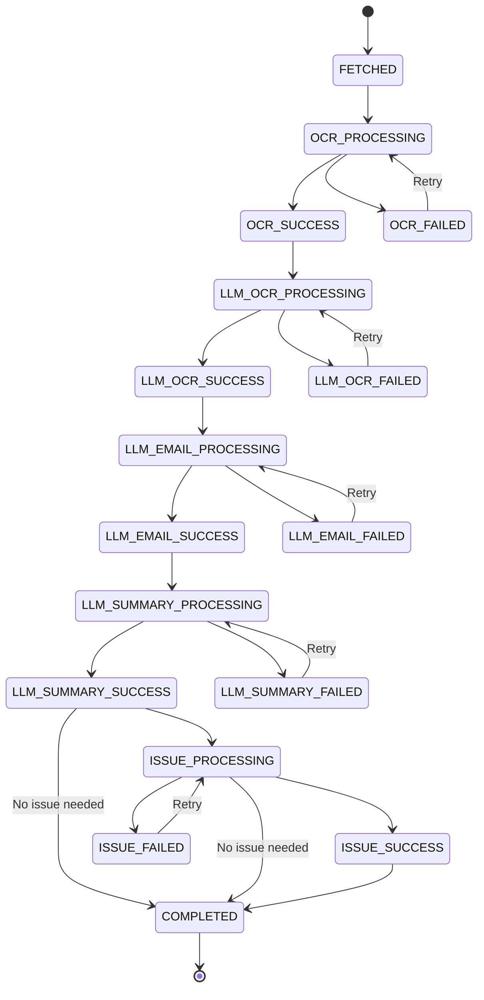
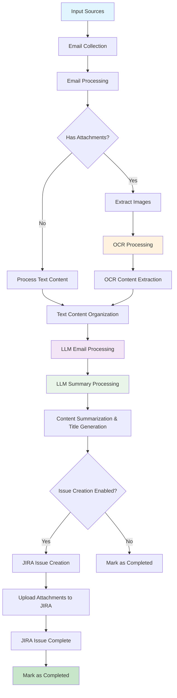

# About Devify

## What is Devify?

### Purpose

Devify is a comprehensive **toolkit for AI-driven development lifecycle management**. It is designed to accelerate R&D workflows and address pain points that typically require substantial manual effort. Devify brings together a suite of tools that leverage artificial intelligence to automate and optimize various stages of the software development lifecycle. The project was initiated to fulfill internal needs for smarter, more efficient, and streamlined development processes.

### Vision

By integrating advanced AI technologies, Devify aims to:
- Automate repetitive and time-consuming tasks in the development lifecycle
- Reduce manual workload for engineering teams
- Enable faster and more reliable delivery of features and fixes

### Key Features

Below is a list of the main tools and components included in this project:

- **Threadline Core Feature:** Automatically organizes and structures chat records (including WeChat, WhatsApp, email, etc.) to streamline requirements gathering and task creation. As an extension, these organized records can be sent to JIRA issues or other platforms as needed.

#### Threadline AI Agent

Threadline AI Agent was born out of a common pain point in daily project management: many issues and solutions are discussed and resolved within WeChat groups, but this valuable knowledge is often lost because it is not systematically captured in the product knowledge base. Since WeChat does not provide a direct API to access all conversation content, and relying solely on delivery personnel to manually document these discussions is unreliable, we sought an alternative approach.

Our solution leverages the fact that WeChat allows users to forward chat records via email. By simply sending relevant chat logs to a designated internal mailbox, we can then utilize large language models and image recognition technologies to process the content.  After appropriate analysis and summarization, the processed information is automatically submitted to JIRA, enabling the initial accumulation of project knowledge with minimal manual intervention.

In fact, this approach is not limited to WeChat chat records.  It can be extended to many other scenarios as well. In the future, we will continue to broaden the boundaries of this model.

### Technical Overview

This project is a robust AI workflow and agent system, architected with Django and powered by Celery for efficient orchestration of diverse tasks. It streamlines business processes by integrating advanced AI capabilities, including large language models (LLMs), OCR, and speech technologies. All system management and configuration are currently handled through Django’s built-in Admin Portal, enabling rapid development and easy maintenance. In future releases, dedicated user-facing interfaces will be introduced to further enhance accessibility and user experience, with the ultimate goal of evolving into a SaaS platform for broader adoption.

Notably, the AI workflow and process control in this project are implemented using a custom state machine tailored to business requirements, rather than relying on existing frameworks such as LangChain or Dify. This approach ensures that the workflow logic remains flexible, maintainable, and closely aligned with real-world use cases.

## Development

### Testing with Nox

This project uses [Nox](https://nox.thea.codes/) for development task automation. Nox provides a unified interface for running tests, code formatting, and other development tasks.

#### Available Nox Sessions

```bash
# Run all tests
nox -s tests

# Run EML email parsing tests
nox -s eml_tests

# Run unit tests only
nox -s unit_tests

# Run API tests only
nox -s api_tests

# Run functional tests only
nox -s functional_tests

# Generate test coverage report
nox -s coverage

# Auto format code
nox -s format

# Code quality check
nox -s lint

# Django system check
nox -s django_check

# Start development server
nox -s runserver
```

#### Installation

```bash
# Install nox
pip install nox

# Or using uv (faster)
uv pip install nox
```

## How to run Devify?

Devify supports both development and production environments using Docker. Please note the following differences:

- **Development Mode (`docker-compose.dev.yml`):**
  - Local source code is mounted into the container.
  - The application runs in Django development mode.
  - Any code changes on your host machine will automatically
    trigger a reload of the service inside the container.
  - This setup is ideal for rapid development and debugging.

- **Production Mode (`docker-compose.yml`):**
  - The application runs using Gunicorn as the WSGI server,
    providing better performance and stability.
  - Source code is not mounted; the container uses a built image.
  - This setup is recommended for deployment and production use.

### Service Architecture

Both modes include the following services:

- **devify-api**: Django API server (Django dev server in dev mode, Gunicorn in production)
- **devify-worker**: Celery worker for background task processing
- **devify-scheduler**: Celery beat scheduler for periodic tasks
- **mysql**: MariaDB database server
- **redis**: Redis cache and message broker
- **nginx**: Reverse proxy server (production mode only)
- **flower**: Celery monitoring dashboard (development mode only)

### Key Differences

**Development Mode:**
- Uses `development` command to start Django's built-in server
- Includes Flower dashboard for Celery monitoring
- Source code is mounted for live reloading
- Exposes Django admin on port 8000

**Production Mode:**
- Uses `gunicorn` command for production-grade WSGI server
- Includes Nginx reverse proxy with SSL support
- Optimized for performance and stability
- Health checks and restart policies enabled

### Environment Preparation

This step is required for both development and production environments.

```
cp env.sample .env
```

### Docker Build Configuration

Devify supports using Chinese mirrors for faster package downloads during Docker builds. This is particularly useful for users in China or regions with slow access to default package sources.

#### Mirror Configuration

The Docker build process can be configured to use Chinese mirrors through the `USE_MIRROR` environment variable:

**For Chinese users (recommended):**
```bash
# In .env file
USE_MIRROR=true
```

**For international users:**
```bash
# In .env file
USE_MIRROR=false
```

#### What the Mirror Configuration Does

When `USE_MIRROR=true`, the Dockerfile will:

1. **Debian Package Sources**: Replace default Debian sources with Tsinghua University mirrors
   - `deb.debian.org` → `mirrors.tuna.tsinghua.edu.cn`
   - `security.debian.org` → `mirrors.tuna.tsinghua.edu.cn/debian-security`

2. **Python Package Sources**: Use Tsinghua PyPI mirror for faster pip installs
   - `pypi.org` → `pypi.tuna.tsinghua.edu.cn`

3. **Build Process**: Automatically configure both system packages and Python dependencies

#### Default Behavior

- **Development Mode** (`docker-compose.dev.yml`): `USE_MIRROR=true` (default)
- **Production Mode** (`docker-compose.yml`): `USE_MIRROR=false` (default)
- **Override**: You can override the default by setting `USE_MIRROR` in your `.env` file

#### Docker Compose Differences

**Development Mode (`docker-compose.dev.yml`):**
- Uses local image name: `devify:latest`
- Default `USE_MIRROR=true` for faster development builds
- Includes Flower monitoring dashboard
- Source code mounted for live reloading

**Production Mode (`docker-compose.yml`):**
- Uses remote image: `registry.cn-beijing.aliyuncs.com/cloud2ai/devify:latest`
- Default `USE_MIRROR=false` for production builds
- Includes Nginx reverse proxy
- Optimized for production deployment

This environment values should be provided:

```
# Docker Build Configuration
USE_MIRROR=true

# Database Configuration
DB_ENGINE=mysql
MYSQL_ROOT_PASSWORD=root_password
MYSQL_PORT=3306
MYSQL_USER=devify
MYSQL_PASSWORD=devifyPass
MYSQL_DATABASE=devify

# Celery Configuration
CELERY_BROKER_URL=redis://redis:6379
CELERY_RESULT_BACKEND=redis://redis:6379
CELERY_CONCURRENCY=4
CELERY_MAX_TASKS_PER_CHILD=1000
CELERY_MAX_MEMORY_PER_CHILD=256000
CELERY_LOG_LEVEL=INFO

# Server Configuration (Production)
WORKERS=1
THREADS=1
NGINX_HTTP_PORT=10080
NGINX_HTTPS_PORT=10443

AZURE_OPENAI_API_BASE=https://your-azure-openai-endpoint.openai.azure.com/
AZURE_OPENAI_API_KEY=your-azure-openai-api-key
AZURE_OPENAI_DEPLOYMENT=your-azure-openai-deployment
AZURE_OPENAI_API_VERSION=your-azure-openai-api-version

# OCR
AZURE_DOCUMENT_INTELLIGENCE_KEY="your-azure-document-intelligence-key"
AZURE_DOCUMENT_INTELLIGENCE_ENDPOINT="https://your-azure-document-intelligence-endpoint.cognitiveservices.azure.com/"
```

### Run in Development Mode

```
docker-compose -f docker-compose.dev.yml build
docker-compose -f docker-compose.dev.yml up -d
```

**Note:** Development mode uses `USE_MIRROR=true` by default for faster builds in China. You can override this by setting `USE_MIRROR=false` in your `.env` file.

Django API services is running in http://your_host:8000

Check output:

```
docker logs -f devify-api
```

### Run in Production Mode

```
docker-compose -f docker-compose.yml build
docker-compose -f docker-compose.yml up -d
```

**Note:** Production mode uses `USE_MIRROR=false` by default. For faster builds in China, you can set `USE_MIRROR=true` in your `.env` file.

### Service Access

**Development Mode:**
- Django API: http://localhost:8000
- Django Admin: http://localhost:8000/admin/
- Flower Dashboard: http://localhost:5555

**Production Mode:**
- Nginx HTTP: http://localhost:10080
- Nginx HTTPS: https://localhost:10443
- Health Check: http://localhost:10080/health

### Container Management

**View logs:**
```bash
# API service
docker logs -f devify-api

# Worker service
docker logs -f devify-worker

# Scheduler service
docker logs -f devify-scheduler
```

**Execute commands:**
```bash
# Enter API container
docker exec -it devify-api bash

# Run Django management commands
docker exec -it devify-api python manage.py migrate
docker exec -it devify-api python manage.py collectstatic
```

## Threadline Settings

Before using Threadline features, you should initialize the required settings for all users. This can be done via a management command inside the API container. The command will automatically create default records for all necessary THREADLINE settings (`email_config`, `email_filter_config`, `issue_config`, `prompt_config`, `webhook_config`) for each user if they do not already exist.

To simplify configuration, all required settings should be added here. Below are the key-value pairs you need to set before using the system. The table describes the key design, and the values should be saved in JSON format.

| Key                  | Description                                                      | Required | Example Key Fields/Notes                |
|----------------------|------------------------------------------------------------------|----------|-----------------------------------------|
| email_config         | Email server connection and authentication settings               | Yes      | See below                              |
| email_filter_config  | Email filtering and processing rules                              | Yes      | See below                              |
| issue_config         | Issue creation engine configuration (JIRA, email, Slack, etc.)   | Yes      | See below                              |
| prompt_config        | AI prompt templates for email/attachment/summary processing       | Yes      | See below                              |
| webhook_config       | Webhook configuration for external notifications                  | No       | See below                              |

> **Note:**
> All values must be valid JSON.
> If you add new fields to the models or settings, update this table accordingly.

**How to initialize THREADLINE settings:**

1. **Enter the API container:**

   ```bash
   docker exec -it devify-api python manager.py init_threadline_settings --user admin
   ```

**Note:**
- The initialization command is idempotent and safe to run multiple times.
- All values are stored in JSON format and should be customized according to your actual email, JIRA, and AI integration requirements.

2. **Edit the settings in Django Admin:**

   After initialization, log in to the Django Admin panel and navigate to the **Settings** section. You can then edit the values for each key (`email_config`, `email_filter_config`, `issue_config`, `prompt_config`, `webhook_config`) as needed for your environment.

   > **Tip:**
   > You can also update these settings directly in the database if required.

3. **Log in to Django Admin**
   - Visit [http://localhost:8000/admin](http://localhost:8000/admin) in your browser.
   - Log in with your admin credentials.
   - Username: admin
   - Password: adminpassword

4. **Navigate to the Settings Model**
   - In the sidebar, find and click on **Settings** under THREADLINE

### Email Configuration(email_config)

| Key               | Type     | Description                                 | Example                        |
|-------------------|----------|---------------------------------------------|--------------------------------|
| host              | string   | SMTP server hostname                        | "smtp.feishu.cn"               |
| imap_host         | string   | IMAP server hostname                        | "imap.feishu.cn"               |
| smtp_ssl_port     | integer  | SMTP SSL port (default: 465)                | 465                            |
| smtp_starttls_port| integer  | SMTP StartTLS port (default: 587)           | 587                            |
| imap_ssl_port     | integer  | IMAP SSL port (default: 993)                | 993                            |
| username          | string   | Email username                              | "your-email@domain.com"        |
| password          | string   | Email password                              | "your-email-password"          |
| use_ssl           | boolean  | Enable SSL                                  | true                           |
| use_starttls      | boolean  | Enable StartTLS                             | false                          |

```
{
  "imap_host": "your-imap-server-hostname",
  "smtp_ssl_port": 465,
  "smtp_starttls_port": 587,
  "imap_ssl_port": 993,
  "username": "your-email-username",
  "password": "your-email-password",
  "use_ssl": true,
  "use_starttls": false
}
```

### Email Filter Config(email_filter_config)

| Key              | Type     | Description                                                        | Example                |
|------------------|----------|--------------------------------------------------------------------|------------------------|
| filters          | array    | List of IMAP search criteria to apply when fetching emails         | ["UNSEEN", "SINCE \"24-Jul-2025\""] |
| exclude_patterns | array    | Patterns to exclude emails, e.g., subjects containing keywords     | ["spam", "newsletter"] |
| max_age_days     | integer  | Maximum age of emails to process, in days                          | 7                      |

**Available IMAP Search Criteria for `filters` array:**

| Category         | Criteria                    | Description                                    | Example                                    |
|------------------|-----------------------------|------------------------------------------------|--------------------------------------------|
| **Time-based**   | `SINCE`                     | Emails received after specified date          | `"SINCE \"24-Jul-2025\""`                  |
|                  | `BEFORE`                    | Emails received before specified date         | `"BEFORE \"25-Jul-2025\""`                 |
|                  | `ON`                        | Emails received on specified date             | `"ON \"24-Jul-2025\""`                     |
| **Status**       | `UNSEEN`                    | Unread emails                                 | `"UNSEEN"`                                 |
|                  | `SEEN`                      | Read emails                                   | `"SEEN"`                                   |
|                  | `FLAGGED`                   | Flagged emails                                | `"FLAGGED"`                                |
|                  | `UNFLAGGED`                 | Unflagged emails                              | `"UNFLAGGED"`                              |
| **Sender/Recipient** | `FROM`                  | Emails from specific sender                   | `"FROM \"sender@example.com\""`            |
|                  | `TO`                        | Emails to specific recipient                  | `"TO \"recipient@example.com\""`           |
|                  | `CC`                        | Emails CC'd to specific address               | `"CC \"cc@example.com\""`                  |
| **Content**      | `SUBJECT`                   | Emails with subject containing keyword        | `"SUBJECT \"important\""`                  |
|                  | `BODY`                      | Emails with body containing keyword           | `"BODY \"urgent\""`                        |
|                  | `TEXT`                      | Emails with subject or body containing keyword | `"TEXT \"meeting\""`                       |

**Example configuration:**

```json
{
  "filters": [
    "UNSEEN",
    "SINCE \"24-Jul-2025\"",
    "FROM \"admin@example.com\""
  ],
  "exclude_patterns": [
    "spam",
    "newsletter"
  ],
  "max_age_days": 7
}
```

**Note:**
- The `filters` array can contain multiple IMAP search criteria (combined with AND logic)
- Date format should be "DD-MMM-YYYY" (e.g., "24-Jul-2025")
- The system automatically adds time-based filtering using `last_email_fetch_time` for incremental fetching

### Issue Config(issue_config)

The issue configuration supports multiple engines (JIRA, email, Slack, etc.) with engine-specific settings.

| Key                | Type     | Description                                      | Example                      |
|--------------------|----------|--------------------------------------------------|------------------------------|
| enable             | boolean  | Whether issue creation is enabled                | true                         |
| engine             | string   | Issue creation engine type                       | "jira"                       |
| jira               | object   | JIRA-specific configuration (when engine="jira") | See JIRA config below        |

#### JIRA Configuration (when engine="jira")

| Key                | Type     | Description                                      | Example                      |
|--------------------|----------|--------------------------------------------------|------------------------------|
| url                | string   | JIRA server URL                                  | "https://jira.example.com"   |
| username           | string   | JIRA account username                            | "jira-user"                  |
| api_token          | string   | JIRA API token or password                       | "your-api-token"             |
| summary_prefix     | string   | Prefix for issue summary                         | "[AI]"                       |
| summary_timestamp  | boolean  | Add timestamp to summary                         | true                         |
| project_key        | string   | Default JIRA project key                         | "PRJ"                        |
| allow_project_keys | array    | Allowed project keys for validation              | ["PRJ", "REQ"]               |
| project_prompt     | string   | LLM prompt for project key selection (empty = use default) | "" or "The project key is: ..." |
| default_issue_type | string   | Default issue type for new issues                | "Task"                       |
| default_priority   | string   | Default priority for new issues                  | "High"                       |
| epic_link          | string   | Epic link key (optional)                         | "PRJ-1234"                   |
| assignee           | string   | Default assignee username (optional)             | "jira-assignee"              |
| allow_assignees    | array    | Allowed assignees for validation                 | ["assignee1", "assignee2"]   |
| assignee_prompt    | string   | LLM prompt for assignee selection (empty = use default) | "" or "Assign the issue to..." |
| description_prompt | string   | LLM prompt for description formatting (empty = use default) | "" or "Convert the provided..." |

**Example configuration:**

```json
{
  "enable": false,
  "engine": "jira",
  "jira": {
    "url": "your-jira-url",
    "username": "your-jira-username",
    "api_token": "your-api-token-or-password",
    "summary_prefix": "[AI]",
    "summary_timestamp": true,
    "project_key": "your-default-project-key",
    "allow_project_keys": ["PRJ", "REQ"],
    "project_prompt": "",
    "default_issue_type": "your-default-issue-type",
    "default_priority": "your-default-priority",
    "epic_link": "your-epic-link-key",
    "assignee": "your-default-assignee-username",
    "allow_assignees": ["assignee1", "assignee2"],
    "description_prompt": "",
    "assignee_prompt": ""
  }
}
```

**Note about prompts:**
- If `project_prompt`, `assignee_prompt`, or `description_prompt` are empty strings (`""`), the system will use the default values directly without calling LLM
- This is the recommended approach for simple setups where you want to use fixed project keys, assignees, and standard description formatting
- If you want LLM-based dynamic selection, provide custom prompts for these fields

### Prompt Config (prompt_config)

| Config Key              | Description                                                                                   | Required |
|------------------------|-----------------------------------------------------------------------------------------------|----------|
| `output_language`      | Default output language for LLM responses                                                     | Yes      |
| `email_content_prompt` | Organizes email/chat content for LLM processing.                                              | Yes      |
| `ocr_prompt`           | Processes OCR text from images for LLM summarization.                                         | Yes      |
| `summary_prompt`       | Summarizes email and attachment content for JIRA issue creation.                              | Yes      |
| `summary_title_prompt` | Generates a structured and concise JIRA issue title.                                          | Yes      |

**Example:**
```json
{
  "output_language": "zh-hans",
  "email_content_prompt": "Organize the provided email content (which may include chat records or message bodies) in chronological order into a conversation text with minimal polishing (clearly mark any assumptions), without altering any original meaning and retaining all information. Output format: [Date Time] Speaker: Content (on a single line, or wrapped across multiple lines if necessary), with image placeholders [IMAGE: filename.png] placed on separate lines in their original positions. Date and time: if the date is unknown, display only the time; if known, display both date and time. Conversation text must be plain text (excluding emojis, special characters, etc.) with clear structure. Always preserve the original language of the conversation; if the specified output language differs from the original language, include the original text on top and the translated text below. No explanations or additional content should be provided.",
  "ocr_prompt": "Organize the provided OCR results into plain text output, using Markdown formatting when necessary for code or quoted content (e.g., ``` for code blocks, > for quotes). Describe all explanatory or interpretive content in the specified output language, while keeping all actual OCR text in the original language from the image. Fully retain and describe all content without omission. Clearly highlight any normal, abnormal, or valuable information. Attempt to correct and standardize incomplete, unclear, or potentially erroneous OCR content without altering its original meaning, and mark any uncertain parts as [unclear]. Produce only structured text with necessary Markdown formatting, without any additional explanations, summaries, or unrelated content.",
  "summary_prompt": "Based on the provided content (including chronological chat records and OCR-recognized content from images), organize the chat records in chronological order, preserving the original speaker and language for each entry, fully retaining all information, and using Markdown formatting when necessary for code or quoted content. The output should include four sections: 1) **Main Content**: list the key points of the current conversation; 2) **Process Description**: provide a detailed description of the problem and its reproduction steps, marking any uncertain information as \"unknown\"; 3) **Solution** (if unresolved, indicate attempted measures): if the issue is resolved, list the solution; if unresolved, list measures already taken and their results, optionally including possible causes clearly marked as (speculation); 4) **Resolution Status**: indicate whether the issue has been resolved (Yes/No). Output must be well-structured, hierarchically clear plain text, without any additional explanations, summaries, or extra content, while highlighting any normal, abnormal, or valuable information for quick reference.",
  "summary_title_prompt": "Based on the chat records, extract a single structured title in the format: [Issue Category][Participant]Title Content; the title should use a verb-object structure, be concise, and accurately express the core problem or requirement, avoiding vague terms, with a maximum length of 300 characters; if the information is unclear, add [To Be Confirmed]; if multiple issues exist, extract only the most critical and central one, generating a single structured title."
}
```

### Webhook Config (webhook_config)

Threadline supports webhook notifications to keep you informed about email processing status. Configure webhook settings in Django Admin under **Settings**.

| Key                | Type     | Description                                      | Example                      | Required |
|--------------------|----------|--------------------------------------------------|------------------------------|----------|
| `url`              | string   | Webhook endpoint URL                             | `"https://open.feishu.cn/open-apis/bot/v2/hook/xxx"` | Yes |
| `events`           | array    | List of events to notify                         | `["issue_success", "ocr_failed", "llm_summary_failed"]` | No |
| `timeout`          | integer  | Request timeout in seconds                       | `10`                         | No |
| `retries`          | integer  | Number of retry attempts                         | `3`                          | No |
| `headers`          | object   | Custom headers for webhook requests              | `{"Authorization": "Bearer xxx"}` | No |
| `language`         | string   | Notification message language                    | `"zh-hans"` or `"en"`        | No |
| `provider`         | string   | Webhook provider type                            | `"feishu"`                   | No |

> **Note:** Whether the webhook is enabled is controlled by the `is_active` field of the `webhook_config` setting in Django Admin. There is no need for an `enabled` field inside the JSON config.

#### Supported Providers

Currently, the following webhook providers are supported:

- **`feishu`** (default): Feishu/Lark interactive card messages with Markdown format

#### Supported Events

All email processing status events from the state machine can be configured for notifications:

**Email Fetch Status:**
- **`fetched`**: Email has been fetched and is ready for processing

**OCR Processing Status:**
- **`ocr_processing`**: OCR processing is in progress
- **`ocr_success`**: OCR processing completed successfully
- **`ocr_failed`**: OCR processing failed

**LLM OCR Processing Status:**
- **`llm_ocr_processing`**: LLM processing OCR results in progress
- **`llm_ocr_success`**: LLM OCR processing completed successfully
- **`llm_ocr_failed`**: LLM OCR processing failed

**LLM Email Content Processing Status:**
- **`llm_email_processing`**: LLM processing email content in progress
- **`llm_email_success`**: LLM email processing completed successfully
- **`llm_email_failed`**: LLM email processing failed

**LLM Summary Generation Status:**
- **`llm_summary_processing`**: LLM summary generation in progress
- **`llm_summary_success`**: LLM summary generation completed successfully
- **`llm_summary_failed`**: LLM summary generation failed

**Issue Creation Status:**
- **`issue_processing`**: Issue creation is in progress
- **`issue_success`**: Issue creation completed successfully
- **`issue_failed`**: Issue creation failed

**Completion Status:**
- **`completed`**: Email processing completed successfully

#### Example Webhook Configuration

**Basic Configuration (only key events):**
```json
{
  "url": "https://open.feishu.cn/open-apis/bot/v2/hook/xxx",
  "events": ["issue_success", "ocr_failed", "llm_summary_failed"],
  "timeout": 10,
  "retries": 3,
  "headers": {},
  "language": "zh-hans",
  "provider": "feishu"
}
```

**Complete Configuration (all events):**
```json
{
  "url": "https://open.feishu.cn/open-apis/bot/v2/hook/xxx",
  "events": [
    "fetched",
    "ocr_processing", "ocr_success", "ocr_failed",
    "llm_ocr_processing", "llm_ocr_success", "llm_ocr_failed",
    "llm_email_processing", "llm_email_success", "llm_email_failed",
    "llm_summary_processing", "llm_summary_success", "llm_summary_failed",
    "issue_processing", "issue_success", "issue_failed",
    "completed"
  ],
  "timeout": 10,
  "retries": 3,
  "headers": {},
  "language": "zh-hans",
  "provider": "feishu"
}
```

**Minimal Configuration (only failures):**
```json
{
  "url": "https://open.feishu.cn/open-apis/bot/v2/hook/xxx",
  "events": ["ocr_failed", "llm_email_failed", "llm_summary_failed", "issue_failed"],
  "timeout": 10,
  "retries": 3,
  "headers": {},
  "language": "zh-hans",
  "provider": "feishu"
}
```
#### Feishu Card Message Format

When using the `feishu` provider, notifications are sent as interactive cards with:

- **Color-coded headers**: Green (success), Red (failure), Blue (processing), Grey (other)
- **Markdown content**: Formatted with time, subject, sender, stage, and details
- **JIRA integration**: Includes issue key and URL when available
- **Internationalization**: Supports Chinese and English message content

#### Testing Webhook Configuration

Use the management command to test your webhook configuration:

```bash
# Test with default parameters
python manage.py test_webhook --user your_username

# Test with specific email and status
python manage.py test_webhook --user your_username --email-id 123 --old-status fetched --new-status jira_success

# Test with status transition only
python manage.py test_webhook --user your_username --old-status processing --new-status jira_success
```
### How to Configure the Scheduler in Django Admin

To enable automated email processing and JIRA issue creation, you need to configure the scheduler in Django Admin. Follow these steps:

3. **Configure the Scheduler Task**
   - In Django Admin, go to the **Periodic Tasks** section (provided by `django-celery-beat`).
   - Click **Add** to create a new periodic task.
   - In the **Task** field, select the task you want to schedule (for example, your email/JIRA processing task).
   - Set the **Interval** or **Crontab** schedule as needed (e.g., every 5 minutes).
   - Fill in any required arguments or keyword arguments for your task.
   - Optionally, add a description for clarity.
   - Ensure the **Enabled** checkbox is selected.

4. **Save the Task**
   - Click **Save** to activate the periodic task.

5. **Verify**
   - The periodic task will now run automatically according to your schedule (e.g., scanning emails, triggering LLM, submitting to JIRA).
   - You can edit, disable, or delete the task at any time in the **Periodic Tasks** section.

> **Tip:**
> Managing periodic tasks directly in the **Periodic Tasks** section is recommended for most use cases. No need to configure scheduler settings separately if you use `django-celery-beat`.

> **Important:**
> You must configure the following two periodic tasks in Django Admin (Periodic Tasks section):
>
> 1. **schedule_email_processing_tasks**
>    - This is the main scheduler task. It periodically polls the email/message status and triggers the appropriate processing tasks (such as OCR, LLM summarization, and JIRA submission) based on the current state machine.
>
> 2. **reset_stuck_processing_emails**
>    - This task is responsible for detecting and resetting any email/message tasks that have been stuck in a pending or processing state for too long (timeout recovery). It helps ensure the system can recover from unexpected failures or timeouts.
>
> Both tasks are essential for robust, automated email-to-JIRA processing. Make sure both are scheduled to run at appropriate intervals (e.g., every 5 minutes for the main scheduler, every 10-30 minutes for the stuck task reset).

## Required Periodic Tasks

You **must** configure the following periodic tasks in Django Admin (**Periodic Tasks** section, provided by `django-celery-beat`):

1. **schedule_email_processing_tasks**
   - Main scheduler task. Periodically checks for emails in `FETCHED` status and triggers the complete processing chain (OCR → LLM → JIRA).
   - Uses the new chain-based approach for better workflow management and error handling.
   - **Recommended interval:** every 5 minutes.

2. **reset_stuck_processing_emails**
   - Detects and resets emails stuck in processing states for longer than the specified timeout.
   - Automatically resets stuck emails to appropriate previous states for retry:
     - `OCR_PROCESSING` → `FETCHED`
     - `SUMMARY_PROCESSING` → `OCR_SUCCESS`
     - `JIRA_PROCESSING` → `SUMMARY_SUCCESS`
   - **Recommended interval:** every 10–30 minutes.
   - **Default timeout:** 30 minutes (configurable via `timeout_minutes` parameter)

> **Note:** The email scanning is now handled automatically by the processing chain, so you no longer need a separate email scanning task.

> **Tip:**
> You can edit, disable, or delete these tasks at any time in the **Periodic Tasks** section.

## EmailMessage State Machine & Exception Handling

The `EmailMessage` model uses a comprehensive state machine to track the processing stage with proper error handling and retry mechanisms.

### State Machine Flow



### State Descriptions

| Status | Description | Next Possible States |
|--------|-------------|---------------------|
| `FETCHED` | Email has been fetched and is ready for OCR | `OCR_PROCESSING` |
| `OCR_PROCESSING` | OCR processing is in progress | `OCR_SUCCESS`, `OCR_FAILED` |
| `OCR_SUCCESS` | OCR processing completed successfully | `LLM_OCR_PROCESSING` |
| `OCR_FAILED` | OCR processing failed | `OCR_PROCESSING` (retry) |
| `LLM_OCR_PROCESSING` | LLM processing OCR results in progress | `LLM_OCR_SUCCESS`, `LLM_OCR_FAILED` |
| `LLM_OCR_SUCCESS` | LLM OCR processing completed successfully | `LLM_EMAIL_PROCESSING` |
| `LLM_OCR_FAILED` | LLM OCR processing failed | `LLM_OCR_PROCESSING` (retry) |
| `LLM_EMAIL_PROCESSING` | LLM Email content organization is in progress | `LLM_EMAIL_SUCCESS`, `LLM_EMAIL_FAILED` |
| `LLM_EMAIL_SUCCESS` | LLM Email content organization completed successfully | `LLM_SUMMARY_PROCESSING` |
| `LLM_EMAIL_FAILED` | LLM Email content organization failed | `LLM_EMAIL_PROCESSING` (retry) |
| `LLM_SUMMARY_PROCESSING` | LLM summary processing is in progress | `LLM_SUMMARY_SUCCESS`, `LLM_SUMMARY_FAILED` |
| `LLM_SUMMARY_SUCCESS` | LLM summary processing completed successfully | `ISSUE_PROCESSING`, `COMPLETED` |
| `LLM_SUMMARY_FAILED` | LLM summary processing failed | `LLM_SUMMARY_PROCESSING` (retry) |
| `ISSUE_PROCESSING` | Issue creation is in progress | `ISSUE_SUCCESS`, `ISSUE_FAILED`, `COMPLETtED` |
| `ISSUE_SUCCESS` | Issue creation completed successfully | `COMPLETED` |
| `ISSUE_FAILED` | Issue creation failed | `ISSUE_PROCESSING` (retry) |
| `COMPLETED` | Task completed successfully | Terminal state |

### Key Features

- **Chain-based Processing**: The main scheduler (`schedule_email_processing_tasks`) automatically triggers the complete processing chain for emails in `FETCHED` status
- **Automatic Transitions**: Each processing stage automatically transitions to the next stage upon successful completion
- **Retry Mechanism**: Failed states can retry by transitioning back to their respective processing states
- **Stuck Task Recovery**: The `reset_stuck_processing_emails` task automatically detects and resets stuck emails
- **Force Mode**: Available for reprocessing emails regardless of current status (useful for debugging and manual reprocessing)
- **Parallel Processing**: OCR and email content processing can run in parallel after OCR completion for better performance

### Error Handling

- **Automatic Retries**: Failed tasks are automatically retried by transitioning back to processing states
- **Timeout Recovery**: Stuck tasks are reset to appropriate previous states after configurable timeout
- **Status Validation**: Each state transition is validated against the state machine rules
- **Force Processing**: Bypass status checks for manual reprocessing and debugging

> **Best Practice:**
> Always keep your prompt templates, periodic task names, and state machine logic in sync with the codebase. If you add new settings or change the structure of any config, update the README accordingly.

## Reference
The foundational framework of this project is based on the
[django-starter-template](https://github.com/xiaoquqi/django-starter-template)
project, which provides a robust and modular Django REST API structure.

Core features of this project leverage components from the
[devtoolbox](https://github.com/cloud2ai/devtoolbox) project, including:

- **LLM Service**: For AI-powered content summarization and processing.
- **OCR Service**: For document and image text extraction.
- **JIRA Clients**: For seamless integration and automation with JIRA.

For more details on the architecture and advanced usage, please refer to the
above repositories.

## Threadline Processing Flow



### Process Description

1. **Input Sources**: Various communication tools (WeChat, Slack, Teams, etc.) or direct emails
2. **Email Collection**: System fetches emails from configured mailboxes
3. **Email Processing**: Parses email content and extracts attachments
4. **OCR Processing**: Extracts text content from image attachments using Azure Document Intelligence
5. **LLM Email Processing**: LLM organizes chat logs and OCR content into structured format
6. **LLM Summary Processing**: LLM generates comprehensive summary and issue title
7. **Issue Creation**: Creates JIRA issue with organized content and uploaded attachments (if enabled)
8. **Completion**: Marks email as completed regardless of issue creation status

### Key Features

- **Multi-source Input**: Supports various communication platforms via email forwarding
- **Image Processing**: Automatic OCR extraction from screenshots and documents
- **AI-powered Analysis**: Two-stage LLM processing (email organization + summary generation)
- **Automated JIRA Creation**: Direct integration with JIRA for issue tracking
- **Attachment Handling**: Preserves and uploads original files to JIRA issues
- **Parallel Processing**: OCR and email content processing can run in parallel for better performance
- **Flexible Completion**: Can complete processing with or without JIRA issue creation
- **State Machine Management**: Comprehensive status tracking with automatic retry and recovery mechanisms
