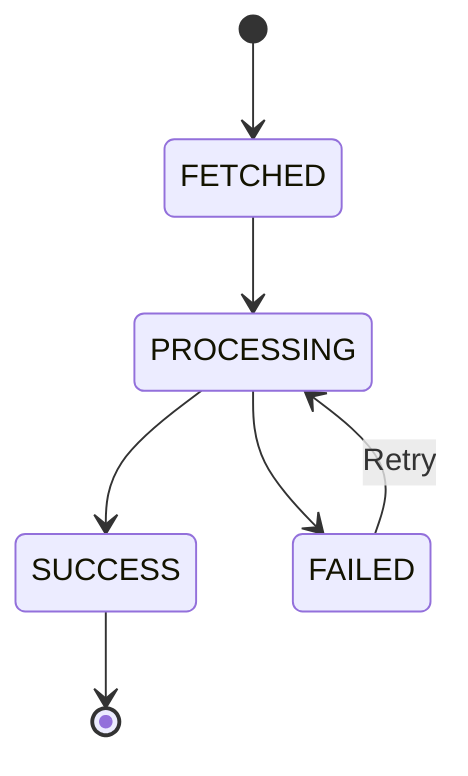
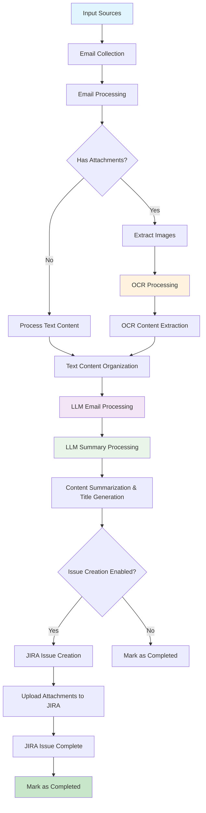

# About Devify

## What is Devify?

### Purpose

Devify is an **AI Agent-powered personal productivity platform** that leverages intelligent automation to enhance daily work efficiency.

**Project Evolution:**

The project was originally conceived as a toolkit for AI-driven development lifecycle management, designed to accelerate R&D workflows and address pain points in software development processes. However, through practical application and iteration, we discovered that the core AI Agent architecture we built could be more effectively applied to solve broader personal productivity challenges in everyday work scenarios.

This realization led to a strategic pivot: rather than focusing solely on development lifecycle automation, we evolved Devify into a personal productivity platform that uses AI Agents to streamline various aspects of daily work—from email processing and information organization to task creation and knowledge management. The underlying AI Agent framework remains robust and flexible, now serving a wider range of personal efficiency use cases.

### Vision

By integrating advanced AI technologies and Agent-based automation, Devify aims to:
- Automate repetitive and time-consuming tasks in daily work routines
- Reduce manual effort in information processing and organization
- Enable individuals to focus on high-value creative and strategic work
- Continuously expand AI Agent capabilities to cover more productivity scenarios

### Key Features

Below is a list of the main tools and components included in this project:

- **Threadline Core Feature:** Automatically organizes and structures chat records (including WeChat, WhatsApp, email, etc.) to streamline requirements gathering and task creation. As an extension, these organized records can be sent to JIRA issues or other platforms as needed.

#### Threadline AI Agent

Threadline AI Agent was born out of a common pain point in daily project management: many issues and solutions are discussed and resolved within WeChat groups, but this valuable knowledge is often lost because it is not systematically captured in the product knowledge base. Since WeChat does not provide a direct API to access all conversation content, and relying solely on delivery personnel to manually document these discussions is unreliable, we sought an alternative approach.

Our solution leverages the fact that WeChat allows users to forward chat records via email. By simply sending relevant chat logs to a designated internal mailbox, we can then utilize large language models and image recognition technologies to process the content.  After appropriate analysis and summarization, the processed information is automatically submitted to JIRA, enabling the initial accumulation of project knowledge with minimal manual intervention.

In fact, this approach is not limited to WeChat chat records.  It can be extended to many other scenarios as well. In the future, we will continue to broaden the boundaries of this model.

### Technical Overview

This project is a robust AI workflow and agent system, architected with Django and powered by Celery for efficient orchestration of diverse tasks. It streamlines business processes by integrating advanced AI capabilities, including large language models (LLMs), OCR, and speech technologies. All system management and configuration are currently handled through Django's built-in Admin Portal, enabling rapid development and easy maintenance. In future releases, dedicated user-facing interfaces will be introduced to further enhance accessibility and user experience, with the ultimate goal of evolving into a SaaS platform for broader adoption.

The AI workflow in this project is powered by **LangGraph**, a framework for building stateful, multi-actor applications with LLMs. The workflow architecture uses a StateGraph pattern with atomic database operations in prepare/finalize nodes, ensuring data consistency and enabling built-in checkpointing for error recovery. This approach provides better observability, maintainability, and resilience compared to traditional orchestration methods.

## Open Source & Commercial Editions

This repository contains the **open source self-hosted edition** of Devify (commercial name: **AImyChats**).

### Features Comparison

| Feature | Open Source (Self-Hosted) | Commercial (SaaS) |
|---------|---------------------------|-------------------|
| IMAP Email Integration | ✅ | ✅ |
| AI Email Processing | ✅ | ✅ |
| OCR Support | ✅ | ✅ |
| Unlimited Usage | ✅ Free | ❌ Subscription |
| Dedicated Email (@aimychats.com) | ❌ | ✅ |
| Real-time SMTP (Haraka) | ❌ | ✅ |
| Payment Integration | ❌ | ✅ (Stripe) |
| Team Collaboration | ❌ | ✅ |
| Priority Support | ❌ | ✅ |

**For commercial SaaS version:** Visit [aimychats.com](https://aimychats.com)

### Email Collection Methods

**Open Source Edition** uses IMAP polling:
- Users connect their existing email accounts (Gmail, Outlook, any IMAP server)
- System periodically polls for new emails
- Full AI processing capabilities included
- Perfect for self-hosted deployments

**Commercial Edition** adds real-time SMTP:
- Dedicated email addresses (@aimychats.com)
- Real-time email receiving via Haraka mail server
- Instant processing (no polling delays)
- Managed hosting with enterprise features

### Self-Hosting Requirements

**Minimum:** 2 CPU cores, 4GB RAM, 20GB storage, Docker & Docker Compose

**External Services Required:**
- Azure OpenAI API (for LLM)
- Azure Document Intelligence (for OCR)
- SMTP server (for notifications, e.g., Gmail)

**SSL/HTTPS:** Use reverse proxy (Nginx Proxy Manager, Traefik, or Caddy) for HTTPS support.

## Development

### Testing with Nox

This project uses [Nox](https://nox.thea.codes/) for development task automation. Nox provides a unified interface for running tests, code formatting, and other development tasks.

#### Available Nox Sessions

```bash
# Run all tests
nox -s tests

# Run EML email parsing tests
nox -s eml_tests

# Run unit tests only
nox -s unit_tests

# Run API tests only
nox -s api_tests

# Run functional tests only
nox -s functional_tests

# Generate test coverage report
nox -s coverage

# Auto format code
nox -s format

# Code quality check
nox -s lint

# Django system check
nox -s django_check

# Start development server
nox -s runserver
```

#### Installation

```bash
# Install nox
pip install nox

# Or using uv (faster)
uv pip install nox
```

## How to run Devify?

Devify supports both development and production environments using Docker. Please note the following differences:

- **Development Mode (`docker-compose.dev.yml`):**
  - Local source code is mounted into the container.
  - The application runs in Django development mode.
  - Any code changes on your host machine will automatically
    trigger a reload of the service inside the container.
  - This setup is ideal for rapid development and debugging.

- **Production Mode (`docker-compose.yml`):**
  - The application runs using Gunicorn as the WSGI server,
    providing better performance and stability.
  - Source code is not mounted; the container uses a built image.
  - This setup is recommended for deployment and production use.

### Service Architecture

Both modes include the following services:

- **devify-api**: Django API server (Django dev server in dev mode, Gunicorn in production)
- **devify-worker**: Celery worker for background task processing
- **devify-scheduler**: Celery beat scheduler for periodic tasks
- **mysql**: MariaDB database server
- **redis**: Redis cache, message broker, and LangGraph checkpoint storage
- **nginx**: Reverse proxy server (production mode only)
- **flower**: Celery monitoring dashboard (development mode only)

**Optional Services (based on email collection mode):**

- **haraka**: Open-source SMTP server for auto_assign mode (receives incoming emails and saves to file system)
  - Only required if using `auto_assign` mode in `email_config`
  - Emails are automatically assigned to users based on recipient addresses (email aliases)
  - Simplifies multi-user email collection without individual IMAP credentials

### Key Differences

**Development Mode:**
- Uses `development` command to start Django's built-in server
- Includes Flower dashboard for Celery monitoring
- **Source code is mounted** for live reloading (`./devify:/opt/devify`)
- Exposes Django admin on port 8000
- Code changes take effect immediately (just restart worker)

**Production Mode:**
- Uses `gunicorn` command for production-grade WSGI server
- Includes Nginx reverse proxy with SSL support
- **Source code is packaged in Docker image** (no volume mount)
- Optimized for performance and stability
- Health checks and restart policies enabled
- Code updates require image rebuild and container restart

### Environment Preparation

This step is required for both development and production environments.

```bash
cp env.sample .env
```

### HTTPS Configuration (Production)

For production deployment with HTTPS support:

**1. Generate SSL Certificate:**

```bash
# Option A: Self-signed certificate (for testing)
./scripts/generate-ssl-cert.sh aimychats.com

# Option B: Let's Encrypt (recommended for production)
sudo certbot certonly --standalone -d aimychats.com
sudo cp /etc/letsencrypt/live/aimychats.com/fullchain.pem docker/nginx/certs/nginx-selfsigned.crt
sudo cp /etc/letsencrypt/live/aimychats.com/privkey.pem docker/nginx/certs/nginx-selfsigned.key

# Option C: Use your own certificates
# Place your certificate files in docker/nginx/certs/
# - nginx-selfsigned.crt (certificate)
# - nginx-selfsigned.key (private key)
```

**2. Configure Ports (in `.env`):**

```bash
# HTTP port (external)
NGINX_HTTP_PORT=80

# HTTPS port (external)
NGINX_HTTPS_PORT=443
```

**3. The nginx configuration will:**
- Listen on both HTTP (80) and HTTPS (443)
- Automatically redirect HTTP → HTTPS
- Serve all traffic over secure connections

**Note:** For details on certificate management, see `docker/nginx/certs/README.md`

**Alternative:** Use external Nginx Proxy Manager to handle HTTPS, and configure internal nginx for HTTP only.

## User Authentication

Devify supports **Email Registration** and **Google OAuth** login. Both methods require users to complete a setup process (virtual email, preferences, etc.) after initial authentication.

### Google OAuth Setup (Optional)

If you want to enable Google login, follow these steps:

**1. Create OAuth Credentials:**

Visit [Google Cloud Console](https://console.cloud.google.com/):
- Create or select a project
- Enable "Google+ API"
- Go to **Credentials** → **Create Credentials** → **OAuth 2.0 Client ID**
- Application type: **Web application**
- Add authorized redirect URIs:
  - Development: `http://localhost:8000/accounts/google/login/callback/`
  - Production: `https://yourdomain.com/accounts/google/login/callback/`

  **Important**: Only add the URI **with port number** (`localhost:8000`). Do NOT add `http://localhost/accounts/google/login/callback/` (without port), as the development environment runs on port 8000.

**2. Configure in `.env`:**

```bash
# Django Site Configuration (Required for OAuth)
# This will be automatically configured on container startup
SITE_DOMAIN=localhost:8000
SITE_NAME=Devify Development

# Google OAuth Configuration
GOOGLE_OAUTH_CLIENT_ID=your_client_id_from_google
GOOGLE_OAUTH_CLIENT_SECRET=your_client_secret_from_google

# Registration Configuration (required for all users)
# Note: Virtual email domain uses AUTO_ASSIGN_EMAIL_DOMAIN configured above
REGISTRATION_TOKEN_EXPIRY_HOURS=24

# Frontend URL - Django will redirect here after OAuth login
FRONTEND_URL=http://localhost:3000

# Frontend API Base URL (for CORS and OAuth redirects)
VITE_API_BASE_URL=http://localhost:8000
```

**Note**:
- `SITE_DOMAIN` and Google OAuth settings will be **automatically initialized** when the container starts
- No need to manually configure Django Site in Admin
- Google OAuth does not allow private IP addresses (like `192.168.x.x`), so use `localhost` for development
- For production, use your actual domain (e.g., `app.yourdomain.com`)

**3. API Documentation:**

View available authentication endpoints at `http://localhost:8000/api/schema/swagger-ui/` after starting the server.

### Docker Build Configuration

Devify supports using Chinese mirrors for faster package downloads during Docker builds. This is particularly useful for users in China or regions with slow access to default package sources.

#### Mirror Configuration

The Docker build process can be configured to use Chinese mirrors through the `USE_MIRROR` environment variable:

**For Chinese users (recommended):**
```bash
# In .env file
USE_MIRROR=true
```

**For international users:**
```bash
# In .env file
USE_MIRROR=false
```

#### What the Mirror Configuration Does

When `USE_MIRROR=true`, the Dockerfile will:

1. **Debian Package Sources**: Replace default Debian sources with Tsinghua University mirrors
   - `deb.debian.org` → `mirrors.tuna.tsinghua.edu.cn`
   - `security.debian.org` → `mirrors.tuna.tsinghua.edu.cn/debian-security`

2. **Python Package Sources**: Use Tsinghua PyPI mirror for faster pip installs
   - `pypi.org` → `pypi.tuna.tsinghua.edu.cn`

3. **Build Process**: Automatically configure both system packages and Python dependencies

#### Default Behavior

- **Development Mode** (`docker-compose.dev.yml`): `USE_MIRROR=true` (default)
- **Production Mode** (`docker-compose.yml`): `USE_MIRROR=false` (default)
- **Override**: You can override the default by setting `USE_MIRROR` in your `.env` file

#### Docker Compose Differences

| Feature | Development Mode | Production Mode |
|---------|------------------|-----------------|
| **Docker Compose File** | `docker-compose.dev.yml` | `docker-compose.yml` |
| **Image Name** | `devify:latest` (local) | `registry.cn-beijing.aliyuncs.com/cloud2ai/devify:latest` |
| **Source Code** | Volume mounted (live reload) | Packaged in image (immutable) |
| **Code Updates** | Just restart worker | Rebuild image + restart |
| **Server** | Django dev server | Gunicorn (production WSGI) |
| **Monitoring** | Flower dashboard (port 5555) | Nginx reverse proxy |
| **USE_MIRROR** | Default `true` | Default `false` |
| **Security** | Development settings | Production hardened |

**Volume Mount Comparison:**

Development Mode:
```yaml
volumes:
  - ./devify:/opt/devify  # ✅ Source code mounted for hot reload
  - ./cache:/opt/cache
  - ./data/logs:/var/log
```

Production Mode:
```yaml
volumes:
  # ❌ No source code mount (code in image)
  - ./cache:/opt/cache
  - ./data/logs:/var/log
```

Key environment variables (see `env.sample` for complete list):

```bash
# Database
DB_ENGINE=mysql
MYSQL_PASSWORD=your_password

# Azure OpenAI
AZURE_OPENAI_API_KEY=your_api_key
AZURE_OPENAI_API_BASE=https://your-endpoint.openai.azure.com/

# Azure OCR
AZURE_DOCUMENT_INTELLIGENCE_KEY=your_key
AZURE_DOCUMENT_INTELLIGENCE_ENDPOINT=https://your-endpoint.cognitiveservices.azure.com/

# Email for notifications
EMAIL_HOST=smtp.gmail.com
EMAIL_HOST_USER=your-email@gmail.com
EMAIL_HOST_PASSWORD=your_app_password
```

### Run in Development Mode

```
docker-compose -f docker-compose.dev.yml build
docker-compose -f docker-compose.dev.yml up -d
```

**Note:** Development mode uses `USE_MIRROR=true` by default for faster builds in China. You can override this by setting `USE_MIRROR=false` in your `.env` file.

Django API services is running in http://your_host:8000

Check output:

```
docker logs -f devify-api
```

### Run in Production Mode

**Initial Deployment:**
```bash
docker-compose build
docker-compose up -d
```

**Code Updates (after git push):**
```bash
# On production server
git pull origin main
docker-compose build
docker-compose down
docker-compose up -d
```

**Important Notes:**
- Production mode does **not** mount source code into containers
- Code is packaged inside Docker images for security and consistency
- To update code, you must rebuild the image and restart containers
- Use `USE_MIRROR=true` in `.env` for faster builds in China (default: false)

### Service Access

**Development Mode:**
- Django API: http://localhost:8000
- Django Admin: http://localhost:8000/admin/
- Flower Dashboard: http://localhost:5555

**Production Mode:**
- Nginx HTTP: http://localhost:10080
- Nginx HTTPS: https://localhost:10443
- Health Check: http://localhost:10080/health

### Container Management

**View logs:**
```bash
# API service
docker logs -f devify-api

# Worker service
docker logs -f devify-worker

# Scheduler service
docker logs -f devify-scheduler
```

**Execute commands:**
```bash
# Enter API container
docker exec -it devify-api bash

# Run Django management commands
docker exec -it devify-api python manage.py migrate
docker exec -it devify-api python manage.py collectstatic
```

## Threadline Settings

Before using Threadline features, you should initialize the required settings for all users. This can be done via a management command inside the API container. The command will automatically create default records for all necessary THREADLINE settings (`email_config`, `issue_config`, `prompt_config`, `webhook_config`) for each user if they do not already exist.

To simplify configuration, all required settings should be added here. Below are the key-value pairs you need to set before using the system. The table describes the key design, and the values should be saved in JSON format.

| Key                  | Description                                                      | Required | Example Key Fields/Notes                |
|----------------------|------------------------------------------------------------------|----------|-----------------------------------------|
| email_config         | Email collection mode and configuration (auto_assign or custom_imap) | Yes      | See below - supports Haraka auto-assign and IMAP modes |
| issue_config         | Issue creation engine configuration (JIRA, email, Slack, etc.)   | Yes      | See below                              |
| prompt_config        | AI prompt templates for email/attachment/summary processing       | Yes      | See below                              |
| webhook_config       | Webhook configuration for external notifications                  | No       | See below                              |

> **Note:**
> All values must be valid JSON.
> If you add new fields to the models or settings, update this table accordingly.

**How to initialize THREADLINE settings:**

1. **Enter the API container:**

   ```bash
   docker exec -it devify-api python manage.py init_threadline_settings --user admin
   ```

**Note:**
- The initialization command is idempotent and safe to run multiple times
- JIRA configuration is loaded from `conf/threadline/issues/jira_config.yaml` (YAML format)
- Other settings are stored in JSON format in the database
- Settings can be customized via Django Admin after initialization

2. **Edit the settings in Django Admin:**

   After initialization, log in to the Django Admin panel and navigate to the **Settings** section. You can then edit the values for each key (`email_config`, `issue_config`, `prompt_config`, `webhook_config`) as needed for your environment.

   > **Tip:**
   > You can also update these settings directly in the database if required.

3. **Log in to Django Admin**
   - Visit [http://localhost:8000/admin](http://localhost:8000/admin) in your browser.
   - Log in with your admin credentials.
   - Username: admin
   - Password: adminpassword

4. **Navigate to the Settings Model**
   - In the sidebar, find and click on **Settings** under THREADLINE

### Email Configuration (email_config)

The email configuration supports two distinct modes for email collection, providing flexibility for different deployment scenarios.

#### Email Collection Modes

Threadline supports two email collection modes:

| Mode | Description | Use Case | Email Source |
|------|-------------|----------|--------------|
| **auto_assign** | Haraka-based automatic email assignment | Multi-user shared email server, no IMAP credentials needed | File system |
| **custom_imap** | User-specific IMAP server configuration | Personal email accounts, custom IMAP servers | IMAP server |

**Default Mode**: `auto_assign` (recommended for team collaboration scenarios)

#### Mode Selection Guide

Choose the appropriate mode based on your deployment scenario:

| Scenario | Recommended Mode | Reason |
|----------|------------------|--------|
| Team collaboration with shared email domain | `auto_assign` | No need to manage individual IMAP credentials |
| Multiple users need different email aliases | `auto_assign` | Flexible alias management, one user can have multiple aliases |
| Enterprise deployment with many users | `auto_assign` | Simplified onboarding, just create an alias |
| Personal use or single user | `custom_imap` | Direct access to personal email account |
| Users have different email providers | `custom_imap` | Each user connects to their own email server |
| Need real-time email processing | `auto_assign` | Haraka provides instant email availability |
| Existing IMAP infrastructure | `custom_imap` | Leverage existing email servers |

#### Mode 1: Auto-Assign (Haraka-based) - Recommended

In this mode, emails are received by **Haraka** (an open-source SMTP server) and automatically assigned to users based on recipient email addresses. This eliminates the need for individual IMAP configurations and simplifies multi-user deployments.

**Why Haraka?**

Haraka was introduced to solve several key challenges in multi-user email processing:

1. **Simplified User Management**: No need to collect and manage individual IMAP credentials for each user
2. **Centralized Email Collection**: Single SMTP server handles emails for all users
3. **Flexible Email Routing**: Users can have multiple email aliases for different purposes (e.g., projects, teams)
4. **Security**: No storage of user email passwords in the system
5. **Scalability**: Easily add new users without configuring email servers
6. **Real-time Processing**: Haraka saves emails to file system immediately upon receipt

**How it works:**
1. Haraka receives incoming emails and saves them to the file system (`HARAKA_EMAIL_BASE_DIR/inbox/`)
2. The `haraka_email_fetch` task periodically scans the inbox directory
3. For each email, the system matches the recipient address to user email aliases
4. The email is automatically assigned to the matching user
5. If no user is found, the email is logged and moved to the failed directory
6. Processed emails are moved to `processed/` directory for archival

**Email Alias System:**

Each user automatically gets a default email alias based on their username:
- Default format: `{username}@{AUTO_ASSIGN_EMAIL_DOMAIN}`
- Example: User `admin` → `admin@devify.local`

Users can create additional custom aliases for different purposes:
- Project-specific: `project-alpha@devify.local`
- Team-specific: `devops-team@devify.local`
- Role-specific: `support@devify.local`

**Configuration:**
```json
{
  "mode": "auto_assign"
}
```

**Global Settings (Environment Variables):**
- `AUTO_ASSIGN_EMAIL_DOMAIN`: The email domain for all users (default: `devify.local`)
- `HARAKA_EMAIL_BASE_DIR`: Haraka email storage directory (default: `/opt/haraka/emails`)

**Directory Structure:**
```
/opt/haraka/emails/
├── inbox/           # Incoming emails waiting to be processed
├── processed/       # Successfully processed emails (archived)
└── failed/          # Emails that failed processing (for debugging)
```

**Advantages:**
- ✅ No IMAP credentials needed per user
- ✅ Instant email availability (no polling delay)
- ✅ Multiple aliases per user
- ✅ Centralized email management
- ✅ Easy to add new users (just create an alias)
- ✅ Better security (no password storage)

**Managing Email Aliases:**

In Django Admin, navigate to **THREADLINE** → **Email Aliases** to manage user aliases:

1. **View all aliases**: See all configured email aliases and their associated users
2. **Create new alias**: Click "Add Email Alias" and enter:
   - User: Select the user who will receive emails sent to this alias
   - Alias: Enter the alias name (without domain, e.g., `project-alpha`)
   - Is Active: Check to enable the alias
3. **Full email address**: The system automatically combines your alias with the configured domain (e.g., `project-alpha@devify.local`)
4. **Uniqueness check**: The system ensures each alias is unique across all users

**Haraka Setup (for auto_assign mode):**

If you plan to use auto_assign mode, you need to deploy Haraka SMTP server:

1. **Install Haraka**: Follow [Haraka documentation](https://haraka.github.io/)
2. **Configure email storage**: Set Haraka to save emails to `HARAKA_EMAIL_BASE_DIR`
3. **DNS/MX Records**: Point your domain's MX record to your Haraka server
4. **Directory permissions**: Ensure the Django application can read from Haraka directories

Haraka configuration is beyond the scope of this README. Please refer to Haraka's official documentation for deployment details.

#### Mode 2: Custom IMAP

In this mode, each user configures their own IMAP server credentials for fetching emails from personal or corporate email accounts.

**Configuration Structure:**

| Key | Type | Description | Required |
|-----|------|-------------|----------|
| mode | string | Must be "custom_imap" | Yes |
| imap_config | object | IMAP server configuration | Yes |
| filter_config | object | Email filtering rules (optional) | No |

**IMAP Config Fields:**

| Key               | Type     | Description                                 | Example                        |
|-------------------|----------|---------------------------------------------|--------------------------------|
| imap_host         | string   | IMAP server hostname                        | "imap.feishu.cn"               |
| smtp_ssl_port     | integer  | SMTP SSL port (default: 465)                | 465                            |
| smtp_starttls_port| integer  | SMTP StartTLS port (default: 587)           | 587                            |
| imap_ssl_port     | integer  | IMAP SSL port (default: 993)                | 993                            |
| username          | string   | Email username                              | "user@example.com"             |
| password          | string   | Email password or app-specific password     | "your-password"                |
| use_ssl           | boolean  | Enable SSL connection                       | true                           |
| use_starttls      | boolean  | Enable StartTLS                             | false                          |
| delete_after_fetch| boolean  | Delete emails from server after fetching (default: false) | false              |

**Filter Config Fields (Optional):**

| Key              | Type     | Description                                                        | Example                |
|------------------|----------|--------------------------------------------------------------------|------------------------|
| filters          | array    | List of IMAP search criteria to apply when fetching emails         | ["UNSEEN", "SINCE \"24-Jul-2025\""] |
| exclude_patterns | array    | Patterns to exclude emails, e.g., subjects containing keywords     | ["spam", "newsletter"] |
| max_age_days     | integer  | Maximum age of emails to process, in days                          | 7                      |

**Complete Example (Custom IMAP Mode):**
```json
{
  "mode": "custom_imap",
  "imap_config": {
    "imap_host": "imap.gmail.com",
    "smtp_ssl_port": 465,
    "smtp_starttls_port": 587,
    "imap_ssl_port": 993,
    "username": "your-email@gmail.com",
    "password": "your-app-specific-password",
    "use_ssl": true,
    "use_starttls": false,
    "delete_after_fetch": false
  },
  "filter_config": {
    "filters": ["UNSEEN"],
    "exclude_patterns": ["spam", "newsletter"],
    "max_age_days": 7
  }
}
```

**Note on `delete_after_fetch`:**
- `false` (default, recommended): Emails remain on the IMAP server after fetching. Duplicate emails are automatically prevented by the system's `unique_together` constraint on `(user, message_id)`.
- `true`: Emails are permanently deleted from the IMAP server after successful fetch. Use this to save server storage space, but be aware that emails cannot be re-fetched.

**Simple Example (Auto-Assign Mode):**
```json
{
  "mode": "auto_assign"
}
```

#### IMAP Filter Configuration (custom_imap mode only)

When using `custom_imap` mode, you can optionally configure filters in the `filter_config` section of `email_config` to control which emails are fetched.

**Available IMAP Search Criteria:**

| Category         | Criteria                    | Description                                    | Example                                    |
|------------------|-----------------------------|------------------------------------------------|--------------------------------------------|
| **Time-based**   | `SINCE`                     | Emails received after specified date          | `"SINCE \"24-Jul-2025\""`                  |
|                  | `BEFORE`                    | Emails received before specified date         | `"BEFORE \"25-Jul-2025\""`                 |
|                  | `ON`                        | Emails received on specified date             | `"ON \"24-Jul-2025\""`                     |
| **Status**       | `UNSEEN`                    | Unread emails                                 | `"UNSEEN"`                                 |
|                  | `SEEN`                      | Read emails                                   | `"SEEN"`                                   |
|                  | `FLAGGED`                   | Flagged emails                                | `"FLAGGED"`                                |
|                  | `UNFLAGGED`                 | Unflagged emails                              | `"UNFLAGGED"`                              |
| **Sender/Recipient** | `FROM`                  | Emails from specific sender                   | `"FROM \"sender@example.com\""`            |
|                  | `TO`                        | Emails to specific recipient                  | `"TO \"recipient@example.com\""`           |
|                  | `CC`                        | Emails CC'd to specific address               | `"CC \"cc@example.com\""`                  |
| **Content**      | `SUBJECT`                   | Emails with subject containing keyword        | `"SUBJECT \"important\""`                  |
|                  | `BODY`                      | Emails with body containing keyword           | `"BODY \"urgent\""`                        |
|                  | `TEXT`                      | Emails with subject or body containing keyword | `"TEXT \"meeting\""`                       |

**Note:**
- The `filters` array can contain multiple IMAP search criteria (combined with AND logic)
- Date format should be "DD-MMM-YYYY" (e.g., "24-Jul-2025")
- The system automatically adds time-based filtering using `last_email_fetch_time` for incremental fetching
- Filter configuration is **not applicable** to auto_assign mode (Haraka processes all incoming emails)

### Issue Config(issue_config)

The issue configuration supports multiple engines (JIRA, email, Slack, etc.) with engine-specific settings.

| Key                | Type     | Description                                      | Example                      |
|--------------------|----------|--------------------------------------------------|------------------------------|
| enable             | boolean  | Whether issue creation is enabled                | true                         |
| issue_engine       | string   | Issue creation engine type                       | "jira"                       |
| jira               | object   | JIRA-specific configuration                      | See JIRA config below        |
| language           | string   | LLM output language                              | "Chinese" or "English"       |
| fields             | object   | Field configurations (see below)                 | See JIRA config below        |

#### JIRA Configuration

JIRA issue creation is configured via YAML file at `conf/threadline/issues/jira_config.yaml`.
All configuration is automatically loaded during settings initialization.

**Configuration Structure:**

```yaml
# Basic settings
enable: true              # Enable/disable issue creation
issue_engine: jira       # Issue engine type
language: Chinese        # LLM output language

# JIRA connection
jira:
  url: "https://jira.example.com/"
  username: "your-username"
  api_token: "your-api-token"

# Field configurations
fields:
  # Static fields - Fixed values
  project_key_config:
    jira_field: project
    default: "REQ"

  issue_type_config:
    jira_field: issuetype
    default: "New Feature"

  priority_config:
    jira_field: priority
    default: "High"

  summary_config:
    prefix: "[AI]"
    add_timestamp: true

  description_config:
    jira_field: description

  # LLM fields - Smart processing
  assignee_config:
    use_llm: true
    jira_field: assignee
    default: "default-user"
    allow_values: ["user1", "user2", "user3"]
    prompt: "Match assignee based on content"

  components_config:
    use_llm: true
    fetch_from_api: true
    jira_field: components

  epic_link_config:
    use_llm: true
    fetch_from_api: true
    jira_field: customfield_10014
    default: "REQ-100"
```

**JIRA Field Types:**

Fields fall into three categories:

1. **Standard Fields**: Use simple names
   - Example: `project`, `summary`, `description`, `components`

2. **Custom Fields**: Use `customfield_XXXXX` format
   - Example: `customfield_10014` (Epic Link)
   - Find your custom field ID via JIRA Admin or API

3. **Processing Types**:
   - **Static**: Fixed values (no LLM, no API fetch)
   - **LLM**: Smart content generation
   - **API Fetch**: Dynamic options from JIRA

**How to Configure:**

1. Edit `conf/threadline/issues/jira_config.yaml`
2. Update JIRA credentials and project settings
3. Add optional LLM-based features
4. Run: `python manage.py init_threadline_settings --user username`

**How LLM Prompt System Works:**

The system uses a three-stage processing pipeline for LLM-based fields:

1. **Stage 1: Static Fields**
   - Fields with fixed default values (project, issue_type, priority)
   - No LLM processing needed

2. **Stage 2: API Data Fetching**
   - Fields with `fetch_from_api: true` fetch available options from JIRA
   - Example: `components_config` fetches all project components
   - Example: `epic_link_config` fetches all Epic issues
   - Data is stored for LLM to select from

3. **Stage 3: LLM Analysis**
   - LLM receives the email content and available options
   - Each LLM field has:
     - **allow_values**: Available options (from API or config)
     - **prompt**: Custom instructions or default behavior
     - **default**: Fallback value if LLM returns empty

**Prompt Customization:**

You can customize prompts in two ways:

1. **Default Prompt** (if `prompt` is empty):
   - With allow_values: Selection prompt ("Choose from available options")
   - Without allow_values: Generation prompt ("Generate based on content")

2. **Custom Prompt** (if `prompt` is provided):
   ```yaml
   assignee_config:
     use_llm: true
     jira_field: assignee
     prompt: "Match the most appropriate assignee based on content"
     allow_values: ["user1", "user2", "user3"]
   ```

**Example LLM Processing Flow:**

```
Email Content: "Need to fix login bug"
↓
1. Fetch components from JIRA API → ["Frontend", "Backend", "API"]
2. Build LLM prompt:
   {
     "components": ["Frontend", "Backend", "API"]
   }
   Prompt: "Select components. Available: Frontend, Backend, API"
3. LLM analyzes content → Returns: ["Frontend", "Backend"]
4. Validate and use default if empty
5. Create JIRA issue with selected components
```

**Text Formatting Features:**

The system automatically handles:
- Converting descriptions to JIRA Wiki format with proper indentation
- Adding indentation to plain text paragraphs for better readability
- Adding timestamps to summaries
- Processing attachments
- Error handling and fallbacks

**Formatting Details:**
- Plain text paragraphs are converted to quote blocks (bq.) for better readability and indentation
- List items (* and #) automatically get proper indentation
- Headers, code blocks, and special formatting remain unchanged
- Quote blocks provide visual distinction and indentation for regular paragraphs
- Special JIRA Wiki syntax is preserved correctly

For detailed configuration options, see: `devify/devify/conf/threadline/issues/README.md`

### Prompt Config (prompt_config)

The prompt configuration system has been redesigned for better maintainability and multi-language support. Prompt templates are now centrally managed in YAML configuration files, and the `prompt_config` setting only stores language and scene preferences.

#### Architecture Overview

- **Centralized Prompt Templates**: All prompt templates are defined in `conf/threadline/prompts/default.yaml` under the `common` section
- **Dynamic Language Support**: Prompts use a `{language}` variable that is replaced at runtime based on user preferences
- **Scene-Specific Customization**: Scene-specific prompt files (e.g., `chat.yaml`, `product_issue.yaml`) can override common prompts if needed
- **Backward Compatibility**: Legacy format with full prompt strings is still supported for users with custom prompts

#### New Format (Recommended)

The new format only stores language and scene preferences. The system dynamically generates complete prompt configurations at runtime.

| Config Key              | Description                                                                                   | Required | Example                    |
|------------------------|-----------------------------------------------------------------------------------------------|----------|----------------------------|
| `language`             | Language code for LLM output (e.g., `zh-CN`, `en-US`, `es`)                                  | Yes      | `"zh-CN"`                  |
| `scene`                | Scene identifier for scenario-specific processing (e.g., `chat`, `product_issue`)            | Yes      | `"chat"`                   |

**Example (New Format):**
```json
{
  "language": "zh-CN",
  "scene": "chat"
}
```

This will automatically load the appropriate prompts from the YAML configuration files with the correct language settings.

#### Legacy Format (Backward Compatible)

If you have existing custom prompts, they will continue to work. The system detects legacy format by checking for prompt fields (`summary_prompt`, `metadata_prompt`, `email_content_prompt`, etc.).

**Legacy Format:**
```json
{
  "output_language": "zh-hans",
  "email_content_prompt": "Custom prompt text here...",
  "ocr_prompt": "Custom OCR prompt text here...",
  "summary_prompt": "Custom summary prompt text here...",
  "summary_title_prompt": "Custom title prompt text here..."
}
```

> **Note:** Legacy format takes priority. If you want to use the new dynamic language-based prompts, remove all legacy prompt fields from your `prompt_config` and use the new format with only `language` and `scene`.

#### Prompt Template Priority

The system follows a priority order when loading prompt configurations. Templates with higher priority override those with lower priority:

1. **User Settings (Legacy Format)** - Highest Priority
   - If user's `prompt_config` contains legacy format (full prompt strings like `summary_prompt`, `email_content_prompt`, etc.), these are used directly
   - System skips dynamic generation when legacy format is detected
   - Use this when you need completely custom prompts for a specific user

2. **User Settings (New Format)** - Based on User Preferences
   - User's `prompt_config` with `language` and `scene` preferences determines which templates to load
   - System dynamically generates prompts based on user's language and scene selection
   - This is the recommended approach for most users

3. **Scene-Specific Prompts** - Override Defaults
   - Prompts from scene-specific YAML files (e.g., `chat.yaml`, `product_issue.yaml`)
   - Only override prompts that are explicitly defined in the scene file's `common` section
   - Currently, scene files are mostly placeholders and use common prompts

4. **Default Common Prompts** - Base Templates
   - Prompts from `default.yaml` `common` section serve as the base templates
   - These are used when no scene-specific override exists

**Priority Flow Example:**
```
User Legacy Format → (if exists, use directly, skip all below)
        ↓
User New Format (language: zh-CN, scene: chat)
        ↓
Scene: chat → prompts/chat.yaml common section (if exists)
        ↓
Default: prompts/default.yaml common section (always)
```

#### Prompt Template Management

All prompt templates are managed in YAML files located at `conf/threadline/prompts/`:

- **`default.yaml`**: Contains all common prompts in the `common` section (base templates)
- **`chat.yaml`**: Can override common prompts for chat scenarios (currently uses common prompts)
- **`product_issue.yaml`**: Can override common prompts for product issue tracking (currently uses common prompts)

**Available Prompt Types:**
- `email_content_prompt`: Organizes email/chat content for LLM processing
- `ocr_prompt`: Processes OCR text from images
- `summary_prompt`: Generates structured summaries
- `summary_title_prompt`: Generates concise titles
- `metadata_prompt`: Extracts metadata from conversations

**Supported Languages:**
- `zh-CN`: 简体中文 (Chinese)
- `en-US`: English
- `es`: Español (Spanish)

The system automatically replaces `{language}` variables in prompts with the appropriate language display name at runtime.

#### Initialization

When you run `init_threadline_settings`, the system automatically creates a `prompt_config` with default language and scene:

```json
{
  "language": "en-US",
  "scene": "chat"
}
```

You can customize this in Django Admin after initialization to match your preferences.

### Webhook Config (webhook_config)

Threadline supports webhook notifications to keep you informed about email processing status. Configure webhook settings in Django Admin under **Settings**.

| Key                | Type     | Description                                      | Example                      | Required |
|--------------------|----------|--------------------------------------------------|------------------------------|----------|
| `url`              | string   | Webhook endpoint URL                             | `"https://open.feishu.cn/open-apis/bot/v2/hook/xxx"` | Yes |
| `events`           | array    | List of events to notify                         | `["issue_success", "ocr_failed", "llm_summary_failed"]` | No |
| `timeout`          | integer  | Request timeout in seconds                       | `10`                         | No |
| `retries`          | integer  | Number of retry attempts                         | `3`                          | No |
| `headers`          | object   | Custom headers for webhook requests              | `{"Authorization": "Bearer xxx"}` | No |
| `language`         | string   | Notification message language                    | `"zh-hans"` or `"en"`        | No |
| `provider`         | string   | Webhook provider type                            | `"feishu"`                   | No |

> **Note:** Whether the webhook is enabled is controlled by the `is_active` field of the `webhook_config` setting in Django Admin. There is no need for an `enabled` field inside the JSON config.

#### Supported Providers

Currently, the following webhook providers are supported:

- **`feishu`** (default): Feishu/Lark interactive card messages with Markdown format

#### Supported Events

Email processing status events from the simplified state machine can be configured for notifications:

**Simplified State Machine Events (4 States):**
- **`fetched`**: Email has been fetched and is ready for processing
- **`processing`**: Email is being processed through the LangGraph workflow (OCR → LLM → Issue creation)
- **`success`**: All processing completed successfully (terminal state)
- **`failed`**: Processing failed, can be retried

**Note:** The workflow now uses a simplified 4-state model. Detailed step-by-step progress (OCR, LLM, Issue creation) is managed internally by the LangGraph workflow and is not reflected as separate database states. For detailed progress tracking, check the workflow logs or LangGraph checkpoints.

#### Example Webhook Configuration

**Basic Configuration (simplified state model):**
```json
{
  "url": "https://open.feishu.cn/open-apis/bot/v2/hook/xxx",
  "events": ["success", "failed"],
  "timeout": 10,
  "retries": 3,
  "headers": {},
  "language": "zh-hans",
  "provider": "feishu"
}
```

**Complete Configuration (all state transitions):**
```json
{
  "url": "https://open.feishu.cn/open-apis/bot/v2/hook/xxx",
  "events": ["fetched", "processing", "success", "failed"],
  "timeout": 10,
  "retries": 3,
  "headers": {},
  "language": "zh-hans",
  "provider": "feishu"
}
```

**Minimal Configuration (only completion events):**
```json
{
  "url": "https://open.feishu.cn/open-apis/bot/v2/hook/xxx",
  "events": ["success"],
  "timeout": 10,
  "retries": 3,
  "headers": {},
  "language": "zh-hans",
  "provider": "feishu"
}
```
#### Feishu Card Message Format

When using the `feishu` provider, notifications are sent as interactive cards with:

- **Color-coded headers**: Green (success), Red (failure), Blue (processing), Grey (other)
- **Markdown content**: Formatted with time, subject, sender, stage, and details
- **JIRA integration**: Includes issue key and URL when available
- **Internationalization**: Supports Chinese and English message content

#### Testing Webhook Configuration

Use the management command to test your webhook configuration:

```bash
# Test with default parameters
python manage.py test_webhook --user your_username

# Test with specific email and status
python manage.py test_webhook --user your_username --email-id 123 --old-status fetched --new-status jira_success

# Test with status transition only
python manage.py test_webhook --user your_username --old-status processing --new-status jira_success
```
### How to Configure the Scheduler in Django Admin

To enable automated email processing and JIRA issue creation, you need to configure the scheduler in Django Admin. Follow these steps:

3. **Configure the Scheduler Task**
   - In Django Admin, go to the **Periodic Tasks** section (provided by `django-celery-beat`).
   - Click **Add** to create a new periodic task.
   - In the **Task** field, select the task you want to schedule (for example, your email/JIRA processing task).
   - Set the **Interval** or **Crontab** schedule as needed (e.g., every 5 minutes).
   - Fill in any required arguments or keyword arguments for your task.
   - Optionally, add a description for clarity.
   - Ensure the **Enabled** checkbox is selected.

4. **Save the Task**
   - Click **Save** to activate the periodic task.

5. **Verify**
   - The periodic task will now run automatically according to your schedule (e.g., scanning emails, triggering LLM, submitting to JIRA).
   - You can edit, disable, or delete the task at any time in the **Periodic Tasks** section.

> **Tip:**
> Managing periodic tasks directly in the **Periodic Tasks** section is recommended for most use cases. No need to configure scheduler settings separately if you use `django-celery-beat`.

> **Important:**
> You must configure the following two periodic tasks in Django Admin (Periodic Tasks section):
>
> 1. **schedule_email_fetch**
>    - This is the main scheduler task. It periodically fetches emails from IMAP and Haraka sources and triggers the appropriate processing tasks (such as OCR, LLM summarization, and JIRA submission) based on the current state machine.
>
> 2. **reset_stuck_processing_emails**
>    - This task is responsible for detecting and resetting any email/message tasks that have been stuck in a pending or processing state for too long (timeout recovery). It helps ensure the system can recover from unexpected failures or timeouts.
>
> Both tasks are essential for robust, automated email-to-JIRA processing. Make sure both are scheduled to run at appropriate intervals (e.g., every 5 minutes for the main scheduler, every 10-30 minutes for the stuck task reset).

## Required Periodic Tasks

You **must** configure the following periodic tasks in Django Admin (**Periodic Tasks** section, provided by `django-celery-beat`):

1. **schedule_email_fetch**
   - Main scheduler task. Periodically fetches emails from IMAP and Haraka sources and triggers the LangGraph workflow for each email.
   - Automatically processes emails through the complete workflow (OCR → LLM → Issue creation).
   - **Recommended interval:** every 5 minutes.

2. **schedule_reset_stuck_processing_emails**
   - Detects and resets emails stuck in `PROCESSING` state for longer than the specified timeout.
   - Automatically marks stuck emails as `FAILED` with error message indicating manual intervention is required.
   - This prevents infinite retry loops and ensures system stability.
   - **Recommended interval:** every 10–30 minutes.
   - **Default timeout:** 30 minutes (configurable via `timeout_minutes` parameter)

3. **schedule_haraka_cleanup** (Optional)
   - Cleans up old Haraka email files from the file system to free up disk space.
   - **Recommended interval:** daily or weekly, depending on email volume.

4. **schedule_email_task_cleanup** (Optional)
   - Cleans up old EmailTask records from the database to prevent database bloat.
   - **Recommended interval:** daily or weekly.

> **Note:** Email fetching automatically triggers the LangGraph workflow for each new email, eliminating the need for separate processing tasks.

> **Tip:**
> You can edit, disable, or delete these tasks at any time in the **Periodic Tasks** section.

## EmailMessage State Machine & Exception Handling

The `EmailMessage` model uses a comprehensive state machine to track the processing stage with proper error handling and retry mechanisms.

### State Machine Flow (Simplified 4-State Model)



### State Descriptions

| Status | Description | Next Possible States |
|--------|-------------|---------------------|
| `FETCHED` | Email has been fetched and ready for processing | `PROCESSING` |
| `PROCESSING` | Email is being processed through the workflow (OCR → LLM → Issue creation) | `SUCCESS`, `FAILED` |
| `FAILED` | Processing failed, can be retried | `PROCESSING` |
| `SUCCESS` | All processing completed successfully (terminal state) | None (terminal) |

**Note**: Detailed step-by-step progress (OCR, LLM, Issue creation) is managed internally by the LangGraph workflow and is not reflected in the database status. The database status shows only the overall processing stage.

### Key Features

- **Simplified State Model**: Uses a 4-state model (FETCHED → PROCESSING → SUCCESS/FAILED) for easier monitoring and debugging
- **LangGraph Workflow**: Powered by LangGraph StateGraph for robust, stateful workflow execution with built-in checkpointing
- **Atomic Operations**: Prepare and Finalize nodes ensure atomic database operations for data consistency
- **Automatic Transitions**: Processing automatically transitions to SUCCESS or FAILED upon workflow completion
- **Error Message Cleanup**: When transitioning to SUCCESS, error messages are automatically cleared to ensure clean state
- **Retry Mechanism**: Failed emails can be retried using `retry_failed_email_workflow` task with force mode
- **Stuck Task Recovery**: The `schedule_reset_stuck_processing_emails` task automatically detects and marks stuck emails as FAILED
- **Force Mode**: Available for reprocessing emails regardless of current status (useful for debugging and manual reprocessing)
- **Internal Workflow State**: Detailed step-by-step progress is managed by LangGraph internal state with Redis checkpointing, not stored in the database
- **Error Tracking**: Node-level error tracking allows granular debugging and recovery strategies

### Error Handling

- **Node-level Error Tracking**: Each node in the workflow tracks its own errors in the state's `node_errors` field
- **Graceful Degradation**: Workflow continues even if non-critical nodes fail, with errors logged for later review
- **Automatic Recovery**: Redis checkpointing allows workflow resumption from the last successful checkpoint
- **Timeout Protection**: Stuck emails are automatically marked as FAILED after configurable timeout (default: 30 minutes)
- **Status Validation**: Each state transition is validated against the state machine rules to prevent invalid states
- **Force Processing**: Bypass status checks and reprocess emails using `retry_failed_email_workflow` task
- **Detailed Logging**: Comprehensive logging at each workflow node for debugging and monitoring

> **Best Practice:**
> Always keep your prompt templates, periodic task names, and state machine logic in sync with the codebase. If you add new settings or change the structure of any config, update the README accordingly.

## Reference
The foundational framework of this project is based on the
[django-starter-template](https://github.com/xiaoquqi/django-starter-template)
project, which provides a robust and modular Django REST API structure.

Core features of this project leverage components from the
[devtoolbox](https://github.com/cloud2ai/devtoolbox) project, including:

- **LLM Service**: For AI-powered content summarization and processing.
- **OCR Service**: For document and image text extraction.
- **JIRA Clients**: For seamless integration and automation with JIRA.

For more details on the architecture and advanced usage, please refer to the
above repositories.

## LangGraph Workflow Architecture

The email processing workflow is built on **LangGraph**, using a StateGraph pattern with 7 specialized nodes:

### Workflow Nodes

```
START → WorkflowPrepare → OCR → LLMAttachment → LLMEmail → Summary → Issue → WorkflowFinalize → END
```

| Node | Responsibility | Database Access |
|------|----------------|-----------------|
| **WorkflowPrepareNode** | Load email data, attachments, and user configurations into State | Read-only |
| **OCRNode** | Process image attachments and extract text using Azure Document Intelligence | No database access |
| **LLMAttachmentNode** | Process OCR content with LLM to organize and structure text | No database access |
| **LLMEmailNode** | Process email content with LLM, merge with attachment OCR content | No database access |
| **SummaryNode** | Generate comprehensive summary and title for issue creation | No database access |
| **IssueNode** | Create issue in external systems (JIRA) via API | No database access |
| **WorkflowFinalizeNode** | Atomically sync all results to database and update status | Write-only |

### Key Architecture Principles

1. **Prepare/Finalize Pattern**: Only the first and last nodes access the database
   - **Prepare**: Loads all necessary data into State (single read transaction)
   - **Finalize**: Saves all results to database (single write transaction)
   - **Middle nodes**: Pure business logic, operate only on State

2. **State-Driven Design**: All data flows through the `EmailState` TypedDict
   - Type-safe state structure
   - Immutable state updates (functional programming style)
   - Node-level error tracking in `node_errors` field

3. **Error Resilience**:
   - Each node tracks its own errors without stopping the workflow
   - Graceful degradation: non-critical failures don't block the entire process
   - Redis checkpointing enables workflow resumption from any point

4. **Atomic Database Operations**:
   - All database writes happen in a single transaction in WorkflowFinalizeNode
   - Either all changes are saved or none (ACID compliance)
   - Prevents partial updates and data inconsistency

### File Structure

```
threadline/
├── agents/
│   ├── workflow.py                 # LangGraph workflow definition
│   ├── email_state.py              # State structure and helper functions
│   ├── checkpoint_manager.py       # Redis checkpoint management
│   └── nodes/
│       ├── base_node.py            # Base class for all nodes
│       ├── workflow_prepare.py     # Data loading node
│       ├── workflow_finalize.py    # Data persistence node
│       ├── ocr_node.py             # OCR processing
│       ├── llm_attachment_node.py  # LLM for attachments
│       ├── llm_email_node.py       # LLM for email content
│       ├── summary_node.py         # Summary generation
│       └── issue_node.py           # Issue creation
└── tasks/
    ├── email_workflow.py           # Celery task wrapper for workflow
    ├── email_fetch.py              # Email fetching tasks
    ├── cleanup.py                  # Cleanup tasks
    └── scheduler.py                # Periodic task schedulers
```

## Threadline Processing Flow



### Process Description

1. **Input Sources**: Various communication tools (WeChat, Slack, Teams, etc.) or direct emails
2. **Email Collection**: System fetches emails from configured mailboxes (IMAP/Haraka)
3. **Workflow Trigger**: Each email triggers a LangGraph workflow execution
4. **Data Preparation**: WorkflowPrepareNode loads email data, attachments, and user configs into State
5. **OCR Processing**: OCRNode extracts text from image attachments using Azure Document Intelligence
6. **LLM Attachment Processing**: LLMAttachmentNode processes OCR content with LLM for structure and clarity
7. **LLM Email Processing**: LLMEmailNode processes email text, merges with attachment OCR content
8. **Summary Generation**: SummaryNode generates comprehensive summary and title for issue creation
9. **Issue Creation**: IssueNode creates JIRA issue with organized content (if enabled)
10. **Data Persistence**: WorkflowFinalizeNode atomically saves all results to database
11. **Status Update**: Email status automatically set to SUCCESS or FAILED based on workflow result

### Key Features

- **Multi-source Input**: Supports various communication platforms via email forwarding
- **Image Processing**: Automatic OCR extraction from screenshots and documents
- **Three-stage LLM Processing**:
  - Stage 1: Organize attachment OCR content
  - Stage 2: Process and structure email content
  - Stage 3: Generate comprehensive summary and title
- **Automated Issue Creation**: Direct integration with JIRA and other issue tracking systems
- **Attachment Handling**: Preserves and uploads original files to JIRA issues
- **Stateful Workflow**: LangGraph manages internal state with Redis checkpointing for recovery
- **Atomic Database Operations**: All database writes happen in a single transaction for data consistency
- **Error Resilience**: Node-level error tracking allows the workflow to continue despite non-critical failures
- **Force Mode**: Reprocess emails regardless of current status for debugging and manual intervention
- **Email Retry Feature**: Supports retrying email processing for all statuses (SUCCESS, FAILED, etc.)
  - **Retry API Endpoint**: `POST /v1/threadlines/<uuid>/retry`
  - **Parameters**:
    - `language` (optional): Override processing language (e.g., 'zh-CN', 'en-US')
    - `scene` (optional): Override processing scene (e.g., 'chat', 'product_issue')
    - `force` (optional, default false): Force retry mode - re-processes OCR and LLM even if results exist
  - **State Transitions**:
    - All statuses (including SUCCESS) can transition to PROCESSING during retry
    - State machine allows: `SUCCESS → PROCESSING`, `FAILED → PROCESSING`
  - **Temporary Configuration Override**: Retry parameters only affect the current retry, don't update user Settings
  - **Status Updates**: Email status automatically changes to PROCESSING when retry starts, then to SUCCESS or FAILED when complete

---

# License

## Open Source Code

- **Backend (this repository)**: AGPLv3
- Full source code available on GitHub
- Modifications must remain open source under AGPLv3
- SaaS usage is permitted

## Commercial Frontend

- **Frontend UI**: Proprietary license
- Distributed as Docker image
- Free for self-hosted use
- Source code not available

## Commercial Features

- Haraka mail server integration: Available in commercial edition only
- Payment features: Commercial license only
- Team collaboration features: Commercial license only

---

# Contributing

We welcome contributions to the open source edition!

## How to Contribute

1. Fork the repository
2. Create a feature branch (`git checkout -b feature/amazing-feature`)
3. Make your changes
4. Commit your changes (`git commit -m 'Add amazing feature'`)
5. Push to the branch (`git push origin feature/amazing-feature`)
6. Open a Pull Request

## Contribution Guidelines

- Follow existing code style (PEP 8 for Python)
- Add tests for new features
- Update documentation as needed
- Sign the Contributor License Agreement (CLA)

## What to Contribute

**Welcome contributions:**
- Bug fixes
- Performance improvements
- Documentation improvements
- Test coverage enhancements
- IMAP integration enhancements
- AI workflow improvements
- Translation and localization

**Please discuss first (via GitHub Issues):**
- Major architectural changes
- New external dependencies
- Breaking changes
- New commercial features

---

# Support

## Open Source Edition

- **GitHub Issues**: [Bug reports and feature requests](https://github.com/your-org/devify/issues)
- **GitHub Discussions**: [Community support and questions](https://github.com/your-org/devify/discussions)
- **Documentation**: This README and inline code documentation

## Commercial Edition

- **Priority Email Support**: support@aimychats.com
- **Live Chat Support**: Available on [aimychats.com](https://aimychats.com)
- **Phone Support**: Available for enterprise plans
- **Dedicated Account Manager**: Available for enterprise plans

## Commercial Support for Open Source

Need professional support for your self-hosted deployment? Contact us for support contracts: support@aimychats.com

---

# Roadmap

## Open Source Edition

- [ ] Improved IMAP performance and reliability
- [ ] Additional AI models support (OpenAI, Anthropic, local models)
- [ ] Better documentation and tutorials
- [ ] More language support for email processing
- [ ] Enhanced customization options
- [ ] Plugin system for extensibility
- [ ] Improved error handling and recovery

## Commercial Edition

- [ ] Advanced team collaboration features
- [ ] API rate limiting and quotas
- [ ] Webhook integrations
- [ ] Advanced reporting and analytics
- [ ] Mobile applications (iOS/Android)
- [ ] Third-party integrations (Slack, Teams, etc.)

---

# FAQ

## General Questions

### Can I use the open source edition commercially?

Yes! The AGPLv3 license permits commercial use, including running as a SaaS service.

### Can I modify the code?

Yes, but modifications must also be released under AGPLv3 if you distribute the software or provide it as a service.

### Do I need to open source my customizations?

Only if you distribute the software or provide it as a service (SaaS). Internal use doesn't require disclosure.

## Technical Questions

### What's the difference in AI capabilities?

The AI processing engine is identical in both editions. The difference is in deployment features (Haraka, billing, etc.).

### Can I add Haraka to the open source edition?

The Haraka integration code is available in the commercial edition repository. However, setting up Haraka requires significant infrastructure (domain, DNS MX records, SSL certificates, DKIM/SPF/DMARC). We recommend using IMAP for simplicity.

### Which AI models are supported?

Currently Azure OpenAI. Support for OpenAI API, Anthropic Claude, and local models (Ollama) is planned.

### Can I use my own AI API keys?

Yes! Configure your own Azure OpenAI and Document Intelligence keys in the `.env` file.

## Commercial Questions

### Is there a free trial of commercial edition?

Yes, visit [aimychats.com](https://aimychats.com) to start your free trial.

### What's included in commercial support?

Priority email support, live chat, phone support (enterprise), dedicated account manager (enterprise), and SLA guarantees.

### Can I get commercial features with self-hosting?

Yes, we offer enterprise self-hosted deployments with all commercial features. Contact: sales@aimychats.com

---

# Contact

- **Open Source Support**: [GitHub Issues](https://github.com/your-org/devify/issues)
- **Commercial Inquiries**: sales@aimychats.com
- **Enterprise Solutions**: enterprise@aimychats.com
- **General Questions**: support@aimychats.com
- **Website**: [aimychats.com](https://aimychats.com)

---

Thank you for choosing Devify! Whether you're using the open source edition or considering our commercial SaaS, we're excited to help you build better email workflows with AI. 🚀
