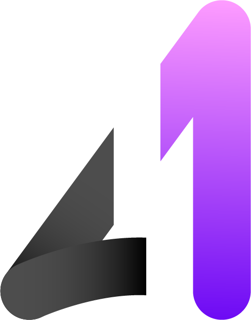

<div align="center">

# Devify

[](LICENSE)
[](pyproject.toml)
[](devify/)
[](ui/)
[](docker-compose.yml)
[](https://github.com/cloud2ai/devify/pulls)

**Enterprise-grade AI-powered conversation intelligence and data application platform**

Turn fragmented conversations — chat records, email threads, screenshots — into structured summaries and reusable data, then deliver them to JIRA, knowledge bases, and workflow automation.

[Quick Start](#-quick-start) · [How It Works](#-how-devify-works) · [Recommended Providers](#-recommended-llm-providers) · [Self-Hosting](#-self-hosting-requirements) · [SaaS Edition](https://aimychats.com)

English | [中文](README_ZH.md)

</div>

---

## 📖 About

Devify is an **enterprise-grade AI-powered conversation intelligence and data application platform**.

Its core value is straightforward:

1. Collect fragmented communication content from enterprise work scenarios
2. Understand both text and image content with AI
3. Transform raw conversations into structured summaries and reusable data
4. Feed that data into downstream systems such as JIRA, knowledge bases, and workflow automation

What matters most is not only collection or summarization, but the abstraction behind the system:

- **Data Layer**: unify scattered raw inputs
- **Data Processing Layer**: convert raw content into structured understanding
- **Data Application Layer**: build reusable business applications on top of that data

This layered design is the real long-term value of the project, because it makes horizontal expansion much easier as new sources and new applications are added.

## 💡 Why We Built It

Devify did not start from an abstract product idea. It grew out of real enterprise collaboration problems.

In many teams, important information is scattered across:

- WeChat groups
- email threads
- screenshots
- temporary chat messages
- cross-functional coordination channels
- personal notes and informal records

Decisions get made, requirements get clarified, and issues get solved, but the result often never becomes structured knowledge.

This creates recurring enterprise pain points:

- important context is scattered across multiple channels
- enterprise and personal information are separated and difficult to unify
- key decisions are easy to miss or lose
- manual knowledge consolidation is expensive and unreliable
- downstream systems receive incomplete information
- valuable business data remains trapped inside unstructured conversations

Devify exists to solve that gap.

## ✨ Key Features

- 🧵 **Threadline workflow** — forward chat records and screenshots by email, get structured summaries delivered to JIRA
- 🖼️ **Multimodal understanding** — AI analysis of both text and images, including intent detection
- 🔌 **17+ LLM providers** — bind different models to different jobs through a unified management console
- 📬 **Built-in inbound email** — Haraka SMTP server with auto-assigned per-user addresses
- 🖥️ **Management console** — configure providers, models, notifications, and scheduled tasks from the UI
- 🐳 **One-command deployment** — full stack (API, worker, scheduler, UI, MySQL, Redis, Nginx, Haraka) via Docker Compose
- 🔓 **Open core** — Apache-2.0 licensed platform with a separately licensed billing module

## 🎯 Purpose and Scenarios

At the current stage, the clearest and most practical workflow is:

- collect chat records and related materials through email
- analyze both text and image content
- generate structured summaries
- output reusable data for project delivery and business workflows

The core purpose is to bring fragmented enterprise and personal information into one unified system, so it can be continuously organized, understood, and reused.

Today, email is the first stable entry point.

In the future, Devify can expand to unify more inputs such as:

- voice content
- meeting notes and transcripts
- forwarded records from more platforms
- other multimodal work artifacts

## 🧩 How Devify Works


```mermaid
flowchart LR
    subgraph SRC["📥 Information Sources"]
        direction TB
        S1["💬 Chat records"]
        S2["📧 Email threads"]
        S3["🖼️ Screenshots"]
        S4["📝 Notes & meetings"]
    end

    subgraph LLM["🧠 LLM Processing"]
        direction TB
        P1["🎯 Image & intent recognition"]
        P2["✍️ Text understanding"]
        P3["📋 Structured summarization"]
    end

    subgraph APP["🚀 Data Applications"]
        direction TB
        A1["✅ TODO management"]
        A2["📨 Delivery hub<br/>JIRA · Knowledge base · Webhooks"]
        A3["✨ More apps coming<br/>extensible by design"]
    end

    SRC ==> LLM ==> APP

    classDef srcStyle fill:#fff7ed,stroke:#fb923c,color:#7c2d12
    classDef llmStyle fill:#eff6ff,stroke:#60a5fa,color:#1e3a8a
    classDef appStyle fill:#f0fdf4,stroke:#4ade80,color:#14532d
    classDef nodeStyle fill:#ffffff,stroke:#9ca3af,color:#1f2937
    classDef futureStyle fill:#ffffff,stroke:#9ca3af,color:#6b7280,stroke-dasharray:6 4

    class SRC srcStyle
    class LLM llmStyle
    class APP appStyle
    class S1,S2,S3,S4,P1,P2,P3,A1,A2 nodeStyle
    class A3 futureStyle
```

One pipeline: fragmented information flows in, LLMs turn it into structured data, and that data powers a growing set of applications — TODO management and the delivery hub today, with the data application layer designed to keep absorbing new apps.

## 🧵 Threadline Core Feature

Threadline is the current flagship workflow inside Devify.

It was born from a practical enterprise pain point: many issues are discussed and even resolved inside chat tools, but the resulting knowledge never enters the formal delivery system.

Threadline focuses on:

- collecting conversation content
- understanding images and text with AI
- generating structured summaries
- delivering the result to downstream systems such as JIRA

This approach is not limited to WeChat chat records. It can be extended to many communication scenarios while keeping the output structured and reusable.

More importantly, Threadline is not just a single feature. It is an example of how the platform turns fragmented communication into reusable data products through the three-layer model.

## 🖥️ Management Console

Runtime configuration is no longer limited to Django Admin.

Many core settings can now be configured in the management UI:

| Path | Purpose |
|------|---------|
| `/management/llm/config` | Provider credentials, models, defaults, and connection testing |
| `/management/app-settings` | Global app settings, Threadline model bindings, notification channels, Relay smart-channel model bindings |
| `/management/threadline/config` | Threadline workflow model settings |
| `/management/threadline/periodic-tasks` | Scheduled tasks |
| `/management/notifier/channels` | Webhook and notification channels |
| `/management/notifier/settings` | Notification-related settings |
| `/management/billing/settings` | Billing-related runtime settings |

Django Admin is still available for low-level inspection and legacy operations, but it is no longer the only day-to-day configuration path.

## ⭐ Recommended LLM Providers

Devify is not tied to a single LLM vendor. The management console ships with **17+ built-in providers** — OpenAI, Azure OpenAI, Anthropic, Google Gemini, DeepSeek, DashScope (Qwen), Mistral, xAI, MiniMax, Moonshot, ZAI, Volcengine, Meta Llama, Amazon Nova, NVIDIA NIM, OpenRouter, plus any OpenAI-compatible endpoint.

This allows you to bind different models for different jobs, such as:

- one multimodal model for image understanding and intent detection
- one text model for summarization and metadata extraction
- one dedicated model for smart delivery channels

If you don't know where to start, the providers below have been validated with Devify workflows. Any of them can be configured in minutes via `/management/llm/config` using the OpenAI-compatible provider type or the dedicated built-in provider.

<table>
  <tr>
    <td width="180" align="center">
      <a href="https://agione.pro">
        <br/>
        <b>AGIone</b>
      </a>
    </td>
    <td>
      <a href="https://agione.pro"><b>AGIone</b></a> is a one-stop LLM API gateway that provides unified, OpenAI-compatible access to mainstream models (GPT, Claude, Gemini, DeepSeek, Qwen, and more) through a single API key. It is a convenient choice for Devify self-hosting: one account covers both the multimodal model for image understanding and the text model for summarization, without juggling multiple vendor accounts. Configure it in Devify as an <code>OpenAI-compatible</code> provider with <code>api_base</code> pointing to <a href="https://agione.pro">agione.pro</a>.
    </td>
  </tr>
</table>

| Provider | Best for | Multimodal | How to configure in Devify |
|----------|----------|:----------:|----------------------------|
|  [AGIone](https://agione.pro) | One API key for all model bindings (recommended for quick start) | ✅ | `OpenAI-compatible` provider, `api_base` → agione.pro |
|  [OpenAI](https://platform.openai.com) | Image understanding, intent detection, summarization | ✅ | Built-in `OpenAI` provider |
|  [Anthropic](https://www.anthropic.com) | High-quality summarization and metadata extraction | ✅ | Built-in `Anthropic` provider |
|  [Google Gemini](https://ai.google.dev) | Cost-effective multimodal understanding | ✅ | Built-in `Google Gemini` provider |
|  [DeepSeek](https://www.deepseek.com) | Low-cost text summarization at scale | — | Built-in `DeepSeek` provider |
|  [DashScope (Qwen)](https://dashscope.aliyun.com) | Chinese-language content and Qwen-VL image understanding | ✅ | Built-in `DashScope` provider |
|  [OpenRouter](https://openrouter.ai) | Trying many models behind one endpoint | ✅ | Built-in `OpenRouter` provider |

> 💡 Devify requires at least one **multimodal** model for image understanding and intent detection. A common minimal setup is a single aggregator account (e.g. AGIone or OpenRouter) bound to all Threadline jobs.

## 🚀 Quick Start

### Development

```bash
cp env.sample .env
docker compose -f docker-compose.dev.yml build
docker compose -f docker-compose.dev.yml up -d
```

Default local access:

- API and Django Admin: `http://localhost:8000`
- Flower: `http://localhost:5555`

### Production

```bash
cp env.sample .env
docker compose build
docker compose up -d
```

The production compose file includes the full application stack: API, worker,
scheduler, UI, MySQL, Redis, Nginx, and Haraka.

### Haraka Inbound Email

Devify includes Haraka for auto-assigned inbound email addresses. When enabled,
users can receive mail at addresses such as:

```text
{username}@{AUTO_ASSIGN_EMAIL_DOMAIN}
```

Haraka receives SMTP traffic on port 25, stores raw email files under
`data/haraka/emails`, and the worker/scheduler processes those files into the
normal email workflow.

For production, the mail domain must be configured in three places:

- `.env`: `AUTO_ASSIGN_EMAIL_DOMAIN=example.com`
- `docker/haraka/config/host_list.prod`: add `example.com`
- DNS: add an MX record for `example.com` pointing to the host that runs Haraka

Recommended DNS records:

```text
example.com.        MX   10 mail.example.com.
mail.example.com.   A    <server-public-ip>
example.com.        TXT  "v=spf1 mx -all"
_dmarc.example.com. TXT  "v=DMARC1; p=quarantine; rua=mailto:admin@example.com"
```

Port 25 must be open from the public internet. If STARTTLS is required, create
Haraka certificates with:

```bash
HARAKA_DOMAIN=mail.example.com HARAKA_CERT_EMAIL=admin@example.com \
  ./scripts/manage-haraka-certs.sh apply
```

More details are documented in `docker/haraka/README.md`.

## ⚙️ Required Configuration

Before first run, review at least these settings in `.env`:

### Basic Runtime

- `USE_MIRROR`
- `SITE_DOMAIN`
- `FRONTEND_URL`
- `VITE_API_BASE_URL`
- `AUTO_ASSIGN_EMAIL_DOMAIN`

### Email / Notifications

- `EMAIL_HOST`
- `EMAIL_PORT`
- `EMAIL_HOST_USER`
- `EMAIL_HOST_PASSWORD`

### Optional OAuth

- `GOOGLE_OAUTH_CLIENT_ID`
- `GOOGLE_OAUTH_CLIENT_SECRET`

### AI Models and Providers

AI services are now configured primarily through the management console, not through a single fixed set of `.env` variables.

Recommended path after startup:

1. Open `/management/llm/config`
2. Add one or more `LLMConfig` entries
3. Configure provider-specific fields such as:
   - `api_key`
   - `api_base`
   - `model`
   - `deployment` for Azure OpenAI
   - optional parameters such as `max_tokens`, `temperature`, `top_p`, and request timeout
4. Bind the appropriate models in `/management/app-settings` and `/management/threadline/config`

In other words, `.env` is mainly for base runtime setup, while actual model provider configuration is managed in the application.

## 📦 Self-Hosting Requirements

Minimum recommendation:

- 2 CPU cores
- 4GB RAM
- 20GB storage
- Docker and Docker Compose

External services:

- at least one supported LLM provider account and API credentials
- multimodal model capability for image understanding and intent detection
- SMTP server for notifications

For HTTPS, use a reverse proxy such as Nginx Proxy Manager, Traefik, or Caddy.

## 🛠️ Development

### Project Structure

```text
devify/              # Django backend, split by domain
├── accounts/        # Authentication and user profiles
├── billing/         # Billing module (commercial license)
├── threadline/      # Threadline conversation workflow
└── ...
ui/                  # Vue 3 frontend (Vite)
docker/              # Service images (Haraka, Nginx, ...)
docker-compose.yml   # Production stack
docker-compose.dev.yml  # Development stack
```

### Commands

```bash
# Backend tests
pytest
pytest devify/threadline/tests -v   # Focused run

# Frontend
cd ui && npm install                # Install dependencies
cd ui && npm run dev                # Vite dev server
cd ui && npm run build              # Production bundle
cd ui && npm run lint               # Lint and auto-fix
```

## 🤝 Contributing

Contributions are welcome! Before submitting a PR:

- Keep each commit focused on one change set, with a short imperative subject
- Include tests for behavior changes (`pytest` markers: `unit`, `integration`, `api`)
- Run `cd ui && npm run lint` for frontend changes
- Summarize the change and validation steps in the PR description; include screenshots for UI updates and migration notes for schema changes

See [CLAUDE.md](CLAUDE.md) for the full repository guidelines.

## 🏢 Open Source & Commercial Editions

This repository contains the **self-hosted Devify platform** with an Apache-2.0 open core and a separately licensed billing module.

Commercial SaaS version: [aimychats.com](https://aimychats.com)

Core difference at a glance:

| | Self-hosted platform | Commercial SaaS edition |
|---|---|---|
| Hosting | Self-managed deployment | Managed hosting |
| Email collection | IMAP-based | Dedicated email, real-time SMTP |
| Extras | Open core | Additional operational features |

## 📜 Licensing

Devify uses a mixed licensing structure:

- core platform: `Apache License 2.0`
- billing module: separate `Devify Billing Commercial License`

Billing follows one simple rule:

- internal company use is allowed
- external operation is prohibited without separate authorization

See [LICENSE](LICENSE), [LICENSES.md](LICENSES.md), [TRADEMARKS.md](TRADEMARKS.md), and [devify/billing/COMMERCIAL-LICENSE.md](devify/billing/COMMERCIAL-LICENSE.md).
