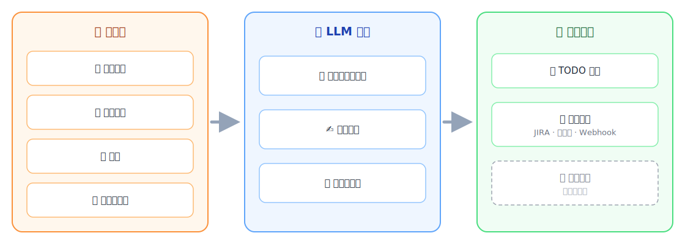

<div align="center">

# Devify

[](LICENSE)
[](pyproject.toml)
[](devify/)
[](ui/)
[](docker-compose.yml)
[](https://github.com/cloud2ai/devify/pulls)

**企业级 AI 对话智能与数据应用平台**

将碎片化的沟通内容——聊天记录、邮件往来、截图——转化为结构化摘要和可复用数据，并自动交付到 JIRA、知识库和工作流自动化系统。

[快速开始](#-快速开始) · [工作原理](#-devify-工作原理) · [推荐模型平台](#-推荐-llm-平台) · [自托管要求](#-自托管要求) · [SaaS 版本](https://aimychats.com)

[English](README.md) | 中文

</div>

---

## 📖 关于项目

Devify 是一个**企业级 AI 对话智能与数据应用平台**。

它的核心价值非常直接：

1. 收集企业工作场景中碎片化的沟通内容
2. 用 AI 理解文本和图片内容
3. 将原始对话转化为结构化摘要和可复用数据
4. 将数据输送到 JIRA、知识库、工作流自动化等下游系统

最重要的不仅是收集或摘要本身，而是系统背后的抽象设计：

- **数据层（Data Layer）**：统一汇集分散的原始输入
- **数据处理层（Data Processing Layer）**：将原始内容转化为结构化理解
- **数据应用层（Data Application Layer）**：在数据之上构建可复用的业务应用

这种分层设计才是项目真正的长期价值——当新的数据源和新的应用不断加入时，水平扩展会变得非常容易。

## 💡 为什么做这个项目

Devify 并非源于一个抽象的产品构想，而是从真实的企业协作痛点中生长出来的。

在很多团队中，重要信息散落在：

- 微信群
- 邮件往来
- 截图
- 临时聊天消息
- 跨部门协调渠道
- 个人笔记和非正式记录

决策做出了、需求澄清了、问题解决了，但结果往往永远没有沉淀为结构化知识。

这带来了反复出现的企业痛点：

- 重要上下文散落在多个渠道
- 企业信息与个人信息彼此割裂、难以统一
- 关键决策容易遗漏或丢失
- 人工整理知识成本高且不可靠
- 下游系统拿到的信息残缺不全
- 有价值的业务数据被困在非结构化对话中

Devify 就是为了填补这个缺口而存在的。

## ✨ 核心特性

- 🧵 **Threadline 工作流** — 通过邮件转发聊天记录和截图，自动生成结构化摘要并交付到 JIRA
- 🖼️ **多模态理解** — AI 同时分析文本和图片内容，支持意图识别
- 🔌 **17+ LLM 平台** — 通过统一管理控制台为不同任务绑定不同模型
- 📬 **内置入站邮件** — Haraka SMTP 服务器，为每个用户自动分配专属邮箱地址
- 🖥️ **管理控制台** — 在 UI 中配置模型供应商、通知渠道和定时任务
- 🐳 **一键部署** — Docker Compose 启动完整技术栈（API、Worker、调度器、UI、MySQL、Redis、Nginx、Haraka）
- 🔓 **开放内核** — 平台核心采用 Apache-2.0 协议，计费模块单独授权

## 🎯 定位与使用场景

现阶段最清晰、最实用的工作流是：

- 通过邮件收集聊天记录及相关材料
- 同时分析文本和图片内容
- 生成结构化摘要
- 输出可复用数据，支撑项目交付和业务流程

核心目标是把碎片化的企业信息和个人信息汇入一个统一系统，使其能够被持续整理、理解和复用。

目前，邮件是第一个稳定的数据入口。

未来，Devify 可以扩展统一更多输入，例如：

- 语音内容
- 会议记录与转写
- 来自更多平台的转发记录
- 其他多模态工作产物

## 🧩 Devify 工作原理

<div align="center">
  
</div>

一条管道贯穿始终：碎片化信息流入，LLM 将其转化为结构化数据，数据驱动不断增长的应用生态——今天是 TODO 管理和投递中心，数据应用层的设计让新应用可以持续接入。

## 🧵 Threadline 核心功能

Threadline 是 Devify 当前的旗舰工作流。

它源于一个非常实际的企业痛点：很多问题在聊天工具里讨论甚至解决了，但由此产生的知识从未进入正式的交付体系。

Threadline 专注于：

- 收集对话内容
- 用 AI 理解图片和文本
- 生成结构化摘要
- 将结果交付到 JIRA 等下游系统

这套方法不局限于微信聊天记录，它可以扩展到多种沟通场景，同时保持输出的结构化和可复用性。

更重要的是，Threadline 不只是一个单一功能。它示范了平台如何通过三层模型，把碎片化沟通转化为可复用的数据产品。

## 🖥️ 管理控制台

运行时配置不再局限于 Django Admin。

许多核心设置现在可以直接在管理界面中配置：

| 路径 | 用途 |
|------|------|
| `/management/llm/config` | 供应商凭证、模型、默认值和连接测试 |
| `/management/app-settings` | 全局应用设置、Threadline 模型绑定、通知渠道、Relay 智能渠道模型绑定 |
| `/management/threadline/config` | Threadline 工作流模型设置 |
| `/management/threadline/periodic-tasks` | 定时任务 |
| `/management/notifier/channels` | Webhook 和通知渠道 |
| `/management/notifier/settings` | 通知相关设置 |
| `/management/billing/settings` | 计费相关运行时设置 |

Django Admin 仍可用于底层检查和遗留操作，但它已不再是日常配置的唯一途径。

## ⭐ 推荐 LLM 平台

Devify 不绑定任何单一 LLM 厂商。管理控制台内置 **17+ 供应商**——OpenAI、Azure OpenAI、Anthropic、Google Gemini、DeepSeek、灵积 DashScope（通义千问）、Mistral、xAI、MiniMax、月之暗面、智谱、火山引擎、Meta Llama、Amazon Nova、NVIDIA NIM、OpenRouter，以及任意 OpenAI 兼容端点。

这让你可以为不同任务绑定不同模型，例如：

- 一个多模态模型负责图片理解和意图识别
- 一个文本模型负责摘要和元数据提取
- 一个专用模型负责智能交付渠道

如果你不知道从哪里开始，下面这些平台已经过 Devify 工作流验证。任何一家都可以在 `/management/llm/config` 中几分钟内完成配置——使用 OpenAI 兼容供应商类型或对应的内置供应商即可。

<table>
  <tr>
    <td width="180" align="center">
      <a href="https://agione.pro">
        <br/>
        <b>AGIone</b>
      </a>
    </td>
    <td>
      <a href="https://agione.pro"><b>AGIone</b></a> 是一站式 LLM API 聚合网关，通过一个 API Key 即可以 OpenAI 兼容方式统一接入主流模型（GPT、Claude、Gemini、DeepSeek、通义千问等）。对于 Devify 自托管用户来说非常省心：一个账号同时覆盖图片理解所需的多模态模型和摘要所需的文本模型，无需在多个厂商之间来回切换。在 Devify 中以 <code>OpenAI 兼容</code> 供应商方式配置，将 <code>api_base</code> 指向 <a href="https://agione.pro">agione.pro</a> 即可。
    </td>
  </tr>
</table>

| 平台 | 适用场景 | 多模态 | 在 Devify 中的配置方式 |
|------|----------|:------:|------------------------|
|  [AGIone](https://agione.pro) | 一个 API Key 绑定所有模型任务（推荐快速上手） | ✅ | `OpenAI 兼容` 供应商，`api_base` → agione.pro |
|  [OpenAI](https://platform.openai.com) | 图片理解、意图识别、摘要 | ✅ | 内置 `OpenAI` 供应商 |
|  [Anthropic](https://www.anthropic.com) | 高质量摘要和元数据提取 | ✅ | 内置 `Anthropic` 供应商 |
|  [Google Gemini](https://ai.google.dev) | 高性价比的多模态理解 | ✅ | 内置 `Google Gemini` 供应商 |
|  [DeepSeek](https://www.deepseek.com) | 大规模低成本文本摘要 | — | 内置 `DeepSeek` 供应商 |
|  [灵积 DashScope（通义千问）](https://dashscope.aliyun.com) | 中文内容处理和 Qwen-VL 图片理解 | ✅ | 内置 `DashScope` 供应商 |
|  [OpenRouter](https://openrouter.ai) | 通过一个端点尝试多种模型 | ✅ | 内置 `OpenRouter` 供应商 |

> 💡 Devify 至少需要一个**多模态**模型用于图片理解和意图识别。最简单的起步方案是使用一个聚合平台账号（如 AGIone 或 OpenRouter）绑定所有 Threadline 任务。

## 🚀 快速开始

### 开发环境

```bash
cp env.sample .env
docker compose -f docker-compose.dev.yml build
docker compose -f docker-compose.dev.yml up -d
```

默认本地访问地址：

- API 和 Django Admin：`http://localhost:8000`
- Flower：`http://localhost:5555`

### 生产环境

```bash
cp env.sample .env
docker compose build
docker compose up -d
```

生产环境 compose 文件包含完整应用技术栈：API、Worker、调度器、UI、MySQL、Redis、Nginx 和 Haraka。

### Haraka 入站邮件

Devify 内置 Haraka，用于自动分配入站邮箱地址。启用后，用户可以通过如下格式的地址接收邮件：

```text
{username}@{AUTO_ASSIGN_EMAIL_DOMAIN}
```

Haraka 在 25 端口接收 SMTP 流量，将原始邮件文件存储在 `data/haraka/emails` 目录下，Worker / 调度器再将这些文件处理进常规的邮件工作流。

生产环境中，邮件域名必须在三处完成配置：

- `.env`：`AUTO_ASSIGN_EMAIL_DOMAIN=example.com`
- `docker/haraka/config/host_list.prod`：添加 `example.com`
- DNS：为 `example.com` 添加 MX 记录，指向运行 Haraka 的主机

推荐的 DNS 记录：

```text
example.com.        MX   10 mail.example.com.
mail.example.com.   A    <服务器公网 IP>
example.com.        TXT  "v=spf1 mx -all"
_dmarc.example.com. TXT  "v=DMARC1; p=quarantine; rua=mailto:admin@example.com"
```

25 端口必须对公网开放。如需 STARTTLS，可以用以下命令创建 Haraka 证书：

```bash
HARAKA_DOMAIN=mail.example.com HARAKA_CERT_EMAIL=admin@example.com \
  ./scripts/manage-haraka-certs.sh apply
```

更多细节见 `docker/haraka/README.md`。

## ⚙️ 必要配置

首次运行前，请至少检查 `.env` 中的以下设置：

### 基础运行时

- `USE_MIRROR`
- `SITE_DOMAIN`
- `FRONTEND_URL`
- `VITE_API_BASE_URL`
- `AUTO_ASSIGN_EMAIL_DOMAIN`

### 邮件 / 通知

- `EMAIL_HOST`
- `EMAIL_PORT`
- `EMAIL_HOST_USER`
- `EMAIL_HOST_PASSWORD`

### 可选 OAuth

- `GOOGLE_OAUTH_CLIENT_ID`
- `GOOGLE_OAUTH_CLIENT_SECRET`

### AI 模型与供应商

AI 服务现在主要通过管理控制台配置，而不是一组固定的 `.env` 变量。

启动后的推荐配置路径：

1. 打开 `/management/llm/config`
2. 添加一个或多个 `LLMConfig` 条目
3. 配置供应商相关字段，例如：
   - `api_key`
   - `api_base`
   - `model`
   - Azure OpenAI 的 `deployment`
   - 可选参数，如 `max_tokens`、`temperature`、`top_p` 和请求超时
4. 在 `/management/app-settings` 和 `/management/threadline/config` 中绑定相应模型

换句话说，`.env` 主要负责基础运行时设置，实际的模型供应商配置在应用内管理。

## 📦 自托管要求

最低推荐配置：

- 2 核 CPU
- 4GB 内存
- 20GB 存储
- Docker 和 Docker Compose

外部服务：

- 至少一个受支持的 LLM 平台账号及 API 凭证
- 用于图片理解和意图识别的多模态模型能力
- 用于通知的 SMTP 服务器

如需 HTTPS，请使用 Nginx Proxy Manager、Traefik 或 Caddy 等反向代理。

## 🛠️ 开发指南

### 项目结构

```text
devify/              # Django 后端，按业务域划分
├── accounts/        # 认证与用户档案
├── billing/         # 计费模块（商业许可）
├── threadline/      # Threadline 对话工作流
└── ...
ui/                  # Vue 3 前端（Vite）
docker/              # 服务镜像（Haraka、Nginx 等）
docker-compose.yml   # 生产环境技术栈
docker-compose.dev.yml  # 开发环境技术栈
```

### 常用命令

```bash
# 后端测试
pytest
pytest devify/threadline/tests -v   # 聚焦运行

# 前端
cd ui && npm install                # 安装依赖
cd ui && npm run dev                # Vite 开发服务器
cd ui && npm run build              # 生产构建
cd ui && npm run lint               # 检查并自动修复
```

## 🤝 参与贡献

欢迎贡献！提交 PR 前请注意：

- 每个提交聚焦一个变更集，使用简短的祈使句作为提交主题
- 行为变更需要附带测试（`pytest` 标记：`unit`、`integration`、`api`）
- 前端变更请运行 `cd ui && npm run lint`
- 在 PR 描述中总结变更内容和验证步骤；UI 更新请附截图，Schema 变更请附迁移说明

完整的仓库规范见 [CLAUDE.md](CLAUDE.md)。

## 🏢 开源版与商业版

本仓库包含**自托管版 Devify 平台**：开放内核采用 Apache-2.0 协议，计费模块单独授权。

商业 SaaS 版本：[aimychats.com](https://aimychats.com)

核心差异一览：

| | 自托管平台 | 商业 SaaS 版本 |
|---|---|---|
| 托管方式 | 自行部署管理 | 托管服务 |
| 邮件收集 | 基于 IMAP | 专属邮箱、实时 SMTP |
| 附加能力 | 开放内核 | 更多运营功能 |

## 📜 许可证

Devify 采用混合许可结构：

- 平台核心：`Apache License 2.0`
- 计费模块：独立的 `Devify Billing Commercial License`

计费模块遵循一条简单规则：

- 允许公司内部使用
- 未经单独授权，禁止对外运营

详见 [LICENSE](LICENSE)、[LICENSES.md](LICENSES.md)、[TRADEMARKS.md](TRADEMARKS.md) 和 [devify/billing/COMMERCIAL-LICENSE.md](devify/billing/COMMERCIAL-LICENSE.md)。
