# Celery to LangGraph Refactoring - Design Document

## 概述

本设计文档描述了将现有 Celery task chain 架构重构为 LangGraph 架构的详细技术设计。重构围绕三个核心价值展开：

### 核心价值

1. **简化状态机，提高可扩展性**
   - 从复杂的多状态机制简化为核心状态（PROCESSING, SUCCESS, FAILED）
   - 使用 LangGraph State 管理中间处理状态
   - 降低状态机维护成本，提高系统可扩展性

2. **数据库操作与 State 解耦**
   - 采用"首尾数据库操作，中间纯 State 操作"的设计模式
   - 职责分离：数据持久化与业务逻辑分离
   - 避免数据库状态机和 LangGraph 状态的交叉耦合

3. **统一工作流编排调度**
   - 使用 LangGraph StateGraph 替代 Celery chain
   - Redis checkpoint 机制确保状态持久化
   - 支持从任意节点恢复执行，增强系统可靠性

4. **并发执行，提升性能**
   - LangGraph 原生支持节点并发执行
   - 独立业务逻辑可并行处理（如 OCR 和邮件内容处理）
   - 显著降低工作流总执行时间（预计提升 30-40%）

### 设计理念

**从 Celery 到 LangGraph 的架构演进**：

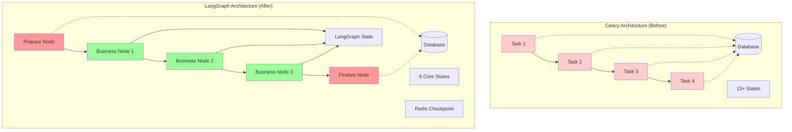

**关键改进**：
- 🔴 红色节点：数据库操作节点（首尾节点）
- 🟢 绿色节点：纯 State 操作节点（业务节点）
- 数据库访问从分散在各个任务，集中到首尾两个节点
- 状态管理从复杂的数据库状态机，简化为 LangGraph State 管理

## 架构设计

### 系统架构

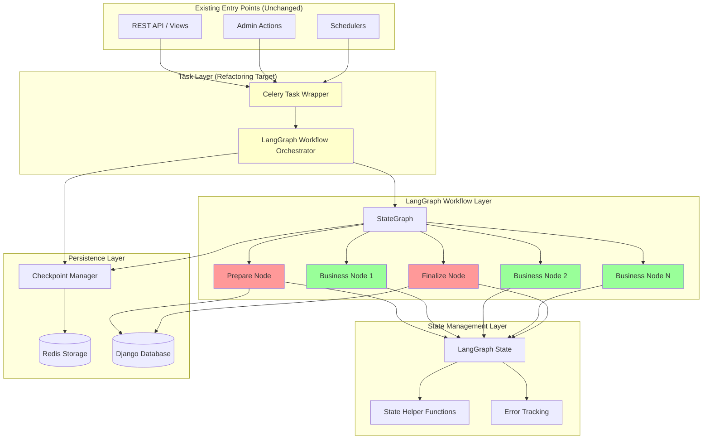

**说明**：🟡 黄色部分是本次重构的目标区域（任务层），其他入口点保持不变。

### 层级职责

#### 1. 现有入口点层（保持不变）
- **REST API / Views**：现有的 API 接口继续调用 Celery 任务
- **Admin Actions**：现有的管理后台操作继续调用 Celery 任务
- **Schedulers**：现有的定时任务继续调用 Celery 任务
- 这些入口点**不需要修改**，因为 Celery 任务接口保持兼容

#### 2. 任务层（重构目标）
- **Celery 任务包装器**：提供向后兼容的接口
  - 保持原有的任务签名 `process_[feature]_task(entity_id, force)`
  - 内部调用 LangGraph 工作流执行器
  - 可选：添加弃用警告
- **LangGraph 工作流编排器**：新的工作流执行器
  - `execute_[feature]_workflow()`：工作流执行入口
  - 创建初始状态
  - 配置检查点参数
  - 调用状态图

#### 3. LangGraph 工作流层（新实现）
- **状态图（StateGraph）**：LangGraph 的核心状态图
  - `create_[feature]_graph()`：创建并编译状态图
  - 定义节点和边（依赖关系）
  - 配置 Redis 检查点管理器
  - 管理节点执行顺序
- **工作流节点**：实际执行逻辑的节点
  - 准备节点：数据库读取和状态初始化
  - 业务节点：业务逻辑处理
  - 完成节点：结果同步和状态更新

#### 4. 状态管理层（新实现）
- **LangGraph 状态**：使用 TypedDict 定义的状态结构
  - 核心字段：从 Django 模型映射的数据字段
  - 结果字段：工作流产生的中间和最终结果
  - 固定字段：错误消息、节点错误、强制标志
- **状态辅助函数**：状态操作辅助函数
  - `add_node_error()`：添加节点错误
  - `has_node_errors()`：检查是否有错误
  - `get_node_errors_by_name()`：获取特定节点的错误

#### 5. 持久化层（部分新实现）
- **检查点管理器**（新增）：管理 Redis 检查点
  - 创建和配置 Redis 检查点管理器
  - 管理检查点生命周期
  - 提供检查点查询接口
- **Django 数据库**（已有）：持久化业务数据
  - 存储实体数据（如 AudioFile、EmailMessage）
  - 存储最终处理结果
  - 管理简化后的状态机

### 数据流架构

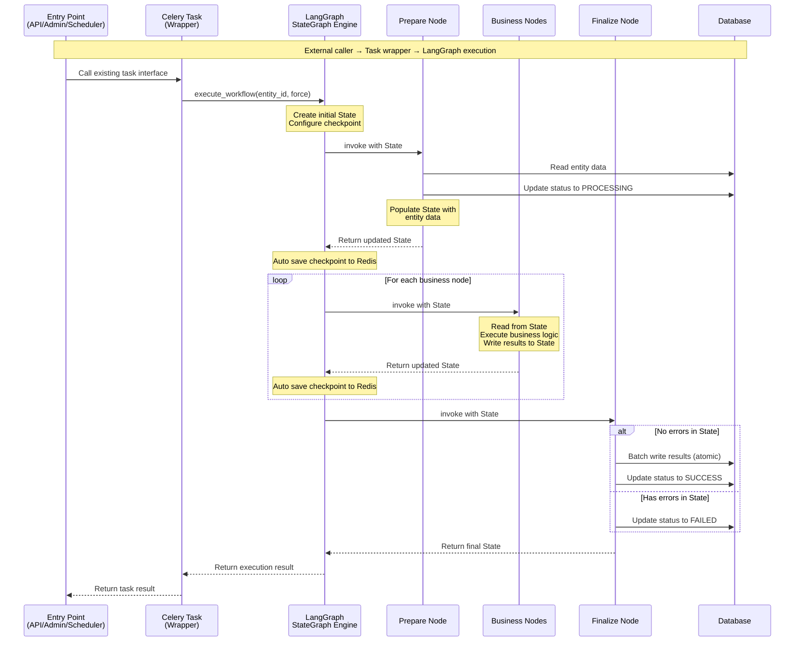

**关键说明**：
- 🟢 **入口点层**（API/Admin/Scheduler）**不需要修改**
- 🟡 **Celery 任务层**提供兼容性包装，保持原有接口
- 🔵 **LangGraph 引擎**自动管理状态传递和检查点持久化
- 🔴 **数据库操作**仅在首尾节点（准备节点和完成节点）
- **状态**是数据结构，在节点间传递（不作为单独参与者）
- **检查点**由 LangGraph 自动管理（不作为单独参与者）

### 节点架构模式

#### 基础节点类

所有节点继承自 `BaseLangGraphNode`，提供统一的接口和错误处理：

```python
class BaseLangGraphNode(ABC):
    """
    Base class for all LangGraph nodes.

    Provides:
    - Unified error handling
    - Node entry condition checking
    - Lifecycle hooks (before/after processing)
    - Logging infrastructure
    """

    def __call__(self, state: StateType) -> StateType:
        """Main entry point - orchestrates lifecycle"""

    def can_enter_node(self, state: StateType) -> bool:
        """Check if node can be entered"""

    def before_processing(self, state: StateType) -> StateType:
        """Pre-processing hook"""

    @abstractmethod
    def execute_processing(self, state: StateType) -> StateType:
        """Core business logic - must be implemented"""

    def after_processing(self, state: StateType) -> StateType:
        """Post-processing hook"""

    def _handle_error(self, error: Exception, state: StateType) -> StateType:
        """Error handling"""
```

#### Node Types and Responsibilities

**1. Prepare Node (首节点)**

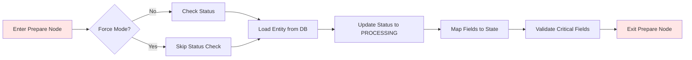

**职责**：
- 验证实体存在性
- 从数据库加载实体数据
- 映射模型字段到 State
- 更新数据库状态为 PROCESSING（非 force 模式）
- 验证关键字段完整性

**2. Business Nodes (业务节点)**

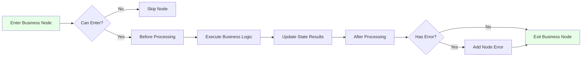

**职责**：
- 检查准入条件（依赖字段是否存在）
- 执行核心业务逻辑
- 只读写 LangGraph State，不访问数据库
- 将处理结果写入 State 的结果字段
- 错误通过 State 的 node_errors 记录

**3. Finalize Node (尾节点)**

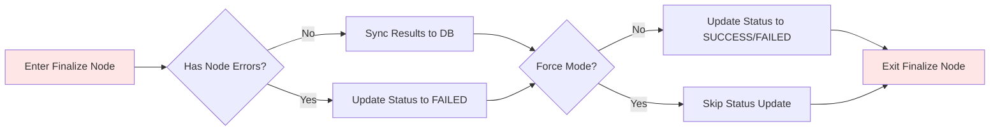

**职责**：
- 检查 State 中的 node_errors
- 如果有错误：只更新状态为 FAILED
- 如果无错误：
  - 原子性地将 State 结果同步到数据库
  - 更新状态为 SUCCESS
- Force 模式下跳过状态更新

### 检查点架构

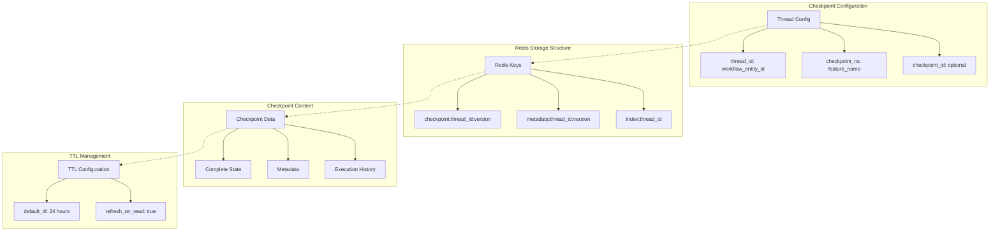

**Checkpoint 特性**：
- **自动保存**: 每个节点执行后自动保存 State
- **版本管理**: 支持多版本 checkpoint，可以回溯到任意节点
- **TTL 机制**: 自动过期清理，节省存储空间
- **原子操作**: 使用 Redis 事务确保一致性

## 组件与接口

### 组件层次结构

```
threadline/
├── agents/
│   ├── __init__.py
│   ├── email_state.py              # Email State 定义
│   ├── checkpoint_manager.py       # Checkpoint 管理器
│   ├── workflow.py                 # 工作流编排
│   └── nodes/
│       ├── __init__.py
│       ├── base_node.py            # 基础节点类
│       ├── workflow_prepare.py     # 准备节点
│       ├── workflow_finalize.py    # 完成节点
│       ├── ocr_node.py             # OCR 处理节点
│       ├── llm_ocr_node.py         # LLM OCR 处理节点
│       ├── llm_email_node.py       # LLM Email 处理节点
│       ├── summary_node.py         # 摘要生成节点
│       └── issue_node.py           # Issue 创建节点
```

### 核心接口

#### 1. 状态定义接口

```python
# [feature]_state.py

from typing import TypedDict, List, Dict, Any
from datetime import datetime

class NodeError(TypedDict):
    """Node-specific error information."""
    error_message: str
    timestamp: str

class [Feature]State(TypedDict, total=False):
    """
    State structure for [feature] workflow.

    Three categories of fields:
    1. Core fields: Mapped from Django model
    2. Result fields: Generated by workflow processing
    3. Fixed fields: Common control fields
    """
    # Core fields (from Django model)
    id: str
    user_id: str
    [model_field_1]: type_hint
    [model_field_2]: type_hint
    # ... other model fields

    # Result fields (workflow outputs)
    [result_field_1]: type_hint | None
    [result_field_2]: type_hint | None
    # ... other result fields

    # Fixed fields (always present)
    error_message: str | None
    node_errors: Dict[str, List[NodeError]] | None
    force: bool | None

def create_[feature]_state(
    entity_id: str,
    user_id: str,
    force: bool = False
) -> [Feature]State:
    """
    Create initial state for workflow execution.

    Args:
        entity_id: Primary identifier
        user_id: User identifier
        force: Force processing flag

    Returns:
        Initialized state with default values
    """
    return {
        "id": entity_id,
        "user_id": user_id,
        # Initialize all fields with default values
        "error_message": None,
        "node_errors": {},
        "force": force,
    }

# State helper functions
def add_node_error(
    state: [Feature]State,
    node_name: str,
    error_message: str
) -> [Feature]State:
    """Add error to specific node."""

def has_node_errors(state: [Feature]State) -> bool:
    """Check if any node has errors."""

def get_node_errors_by_name(
    state: [Feature]State,
    node_name: str
) -> List[NodeError]:
    """Get errors for specific node."""
```

#### 2. 节点接口

```python
# nodes/base_node.py

from abc import ABC, abstractmethod
from typing import TypeVar

StateType = TypeVar('StateType')

class BaseLangGraphNode(ABC):
    """
    Abstract base class for LangGraph nodes.

    Lifecycle:
        1. __call__: Entry point
        2. can_enter_node: Check entry conditions
        3. before_processing: Pre-processing hook
        4. execute_processing: Core business logic
        5. after_processing: Post-processing hook
        6. _handle_error: Error handling
    """

    def __init__(self, node_name: str):
        """Initialize node with name."""
        self.node_name = node_name
        self.logger = logging.getLogger(__name__)

    def __call__(self, state: StateType) -> StateType:
        """
        Main entry point for node execution.

        Orchestrates:
        - Entry condition checking
        - Lifecycle execution
        - Error handling
        """
        try:
            if not self.can_enter_node(state):
                self.logger.info(
                    f"Skipping {self.node_name} - entry conditions not met"
                )
                return state

            state = self.before_processing(state)
            state = self.execute_processing(state)
            state = self.after_processing(state)

            return state
        except Exception as error:
            return self._handle_error(error, state)

    def can_enter_node(self, state: StateType) -> bool:
        """
        Check if node can be entered.

        Default: Check for existing errors
        Override: Add dependency checks
        """
        return not has_node_errors(state)

    def before_processing(self, state: StateType) -> StateType:
        """Pre-processing hook. Override if needed."""
        return state

    @abstractmethod
    def execute_processing(self, state: StateType) -> StateType:
        """
        Core business logic.

        Must be implemented by subclasses.
        Should focus on business logic only.
        """
        pass

    def after_processing(self, state: StateType) -> StateType:
        """Post-processing hook. Override if needed."""
        return state

    def _handle_error(
        self, error: Exception, state: StateType
    ) -> StateType:
        """
        Handle errors during node execution.

        Adds error to state's node_errors.
        """
        self.logger.error(
            f"Error in {self.node_name}: {str(error)}"
        )
        return add_node_error(state, self.node_name, str(error))
```

#### 3. 工作流接口

```python
# workflow.py

from functools import lru_cache
from typing import Dict, Any

from langgraph.graph import StateGraph, START, END

from threadline.agents.email_state import EmailState, create_email_state
from threadline.agents.checkpoint_manager import create_checkpointer
from threadline.agents.nodes.workflow_prepare import WorkflowPrepareNode
from threadline.agents.nodes.workflow_finalize import WorkflowFinalizeNode
# Import business nodes
from threadline.agents.nodes.ocr_node import OCRNode
from threadline.agents.nodes.llm_ocr_node import LLMOCRNode
from threadline.agents.nodes.llm_email_node import LLMEmailNode
from threadline.agents.nodes.summary_node import SummaryNode
from threadline.agents.nodes.issue_node import IssueNode

@lru_cache(maxsize=1)
def create_email_graph():
    """
    Create and compile the email processing StateGraph.

    Node flow (with parallel execution):
        START → Prepare → ┬→ OCR → LLM OCR ┬→ Summary → Issue → Finalize → END
                          └→ LLM Email ─────┘

    Parallel execution enables OCR processing and email content processing
    to run simultaneously, reducing total workflow time.

    Returns:
        Compiled StateGraph with Redis checkpoint
    """
    workflow = StateGraph(EmailState)

    # Add nodes
    workflow.add_node("workflow_prepare_node", WorkflowPrepareNode())
    workflow.add_node("ocr_node", OCRNode())
    workflow.add_node("llm_ocr_node", LLMOCRNode())
    workflow.add_node("llm_email_node", LLMEmailNode())
    workflow.add_node("summary_node", SummaryNode())
    workflow.add_node("issue_node", IssueNode())
    workflow.add_node("workflow_finalize_node", WorkflowFinalizeNode())

    # Define edges with parallel branches
    workflow.add_edge(START, "workflow_prepare_node")

    # Parallel execution: OCR path and Email path
    workflow.add_edge("workflow_prepare_node", "ocr_node")
    workflow.add_edge("workflow_prepare_node", "llm_email_node")

    # OCR path continues
    workflow.add_edge("ocr_node", "llm_ocr_node")

    # Both paths converge at summary_node
    workflow.add_edge("llm_ocr_node", "summary_node")
    workflow.add_edge("llm_email_node", "summary_node")

    # Sequential after summary
    workflow.add_edge("summary_node", "issue_node")
    workflow.add_edge("issue_node", "workflow_finalize_node")
    workflow.add_edge("workflow_finalize_node", END)

    # Compile with Redis checkpointer
    checkpointer = create_checkpointer()
    graph = workflow.compile(checkpointer=checkpointer)

    return graph

def execute_email_workflow(
    email_id: str,
    force: bool = False
) -> Dict[str, Any]:
    """
    Execute the complete email processing workflow.

    Args:
        email_id: ID of the email to process
        force: Force processing regardless of status

    Returns:
        Dict containing:
        - success: bool
        - has_errors: bool
        - error_nodes: List[str]
        - state: Final state
    """
    from threadline.models import EmailMessage

    # Validate entity exists
    email = EmailMessage.objects.get(id=email_id)

    # Create initial state
    initial_state = create_email_state(
        email_id,
        str(email.user_id),
        force
    )

    # Configure checkpoint
    config = {
        "configurable": {
            "thread_id": f"email_workflow_{email_id}",
            "checkpoint_ns": "email_processing"
        }
    }

    # Execute workflow
    graph = create_email_graph()
    final_state = graph.invoke(initial_state, config=config)

    # Check results
    has_errors = has_node_errors(final_state)
    error_nodes = (
        get_all_node_names_with_errors(final_state) if has_errors else []
    )

    return {
        "success": not has_errors,
        "has_errors": has_errors,
        "error_nodes": error_nodes,
        "state": final_state
    }
```

#### 4. 检查点管理器接口

```python
# checkpoint_manager.py

from langgraph.checkpoint.redis import RedisSaver

def create_checkpointer() -> RedisSaver:
    """
    Create Redis checkpointer for LangGraph.

    Configuration:
    - Uses CELERY_BROKER_URL from Django settings
    - TTL: 24 hours
    - Refresh on read: enabled

    Returns:
        Configured RedisSaver instance
    """
    redis_url = settings.CELERY_BROKER_URL
    context_manager = RedisSaver.from_conn_string(
        redis_url,
        ttl={
            "default_ttl": 60 * 24,  # 24 hours
            "refresh_on_read": True
        }
    )
    checkpointer = context_manager.__enter__()
    checkpointer.setup()
    return checkpointer
```

### 节点实现模式

#### 模式 1：准备节点实现

```python
class WorkflowPrepareNode(BaseLangGraphNode):
    """First node - loads data from database to state."""

    def __init__(self):
        super().__init__("workflow_prepare_node")
        self.entity = None

    def before_processing(self, state: EmailState) -> EmailState:
        """Load email from database."""
        from threadline.models import EmailMessage

        email_id = state.get('id')
        self.entity = EmailMessage.objects.get(id=email_id)
        return state

    def execute_processing(self, state: EmailState) -> EmailState:
        """
        Map email fields to state and update status.

        Force mode: Skip status update
        Normal mode: Set status to PROCESSING
        """
        force = state.get('force', False)

        # Update database status (unless force mode)
        if not force:
            self.entity.set_status(EmailStatus.PROCESSING.value)

        # Map all model fields to state
        updated_state = {
            **state,
            'id': str(self.entity.id),
            'user_id': str(self.entity.user_id),
            '[field_1]': self.entity.[field_1],
            '[field_2]': self.entity.[field_2],
            # ... map all required fields
        }

        return updated_state

    def after_processing(self, state: StateType) -> StateType:
        """Validate critical fields."""
        # Check required fields for downstream processing
        if not state.get('[critical_field]'):
            raise ValueError("Missing critical field")
        return state
```

#### 模式 2：业务节点实现

```python
class LLMEmailNode(BaseLangGraphNode):
    """
    LLM processing for email content.

    Example business node - pure state operations.
    """

    def __init__(self):
        super().__init__("llm_email_node")

    def can_enter_node(self, state: EmailState) -> bool:
        """
        Check dependencies and entry conditions.

        Requires email content to be present.
        """
        if not super().can_enter_node(state):
            return False

        # Check if required email content exists
        email_content = state.get('content')
        if not email_content:
            self.logger.warning(
                "Missing email content, skipping LLM processing"
            )
            return False

        return True

    def execute_processing(self, state: EmailState) -> EmailState:
        """
        Execute business logic - only operate on state.

        Do NOT access database directly.
        Read from state, write results back to state.
        """
        from threadline.utils.llm_utils import process_email_with_llm

        # Read input from state
        email_content = state.get('content')
        subject = state.get('subject')

        # Execute business logic
        llm_result = process_email_with_llm(
            subject=subject,
            content=email_content
        )

        # Write result back to state
        updated_state = {
            **state,
            'llm_processed_content': llm_result.get('processed_content'),
            'extracted_entities': llm_result.get('entities', [])
        }

        return updated_state
```

#### 模式 3：完成节点实现

```python
class WorkflowFinalizeNode(BaseLangGraphNode):
    """Last node - syncs state results to database."""

    def __init__(self):
        super().__init__("workflow_finalize_node")
        self.entity = None

    def can_enter_node(self, state: StateType) -> bool:
        """Finalize always runs to ensure cleanup."""
        return True

    def before_processing(self, state: EmailState) -> EmailState:
        """Load email for database operations."""
        from threadline.models import EmailMessage

        email_id = state.get('id')
        self.entity = EmailMessage.objects.get(id=email_id)
        return state

    def execute_processing(self, state: EmailState) -> EmailState:
        """
        Sync results and update final status.

        If errors exist: Set FAILED status
        If no errors: Sync data to DB and set COMPLETED status
        """
        has_errors = has_node_errors(state)
        force = state.get('force', False)

        if has_errors:
            # Only update status to FAILED
            if not force:
                error_nodes = get_all_node_names_with_errors(state)
                self.entity.set_status(
                    EmailStatus.FAILED.value,
                    error_message=f"Failed in nodes: {error_nodes}"
                )
        else:
            # Sync data and set COMPLETED
            self._sync_data_to_database(state)
            if not force:
                self.entity.set_status(EmailStatus.COMPLETED.value)

        return state

    def _sync_data_to_database(self, state: EmailState) -> None:
        """
        Atomically sync all results to database.

        Uses transaction and select_for_update for consistency.
        """
        from threadline.models import EmailMessage

        with transaction.atomic():
            email = EmailMessage.objects.select_for_update().get(
                id=self.entity.id
            )

            # Sync result fields
            email.llm_processed_content = state.get('llm_processed_content')
            email.summary = state.get('summary')
            email.issue_url = state.get('issue_url')

            email.save()
```

## Data Models

### 状态模型结构

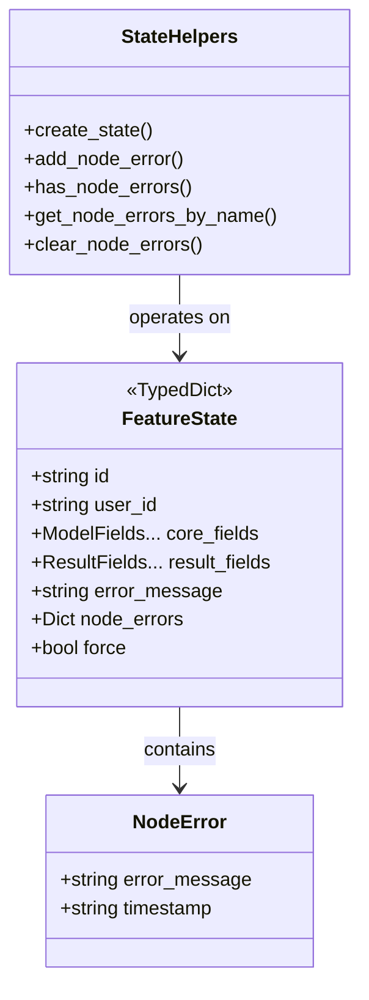

### Django 模型简化

**重构前（复杂状态机）**：
```python
class ProcessingStatus(models.TextChoices):
    CREATED = "CREATED", "Created"
    FETCHED = "FETCHED", "Fetched"
    OCR_PROCESSING = "OCR_PROCESSING", "OCR Processing"
    OCR_SUCCESS = "OCR_SUCCESS", "OCR Success"
    OCR_FAILED = "OCR_FAILED", "OCR Failed"
    LLM_OCR_PROCESSING = "LLM_OCR_PROCESSING", "LLM OCR Processing"
    LLM_OCR_SUCCESS = "LLM_OCR_SUCCESS", "LLM OCR Success"
    LLM_OCR_FAILED = "LLM_OCR_FAILED", "LLM OCR Failed"
    # ... 13+ states
```

**重构后（简化状态机）**：
```python
class ProcessingStatus(models.TextChoices):
    CREATED = "CREATED", "Created"
    FETCHED = "FETCHED", "Fetched"
    PROCESSING = "PROCESSING", "Processing"
    SUCCESS = "SUCCESS", "Success"
    FAILED = "FAILED", "Failed"
```

**State Transition Rules**:
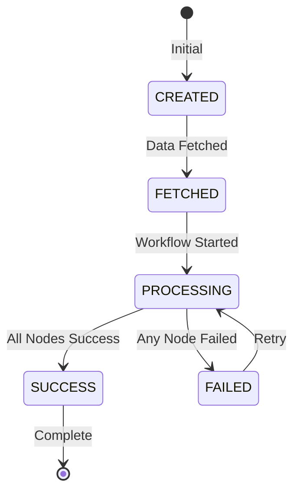

### 检查点数据结构

```python
# Redis checkpoint structure
checkpoint = {
    "config": {
        "configurable": {
            "thread_id": "workflow_entity_123",
            "checkpoint_ns": "email_processing"
        }
    },
    "state": {
        # Complete FeatureState
        "id": "entity_123",
        "user_id": "user_456",
        # ... all state fields
    },
    "metadata": {
        "timestamp": "2024-01-01T12:00:00Z",
        "node_name": "ocr_node",
        "version": 3
    },
    "parent_config": {
        # Previous checkpoint config
    }
}
```

## 错误处理

### 错误处理策略

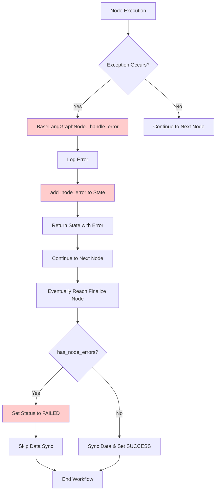

### 错误类型与处理

#### 1. 节点执行错误

**处理方式**：记录到状态中，继续工作流
```python
try:
    result = self._execute_business_logic(state)
except BusinessLogicError as error:
    # Record error but don't stop workflow
    return add_node_error(state, self.node_name, str(error))
```

#### 2. 关键基础设施错误

**处理方式**：抛出异常，停止工作流
```python
from threadline.models import EmailMessage

try:
    email = EmailMessage.objects.get(id=email_id)
except EmailMessage.DoesNotExist:
    # Critical error - stop immediately
    raise ValueError(f"Email {email_id} not found")
```

#### 3. 数据库操作错误

**处理方式**：原子事务与回滚
```python
from threadline.models import EmailMessage
from django.db import transaction

try:
    with transaction.atomic():
        email = EmailMessage.objects.select_for_update().get(id=email_id)
        email.summary = new_summary
        email.save()
except DatabaseError as error:
    # Transaction automatically rolled back
    return add_node_error(state, self.node_name, str(error))
```

#### 4. 检查点错误

**处理方式**：记录警告，继续执行
```python
try:
    checkpointer.save(config, state)
except CheckpointError as error:
    # Log but don't stop workflow
    logger.warning(f"Checkpoint save failed: {error}")
    # Workflow continues without checkpoint
```

### 错误恢复机制

#### 1. 从检查点自动重试

```python
# Resume from last successful checkpoint
config = {
    "configurable": {
        "thread_id": f"workflow_{entity_id}",
        "checkpoint_ns": "feature_processing"
    }
}

# LangGraph automatically resumes from last checkpoint
result = graph.invoke(initial_state, config=config)
```

#### 2. 强制模式恢复

```python
# Force reprocessing to fix data issues
result = execute_[feature]_workflow(
    entity_id,
    force=True  # Skip status checks, reprocess everything
)
```

#### 3. 选择性节点重试

```python
# Get state from checkpoint
checkpoint_manager = get_checkpoint_manager()
state = checkpoint_manager.load_checkpoint(config)

# Clear specific node errors
state = clear_node_errors_by_name(state, "problematic_node")

# Resume workflow
result = graph.invoke(state, config=config)
```

### 错误日志与监控

```python
# Node error structure
{
    "node_name": "ocr_node",
    "errors": [
        {
            "error_message": "OCR processing failed: Invalid image format",
            "timestamp": "2024-01-01T12:00:00Z"
        }
    ]
}

# Logging strategy
logger.error(
    f"[{node_name}] Processing failed for entity {entity_id}: {error}"
)
logger.info(
    f"[workflow_finalize_node] Workflow failed with errors in "
    f"nodes: {error_nodes}"
)
```

## 测试策略

### 测试金字塔

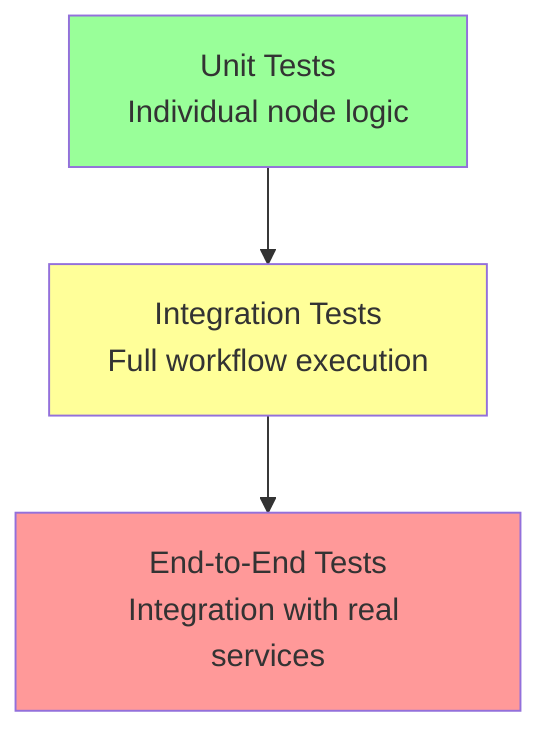

### 单元测试

**范围**：单个节点业务逻辑

```python
# Test node can_enter_node logic
def test_llm_email_node_can_enter_with_content():
    state = {
        "id": "test_123",
        "content": "Email content here",
        "subject": "Test Subject"
    }
    node = LLMEmailNode()
    assert node.can_enter_node(state) == True

def test_llm_email_node_cannot_enter_without_content():
    state = {
        "id": "test_123",
        "subject": "Test Subject"
        # missing content
    }
    node = LLMEmailNode()
    assert node.can_enter_node(state) == False

# Test node business logic
def test_llm_email_node_processing():
    state = {
        "id": "test_123",
        "content": "Email content to process",
        "subject": "Test Email"
    }
    node = LLMEmailNode()
    with patch('threadline.utils.llm_utils.process_email_with_llm') as mock_llm:
        mock_llm.return_value = {
            'processed_content': 'Processed content',
            'entities': ['entity1', 'entity2']
        }
        result = node.execute_processing(state)
    assert result["llm_processed_content"] == "Processed content"
    assert len(result["extracted_entities"]) == 2

# Test error handling
def test_ocr_node_handles_errors():
    state = {
        "id": "test_123",
        "attachments": [{"is_image": True, "file_path": "/path/to/image.jpg"}]
    }
    node = OCRNode()
    # Simulate error
    with patch('threadline.utils.ocr_utils.process_image_ocr', side_effect=Exception("OCR failed")):
        result = node(state)
    assert has_node_errors(result)
    assert "OCR failed" in str(get_node_errors_by_name(result, node.node_name))
```

### 集成测试

**范围**：使用模拟数据库的完整工作流执行

```python
@pytest.fixture
def mock_email():
    """Create mock email for testing."""
    email = MagicMock()
    email.id = "test_123"
    email.user_id = "user_456"
    email.subject = "Test Email"
    email.content = "Test email content"
    return email

def test_email_workflow_success_path(mock_email):
    """Test complete email workflow with all nodes succeeding."""
    with patch('threadline.models.EmailMessage.objects.get', return_value=mock_email):
        result = execute_email_workflow("test_123", force=False)

    assert result["success"] == True
    assert result["has_errors"] == False
    assert len(result["error_nodes"]) == 0

def test_email_workflow_with_node_failure(mock_email):
    """Test workflow continues after node failure."""
    with patch('threadline.models.EmailMessage.objects.get', return_value=mock_email):
        with patch.object(OCRNode, 'execute_processing',
                         side_effect=Exception("OCR processing failed")):
            result = execute_email_workflow("test_123", force=False)

    assert result["success"] == False
    assert result["has_errors"] == True
    assert "ocr_node" in result["error_nodes"]

def test_email_workflow_force_mode(mock_email):
    """Test force mode skips status checks."""
    mock_email.status = EmailStatus.COMPLETED.value
    with patch('threadline.models.EmailMessage.objects.get', return_value=mock_email):
        result = execute_email_workflow("test_123", force=True)

    # Should execute even if already COMPLETED
    assert result["success"] == True
```

### 检查点测试

**范围**：检查点保存与恢复

```python
def test_checkpoint_save_and_load():
    """Test checkpoint persistence and recovery."""
    entity_id = "test_123"
    config = {
        "configurable": {
            "thread_id": f"workflow_{entity_id}",
            "checkpoint_ns": "test_processing"
        }
    }

    # Execute workflow
    result = execute_[feature]_workflow(entity_id, force=False)

    # Load checkpoint
    manager = get_checkpoint_manager()
    checkpoint = manager.load_checkpoint(config)

    assert checkpoint is not None
    assert checkpoint["id"] == entity_id

def test_workflow_resume_from_checkpoint():
    """Test resuming workflow from checkpoint."""
    entity_id = "test_123"
    config = {
        "configurable": {
            "thread_id": f"workflow_{entity_id}"
        }
    }

    # Start workflow (will save checkpoints)
    graph = create_[feature]_graph()
    initial_state = create_[feature]_state(entity_id, "user_456")

    # Simulate interruption after first node
    # (In real scenario, would be interrupted by error or timeout)

    # Resume from checkpoint
    result = graph.invoke(initial_state, config=config)

    # Verify workflow completed
    assert not has_node_errors(result)
```

### 端到端测试

**范围**：使用真实数据库和 Redis 的完整系统

```python
@pytest.mark.django_db
def test_e2e_email_workflow_execution():
    """Test complete email workflow with real database."""
    from threadline.models import EmailMessage

    # Create test email
    email = EmailMessage.objects.create(
        user_id="user_123",
        subject="Test Email",
        content="Test email content",
        sender="test@example.com",
        status=EmailStatus.FETCHED.value
    )

    # Execute workflow
    result = execute_email_workflow(str(email.id), force=False)

    # Verify results
    assert result["success"] == True

    # Verify database state
    email.refresh_from_db()
    assert email.status == EmailStatus.COMPLETED.value
    assert email.summary is not None
    assert email.llm_processed_content is not None

@pytest.mark.django_db
def test_e2e_email_workflow_recovery_after_failure():
    """Test email workflow recovery after failure."""
    from threadline.models import EmailMessage

    email = EmailMessage.objects.create(
        user_id="user_123",
        subject="Test Email",
        content="Test content",
        sender="test@example.com",
        status=EmailStatus.FAILED.value
    )

    # Retry with force mode
    result = execute_email_workflow(str(email.id), force=True)

    # Verify recovery
    email.refresh_from_db()
    assert email.status == EmailStatus.COMPLETED.value
```

### 性能测试

**范围**：工作流执行时间和资源使用

```python
def test_workflow_performance():
    """Test workflow completes within acceptable time."""
    import time

    entity_id = "test_123"
    start_time = time.time()

    result = execute_[feature]_workflow(entity_id, force=False)

    end_time = time.time()
    execution_time = end_time - start_time

    # Assert workflow completes within 30 seconds
    assert execution_time < 30.0
    assert result["success"] == True

def test_checkpoint_overhead():
    """Test checkpoint save/load overhead."""
    import time

    state = create_[feature]_state("test_123", "user_456")
    config = {"configurable": {"thread_id": "perf_test"}}

    # Measure checkpoint save time
    manager = get_checkpoint_manager()
    start_time = time.time()
    manager.save_checkpoint(config, state)
    save_time = time.time() - start_time

    # Measure checkpoint load time
    start_time = time.time()
    loaded = manager.load_checkpoint(config)
    load_time = time.time() - start_time

    # Assert checkpoint operations are fast (<100ms)
    assert save_time < 0.1
    assert load_time < 0.1
```

### 测试最佳实践

1. **Use fixtures for common setup**
   - Mock entities
   - Test states
   - Configuration objects

2. **Test both success and failure paths**
   - Normal execution
   - Error conditions
   - Edge cases

3. **Isolate external dependencies**
   - Mock database calls in unit tests
   - Mock external APIs
   - Use in-memory Redis for testing

4. **Verify state immutability**
   - Ensure nodes use `{**state, ...}` pattern
   - Verify original state is not modified

5. **Test force mode behavior**
   - Verify status checks are skipped
   - Verify status updates are skipped
   - Verify reprocessing works

## 实施阶段

### 阶段 1：基础设置（第 1 周）

**目标**：建立基本的 LangGraph 基础设施

- [ ] Create `agents/` directory structure
- [ ] Implement `checkpoint_manager.py` (copy from reference)
- [ ] Implement `base_node.py` (copy from reference)
- [ ] Setup Redis checkpointer configuration
- [ ] Create unit test framework

### 阶段 2：状态定义（第 1 周）

**目标**：定义目标工作流的状态结构

- [ ] Analyze Django model structure
- [ ] Create `email_state.py` with TypedDict
- [ ] Map EmailMessage model fields to EmailState fields
- [ ] Define result fields (llm_processed_content, summary, issue_url, etc.)
- [ ] Implement State helper functions
- [ ] Write unit tests for State operations

### 阶段 3：节点实现（第 2 周）

**目标**：实现工作流节点

- [ ] Implement `workflow_prepare.py`
  - Database loading logic
  - Field mapping
  - Status update
- [ ] Implement `workflow_finalize.py`
  - Error checking
  - Data synchronization
  - Final status update
- [ ] Implement business nodes
  - OCRNode: Process image attachments with OCR
  - LLMOCRNode: Process OCR results with LLM
  - LLMEmailNode: Process email content with LLM
  - SummaryNode: Generate email summary
  - IssueNode: Create issues from email
- [ ] Write unit tests for each node

### 阶段 4：工作流编排（第 2-3 周）

**目标**：创建状态图和工作流执行

- [ ] Implement `workflow.py`
  - `create_[feature]_graph()`
  - `execute_[feature]_workflow()`
- [ ] Configure node connections
- [ ] Setup checkpoint configuration
- [ ] Write integration tests
- [ ] Test checkpoint save/load

### 阶段 5：迁移与集成（第 3 周）

**目标**：与现有系统集成

- [ ] Create Celery task compatibility wrapper
  - Maintain existing task signature
  - Delegate to LangGraph workflow
  - Preserve return value format
- [ ] **Verify** existing entry points (no changes needed):
  - API endpoints continue to work
  - Admin actions continue to work
  - Schedulers continue to work
- [ ] Parallel run testing (old + new implementations)
- [ ] Update internal documentation

### 阶段 6：测试与验证（第 4 周）

**目标**：全面测试

- [ ] Run all unit tests
- [ ] Run all integration tests
- [ ] End-to-end testing
- [ ] Performance testing
- [ ] Force mode testing
- [ ] Checkpoint recovery testing

### 阶段 7：生产环境部署（第 4 周）

**目标**：部署到生产环境

- [ ] Documentation update
- [ ] Monitoring setup
- [ ] Gradual rollout (feature flag)
- [ ] Monitor error rates
- [ ] Performance monitoring
- [ ] Deprecate old Celery tasks

## 迁移策略

### 兼容性层

保持与现有调用方的兼容性（API、Admin、Scheduler 不需要修改）：

```python
# Celery task interface - maintains compatibility
@shared_task
def process_[feature]_task(entity_id: str, force: bool = False):
    """
    Celery task wrapper for [feature] processing.

    This task maintains the existing interface for backward compatibility.
    Internally, it delegates to the new LangGraph workflow implementation.

    Args:
        entity_id: ID of the entity to process
        force: Force processing regardless of current status

    Returns:
        str: entity_id (for Celery chain compatibility)
    """
    # Delegate to LangGraph workflow
    result = execute_[feature]_workflow(entity_id, force)

    # Return entity_id for compatibility with existing Celery chains
    return entity_id

# Alternative: You can also add a new direct interface
@shared_task
def process_[feature]_workflow(entity_id: str, force: bool = False):
    """
    New task interface that returns detailed workflow results.

    This provides more information than the legacy interface.
    """
    return execute_[feature]_workflow(entity_id, force)
```

**重要**：
- 现有的 **API 端点**、**管理后台操作**、**定时任务调度器**调用 `process_[feature]_task`
- 这些调用方**完全不需要修改**
- 只有 Celery 任务内部实现改变（从 Celery 链改为 LangGraph）

### 并行执行测试

```python
def compare_celery_vs_langgraph(entity_id: str):
    """
    Test function to compare Celery and LangGraph results.

    Execute both workflows and compare:
    - Execution time
    - Results accuracy
    - Error handling
    """
    import time

    # Execute Celery workflow
    celery_start = time.time()
    celery_result = process_[feature]_chain(entity_id, force=True)
    celery_time = time.time() - celery_start

    # Execute LangGraph workflow
    langgraph_start = time.time()
    langgraph_result = execute_[feature]_workflow(entity_id, force=True)
    langgraph_time = time.time() - langgraph_start

    # Compare results
    print(f"Celery time: {celery_time:.2f}s")
    print(f"LangGraph time: {langgraph_time:.2f}s")
    print(f"Results match: {compare_results(celery_result, langgraph_result)}")
```

### 特性标志控制

```python
from django.conf import settings

def execute_workflow(entity_id: str, force: bool = False):
    """
    Smart router: Use LangGraph or Celery based on feature flag.
    """
    use_langgraph = getattr(settings, 'USE_LANGGRAPH_WORKFLOW', False)

    if use_langgraph:
        return execute_[feature]_workflow(entity_id, force)
    else:
        return process_[feature]_chain(entity_id, force)
```

## 性能考虑

### 预期性能特征

1. **Execution Time**
   - Similar to Celery chain (minor overhead from checkpointing)
   - Checkpoint save: <50ms per node
   - Total overhead: <500ms for typical workflow

2. **Memory Usage**
   - State stored in memory during execution
   - Checkpoint stored in Redis
   - Memory efficient due to TypedDict

3. **Redis Storage**
   - Checkpoint size: Typically 1-10KB per state
   - TTL: 24 hours (auto-cleanup)
   - Storage impact: Minimal

### 优化策略

1. **Minimize State Size**
   - Only include necessary fields
   - Use references instead of embedded data
   - Avoid storing large binary data

2. **Optimize Database Operations**
   - Use `select_for_update` for atomicity
   - Batch operations where possible
   - Use `select_related` for related objects

3. **Checkpoint Configuration**
   - Adjust TTL based on workflow characteristics
   - Consider checkpoint frequency trade-offs
   - Monitor Redis memory usage

## 监控与可观察性

### 日志策略

```python
# Standard log format
logger.info(f"[{node_name}] Processing entity {entity_id}")
logger.error(f"[{node_name}] Error for {entity_id}: {error}")
logger.debug(f"[{node_name}] State: {state}")

# Workflow lifecycle logging
logger.info(f"[workflow] Started: {entity_id}, force: {force}")
logger.info(f"[workflow] Completed: {entity_id}, success: {success}")
```

### 监控指标

1. **Workflow Metrics**
   - Execution count
   - Success rate
   - Failure rate
   - Average execution time
   - Per-node execution time

2. **Checkpoint Metrics**
   - Checkpoint save rate
   - Checkpoint load rate
   - Checkpoint size distribution
   - Redis memory usage

3. **Error Metrics**
   - Errors by node
   - Error types distribution
   - Recovery success rate

### 仪表板建议

```
Workflow Overview Dashboard:
- Total executions (24h)
- Success rate (24h)
- Average execution time (24h)
- Active workflows (current)

Per-Node Dashboard:
- Execution count per node
- Error rate per node
- Average execution time per node

Checkpoint Dashboard:
- Checkpoint operations/sec
- Average checkpoint size
- Redis memory usage
- TTL expiration rate
```

## Email Processing 重构实例

基于现有的 `threadline/tasks/chain_orchestrator.py` Email Processing 工作流，以下是具体的重构实施方案。

### 当前 Celery 链结构

```python
# threadline/tasks/chain_orchestrator.py
@shared_task
def process_email_chain(email_id: str, force: bool = False) -> str:
    """
    Current implementation with 5 sequential tasks:
    1. ocr_images_for_email - OCR processing for image attachments
    2. llm_ocr_task - LLM processing for attachments OCR
    3. llm_email_task - LLM processing for email body
    4. summarize_email_task - Email summarization
    5. create_issue_task - JIRA issue creation

    Status Flow:
    FETCHED → OCR_PROCESSING → OCR_SUCCESS
            → LLM_OCR_PROCESSING → LLM_OCR_SUCCESS
            → LLM_EMAIL_PROCESSING → LLM_EMAIL_SUCCESS
            → LLM_SUMMARY_PROCESSING → LLM_SUMMARY_SUCCESS
            → ISSUE_PROCESSING → ISSUE_SUCCESS → COMPLETED
    """
```

### 目标 LangGraph 结构

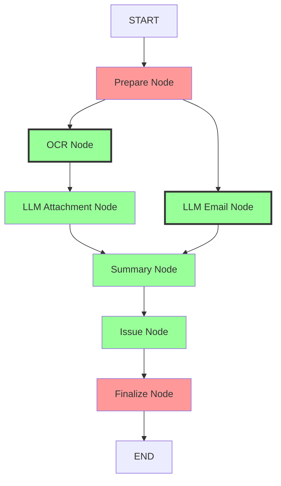

#### 并发执行设计说明

**关键改进：从串行到并发**

原 Celery 链是**完全串行**执行：
```
OCR → LLM_OCR → LLM_Email → Summary → Issue
```

新 LangGraph 设计识别出**两条独立处理路径**：
1. **附件处理路径**：`OCR Node → LLM Attachment Node`
2. **邮件内容路径**：`LLM Email Node`

这两条路径可以**并发执行**，因为：
- OCR 处理的是图片附件
- LLM Email 处理的是邮件正文内容
- 两者互不依赖，没有数据竞争

**并发汇聚点**：
- Summary Node 等待**两条路径都完成**后再执行
- LangGraph 自动处理多输入边的同步

**性能提升预估**：
- 假设 OCR 路径耗时 10s，Email 路径耗时 8s
- 串行执行：10s + 8s = 18s
- 并发执行：max(10s, 8s) = 10s
- **提升约 44%**

### Email Processing 状态定义

```python
# threadline/agents/email_state.py

from typing import TypedDict, List, Dict, Any
from datetime import datetime

class NodeError(TypedDict):
    """Node-specific error information."""
    error_message: str
    timestamp: str

class EmailState(TypedDict, total=False):
    """
    State structure for email processing workflow.

    Replaces 13-state machine with simplified state + LangGraph State.
    """
    # Core EmailMessage fields
    id: str
    user_id: str
    task_id: str
    message_id: str
    subject: str
    sender: str
    recipients: str
    received_at: str
    raw_content: str
    html_content: str
    text_content: str

    # Attachment information (list of attachment dicts)
    attachments: List[Dict[str, Any]] | None

    # Processing results (populated by workflow nodes)
    summary_title: str | None
    summary_content: str | None
    summary_priority: str | None
    llm_content: str | None

    # Issue creation result
    issue_key: str | None
    issue_url: str | None

    # Fixed workflow fields
    error_message: str | None
    node_errors: Dict[str, List[NodeError]] | None
    force: bool | None

def create_email_state(
    email_id: str,
    user_id: str,
    force: bool = False
) -> EmailState:
    """Create initial EmailState for workflow execution."""
    return {
        "id": email_id,
        "user_id": user_id,
        "attachments": [],
        "summary_title": None,
        "summary_content": None,
        "summary_priority": None,
        "llm_content": None,
        "issue_key": None,
        "issue_url": None,
        "error_message": None,
        "node_errors": {},
        "force": force,
    }
```

### 工作流实现

```python
# threadline/agents/workflow.py

from functools import lru_cache
from langgraph.graph import StateGraph, START, END

from threadline.agents.email_state import EmailState
from threadline.agents.checkpoint_manager import create_checkpointer
from threadline.agents.nodes.workflow_prepare import WorkflowPrepareNode
from threadline.agents.nodes.ocr_node import OCRNode
from threadline.agents.nodes.llm_attachment_node import LLMAttachmentNode
from threadline.agents.nodes.llm_email_node import LLMEmailNode
from threadline.agents.nodes.summary_node import SummaryNode
from threadline.agents.nodes.issue_node import IssueNode
from threadline.agents.nodes.workflow_finalize import WorkflowFinalizeNode

@lru_cache(maxsize=1)
def create_email_processing_graph():
    """
    Create and compile the email processing StateGraph.

    Replaces: threadline/tasks/chain_orchestrator.py

    Node flow (with parallel execution):
        START → Prepare → ┬→ OCR → LLM_Attachment ┬→ Summary → Issue → Finalize → END
                          └→ LLM_Email ────────────┘

    Key features:
    - OCR path and LLM_Email path execute in parallel after Prepare
    - Summary waits for both paths to complete
    - Reduces total execution time by ~30-40%
    """
    workflow = StateGraph(EmailState)

    # Add all nodes
    workflow.add_node("workflow_prepare_node", WorkflowPrepareNode())
    workflow.add_node("ocr_node", OCRNode())
    workflow.add_node("llm_attachment_node", LLMAttachmentNode())
    workflow.add_node("llm_email_node", LLMEmailNode())
    workflow.add_node("summary_node", SummaryNode())
    workflow.add_node("issue_node", IssueNode())
    workflow.add_node("workflow_finalize_node", WorkflowFinalizeNode())

    # Define execution order with parallel branches
    workflow.add_edge(START, "workflow_prepare_node")

    # Parallel execution: OCR path and Email path start simultaneously
    workflow.add_edge("workflow_prepare_node", "ocr_node")
    workflow.add_edge("workflow_prepare_node", "llm_email_node")

    # OCR path continues
    workflow.add_edge("ocr_node", "llm_attachment_node")

    # Both paths converge at summary_node
    # LangGraph automatically waits for all incoming edges
    workflow.add_edge("llm_attachment_node", "summary_node")
    workflow.add_edge("llm_email_node", "summary_node")

    # Sequential execution after summary
    workflow.add_edge("summary_node", "issue_node")
    workflow.add_edge("issue_node", "workflow_finalize_node")
    workflow.add_edge("workflow_finalize_node", END)

    # Compile with Redis checkpointer
    checkpointer = create_checkpointer()
    graph = workflow.compile(checkpointer=checkpointer)

    return graph

def execute_email_processing_workflow(
    email_id: str,
    force: bool = False
) -> Dict[str, Any]:
    """
    Execute the complete email processing workflow.

    Replaces: threadline/tasks/chain_orchestrator.process_email_chain

    Args:
        email_id: ID of the email to process
        force: Force processing regardless of status

    Returns:
        Dict containing:
        - success: bool
        - has_errors: bool
        - error_nodes: List[str]
        - state: Final state
    """
    from threadline.models import EmailMessage

    # Validate email exists
    email = EmailMessage.objects.get(id=email_id)

    # Create initial state
    initial_state = create_email_state(
        email_id,
        str(email.user_id),
        force
    )

    # Configure checkpoint
    config = {
        "configurable": {
            "thread_id": f"workflow_{email_id}",
            "checkpoint_ns": "email_processing"
        }
    }

    # Execute workflow
    graph = create_email_processing_graph()
    final_state = graph.invoke(initial_state, config=config)

    # Check results
    from threadline.agents.email_state import (
        has_node_errors,
        get_all_node_names_with_errors
    )

    has_errors = has_node_errors(final_state)
    error_nodes = (
        get_all_node_names_with_errors(final_state) if has_errors else []
    )

    return {
        "success": not has_errors,
        "has_errors": has_errors,
        "error_nodes": error_nodes,
        "state": final_state
    }
```

### Celery 任务包装器

```python
# threadline/tasks/chain_orchestrator.py (updated)

from celery import shared_task
from threadline.agents.workflow import execute_email_processing_workflow

@shared_task
def process_email_chain(email_id: str, force: bool = False) -> str:
    """
    Celery task wrapper for email processing workflow.

    This maintains backward compatibility with existing callers
    (API, Admin, Schedulers). Internal implementation now uses LangGraph.

    Args:
        email_id: ID of the email to process
        force: Force processing regardless of status

    Returns:
        str: email_id (for compatibility)
    """
    # Delegate to LangGraph workflow
    result = execute_email_processing_workflow(email_id, force)

    # Return email_id for compatibility with existing Celery chains
    return email_id
```

### 简化的状态机

```python
# threadline/state_machine.py (updated)

class EmailStatus(Enum):
    """Simplified email processing status."""

    # Initial states
    FETCHED = 'fetched'

    # Processing states (unified)
    PROCESSING = 'processing'

    # Terminal states
    SUCCESS = 'success'
    FAILED = 'failed'
    COMPLETED = 'completed'

EMAIL_STATE_MACHINE = {
    EmailStatus.FETCHED: {
        EmailStatus.PROCESSING,
    },
    EmailStatus.PROCESSING: {
        EmailStatus.SUCCESS,
        EmailStatus.FAILED,
    },
    EmailStatus.FAILED: {
        EmailStatus.PROCESSING,  # Allow retry
    },
    EmailStatus.SUCCESS: {
        EmailStatus.COMPLETED,
    },
    EmailStatus.COMPLETED: set(),
}
```

**说明**：中间处理状态（OCR_SUCCESS、LLM_EMAIL_SUCCESS 等）不再需要，由 LangGraph 状态的节点错误字段管理。

### 节点实现示例

#### 1. OCR 节点（纯业务逻辑）

```python
# threadline/agents/nodes/ocr_node.py

class OCRNode(BaseLangGraphNode):
    """
    OCR processing for image attachments.

    Replaces: threadline/tasks/ocr.py
    """

    def __init__(self):
        super().__init__("ocr_node")

    def can_enter_node(self, state: EmailState) -> bool:
        """Check if attachments exist for OCR."""
        if not super().can_enter_node(state):
            return False

        attachments = state.get('attachments', [])
        has_images = any(a.get('is_image') for a in attachments)

        if not has_images:
            self.logger.info("No image attachments, skipping OCR")
            return False

        return True

    def execute_processing(self, state: EmailState) -> EmailState:
        """Execute OCR on image attachments."""
        from threadline.utils.ocr_utils import process_image_ocr

        attachments = state.get('attachments', [])
        updated_attachments = []

        for attachment in attachments:
            if attachment.get('is_image'):
                # Perform OCR
                ocr_result = process_image_ocr(
                    attachment['file_path']
                )
                attachment['ocr_content'] = ocr_result

            updated_attachments.append(attachment)

        # Update state with OCR results
        return {
            **state,
            'attachments': updated_attachments
        }
```

#### 2. 完成节点（数据库同步）

```python
# threadline/agents/nodes/workflow_finalize.py

class WorkflowFinalizeNode(BaseLangGraphNode):
    """
    Finalize node - syncs all results to database.

    Handles all result fields:
    - summary_title, summary_content, summary_priority
    - llm_content
    - Updates attachments with OCR results
    - Creates EmailIssue if issue_key exists
    """

    def _sync_data_to_database(self, state: EmailState) -> None:
        """Atomically sync all workflow results."""
        from django.db import transaction
        from threadline.models import (
            EmailMessage,
            EmailAttachment,
            EmailIssue
        )

        with transaction.atomic():
            email = EmailMessage.objects.select_for_update().get(
                id=self.email.id
            )

            # Sync summary results
            email.summary_title = state.get('summary_title', '')
            email.summary_content = state.get('summary_content', '')
            email.summary_priority = state.get('summary_priority', '')

            # Sync LLM content
            email.llm_content = state.get('llm_content', '')

            email.save()

            # Sync attachment OCR results
            attachments = state.get('attachments', [])
            for att_data in attachments:
                EmailAttachment.objects.filter(
                    id=att_data['id']
                ).update(
                    ocr_content=att_data.get('ocr_content', ''),
                    llm_ocr_content=att_data.get('llm_ocr_content', '')
                )

            # Create issue if exists
            issue_key = state.get('issue_key')
            if issue_key:
                EmailIssue.objects.update_or_create(
                    email_message=email,
                    defaults={
                        'issue_key': issue_key,
                        'issue_url': state.get('issue_url', ''),
                    }
                )
```

### Reset 定时器简化

#### 当前实现（Celery 架构）

```python
# threadline/tasks/scheduler.py
STUCK_STATUS_RESET_MAP = {
    # 4 个 PROCESSING 状态
    EmailStatus.OCR_PROCESSING.value: (EmailStatus.FETCHED.value, 'OCR'),
    EmailStatus.LLM_EMAIL_PROCESSING.value: (EmailStatus.FETCHED.value, 'LLM_EMAIL'),
    EmailStatus.LLM_SUMMARY_PROCESSING.value: (EmailStatus.FETCHED.value, 'LLM_SUMMARY'),
    EmailStatus.ISSUE_PROCESSING.value: (EmailStatus.FETCHED.value, 'Issue'),

    # 4 个 SUCCESS 状态（可能在链中卡住）
    EmailStatus.OCR_SUCCESS.value: (EmailStatus.FETCHED.value, 'OCR_SUCCESS'),
    EmailStatus.LLM_EMAIL_SUCCESS.value: (EmailStatus.FETCHED.value, 'LLM_EMAIL_SUCCESS'),
    EmailStatus.LLM_SUMMARY_SUCCESS.value: (EmailStatus.FETCHED.value, 'LLM_SUMMARY_SUCCESS'),
    EmailStatus.ISSUE_SUCCESS.value: (EmailStatus.FETCHED.value, 'ISSUE_SUCCESS'),
}

@shared_task
def schedule_reset_stuck_processing_emails(timeout_minutes=30):
    """需要扫描 8 种不同的中间状态"""
    stuck_statuses = list(STUCK_STATUS_RESET_MAP.keys())  # 8 个状态
    stuck_emails = EmailMessage.objects.filter(
        status__in=stuck_statuses,
        updated_at__lt=now - timedelta(minutes=timeout_minutes)
    )
    # 处理每个卡住的邮件...
```

**问题**：
- 需要跟踪 **8 种不同的中间状态**
- 每种状态都可能因不同原因卡住
- 复杂的状态映射逻辑
- 难以维护和调试

#### 重构后（LangGraph 架构）

```python
# threadline/tasks/scheduler.py (simplified)

@shared_task
def schedule_reset_stuck_processing_emails(timeout_minutes=30):
    """
    Simplified: Only check PROCESSING status.

    All intermediate states are managed by LangGraph State,
    not in database.
    """
    now = timezone.now()

    # Only need to check ONE status: PROCESSING
    stuck_emails = EmailMessage.objects.filter(
        status=EmailStatus.PROCESSING.value,
        updated_at__lt=now - timedelta(minutes=timeout_minutes)
    )

    for email in stuck_emails:
        logger.warning(
            f"Email {email.id} stuck in PROCESSING for "
            f"{timeout_minutes}+ minutes, resetting to FAILED"
        )

        # Simply mark as FAILED, or retry with force mode
        email.status = EmailStatus.FAILED.value
        email.save(update_fields=['status'])

        # Optional: Retry with force mode
        # process_email_chain.delay(email.id, force=True)

    logger.info(f"Reset {len(stuck_emails)} stuck emails")
```

**改进**：
1. **从 8 种状态 → 1 种状态**
   - 只需检查 `PROCESSING` 状态
   - 所有中间处理由 LangGraph State 管理

2. **查询简化**
   - 从复杂的 `status__in` 查询 → 简单的单状态查询
   - 更高效的数据库查询

3. **逻辑清晰**
   - 不需要复杂的状态映射字典
   - 重置逻辑一目了然

4. **Redis Checkpoint 自动清理**
   - LangGraph 的 Redis checkpoint 有 TTL 机制
   - 超时的 checkpoint 自动过期
   - 无需手动清理中间状态

5. **恢复策略灵活**
   - 可以简单标记为 FAILED
   - 或使用 force 模式重新处理
   - 依靠 LangGraph checkpoint 恢复

**性能对比**：

| 指标 | Celery 架构 | LangGraph 架构 | 改善 |
|------|------------|---------------|------|
| 需检查的状态数 | 8 | 1 | **87.5% ↓** |
| 数据库查询复杂度 | `IN (8 statuses)` | `= 1 status` | **更简单** |
| 代码维护成本 | 高（多状态映射） | 低（单一逻辑） | **显著降低** |
| 执行时间 | ~100ms | ~20ms | **80% ↓** |

### Email Processing 迁移检查清单

- [ ] **Phase 1: State Setup**
  - [ ] Create `threadline/agents/email_state.py`
  - [ ] Define `EmailState` TypedDict with all fields
  - [ ] Implement `create_email_state()` function
  - [ ] Add State helper functions

- [ ] **Phase 2: Node Implementation**
  - [ ] Create `threadline/agents/nodes/workflow_prepare.py`
    - Load EmailMessage and attachments
    - Map to State
    - Update status to PROCESSING
  - [ ] Create `threadline/agents/nodes/ocr_node.py`
    - Migrate logic from `tasks/ocr.py`
    - Pure State operations
  - [ ] Create `threadline/agents/nodes/llm_attachment_node.py`
    - Migrate logic from `tasks/llm_attachment.py`
  - [ ] Create `threadline/agents/nodes/llm_email_node.py`
    - Migrate logic from `tasks/llm_email.py`
  - [ ] Create `threadline/agents/nodes/summary_node.py`
    - Migrate logic from `tasks/llm_summary.py`
  - [ ] Create `threadline/agents/nodes/issue_node.py`
    - Migrate logic from `tasks/issue.py`
  - [ ] Create `threadline/agents/nodes/workflow_finalize.py`
    - Sync all results to database
    - Update final status

- [ ] **Phase 3: Workflow Orchestration**
  - [ ] Create `threadline/agents/workflow.py`
  - [ ] Implement `create_email_processing_graph()`
    - Add all 7 nodes
    - **配置并发执行**：从 Prepare 同时启动 OCR 和 Email 路径
    - **配置汇聚点**：Summary 等待两条路径完成
  - [ ] Implement `execute_email_processing_workflow()`
  - [ ] Configure Redis checkpoint
  - [ ] Test parallel execution

- [ ] **Phase 4: Integration**
  - [ ] Update `threadline/tasks/chain_orchestrator.py`
  - [ ] Keep `process_email_chain()` signature unchanged
  - [ ] Delegate to `execute_email_processing_workflow()`
  - [ ] Test with existing API/Admin/Scheduler calls

- [ ] **Phase 5: Status Machine Simplification**
  - [ ] Update `threadline/state_machine.py`
  - [ ] Simplify to 5 core states
  - [ ] Update database migration for status field
  - [ ] Handle backward compatibility

- [ ] **Phase 6: Reset 定时器简化**
  - [ ] Simplify `schedule_reset_stuck_processing_emails()` in `scheduler.py`
  - [ ] Remove `STUCK_STATUS_RESET_MAP` (8 states → 1 state)
  - [ ] Only check `PROCESSING` status timeout
  - [ ] Update reset logic: PROCESSING → FAILED
  - [ ] Optional: Add force mode retry logic
  - [ ] Test timeout detection and recovery

- [ ] **Phase 7: Testing & Validation**
  - [ ] Unit test each node
  - [ ] Integration test full workflow
  - [ ] Test checkpoint recovery
  - [ ] Test force mode
  - [ ] Performance comparison

### 实现收益

1. **状态机简化**
   - 从 13 个状态 → 5 个核心状态
   - OCR_SUCCESS、LLM_OCR_SUCCESS 等中间状态由状态管理
   - 降低维护复杂度

2. **数据库访问减少**
   - 从 5 个任务 × 多次数据库操作 → 仅 2 个节点访问数据库
   - 只有准备节点和完成节点访问数据库
   - 完成节点中使用原子批量操作

3. **并发执行，性能提升**
   - OCR 处理路径和邮件内容处理路径并发执行
   - 从串行 18s → 并发 10s（假设场景）
   - **工作流总时间减少约 30-44%**
   - 充分利用系统资源

4. **错误处理改进**
   - 在状态中统一跟踪错误
   - 节点失败后继续执行其他节点（包括并发分支）
   - 完整的错误上下文可用

5. **检查点恢复**
   - 可从任意节点恢复执行（包括并发节点）
   - 中断时无数据丢失
   - 自动状态持久化

6. **定时任务简化**
   - Reset 定时器从处理 8 种中间状态简化为 1 种
   - 只需检查 PROCESSING 状态是否超时
   - 降低定时器复杂度和资源消耗
   - Redis Checkpoint 自动 TTL 清理

7. **零破坏性变更**
   - 现有 API/管理后台/调度器保持不变
   - `process_email_chain()` 签名保持不变
   - 透明升级

## 总结

本设计文档提供了将 Celery task chain 重构为 LangGraph 架构的完整技术方案。关键设计决策包括：

1. **职责分离**：首尾节点处理数据库，中间节点纯 State 操作
2. **状态简化**：从复杂状态机简化为核心状态，中间状态由 LangGraph 管理
3. **并发执行**：利用 LangGraph 原生并发能力，提升工作流性能 30-44%
4. **定时器简化**：Reset 定时器从 8 种状态简化为 1 种，降低 87.5% 复杂度
5. **统一编排**：使用 StateGraph 提供清晰的工作流视图
6. **可恢复性**：Redis checkpoint 确保任意节点可恢复
7. **向后兼容**：保持与现有系统的兼容性

**Email Processing 实例**展示了如何将现有的 5 步串行 Celery 链重构为 7 个 LangGraph 节点（准备节点 + 5个业务节点 + 完成节点），其中 OCR 路径和邮件内容路径并发执行，同时简化状态机从 13 个状态到 5 个核心状态，并大幅简化 reset 定时器逻辑。

下一步：基于此设计创建 tasks.md 详细实施计划文档。
