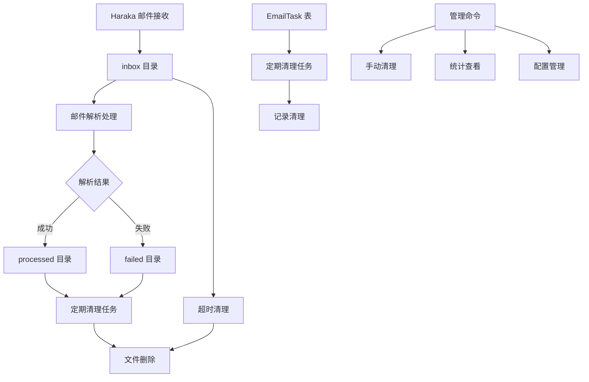

# 设计文档

## 概述

本设计文档基于邮件文件清理需求，实现一个完整的邮件文件存储管理系统。系统通过优化目录结构、实现定期清理任务、提供命令行工具等方式，确保邮件文件不会无限积累，有效管理磁盘空间。

## 架构

### 系统架构图



### 核心组件

1. **目录管理模块**：管理 inbox、processed、failed 目录
2. **清理任务模块**：定期清理过期文件
3. **命令行工具**：提供手动清理和监控功能
4. **配置管理**：管理清理参数和策略
5. **日志监控**：记录清理操作和统计信息

## 组件和接口

### 1. 目录结构优化

#### 当前目录结构
```
emails/
├── inbox/          # 新邮件目录
├── processing/     # 处理中目录（待移除）
└── failed/         # 失败邮件目录
```

#### 优化后目录结构
```
emails/
├── inbox/          # 新邮件目录
├── processed/      # 处理完成目录（新增）
└── failed/         # 失败邮件目录
```

#### 文件流转逻辑
1. **正常流程**：`inbox` → `processed` → 删除
2. **失败流程**：`inbox` → `failed` → 删除
3. **超时清理**：`inbox` → 直接删除

### 2. 清理任务模块

#### 任务类型
- **inbox 清理**：清理超过1小时的未处理邮件
- **processed 清理**：清理超过10分钟的处理完成邮件
- **failed 清理**：清理超过10分钟的失败邮件
- **EmailTask 清理**：清理超过3天的任务记录

#### 任务调度
```python
# Celery Beat 配置
CELERY_BEAT_SCHEDULE = {
    'haraka_cleanup': {
        'task': 'threadline.tasks.scheduler.schedule_haraka_cleanup',
        'schedule': crontab(minute='*/5'),  # 每5分钟运行
    },
    'email_task_cleanup': {
        'task': 'threadline.tasks.scheduler.schedule_email_task_cleanup',
        'schedule': crontab(minute=0, hour='*/6'),  # 每6小时运行
    },
}

# 文件结构
threadline/tasks/
├── scheduler.py              # 统一调度触发器
├── cleanup.py                # 清理实现逻辑
└── ... (其他现有任务)

# scheduler.py - 统一调度管理
@shared_task
def schedule_haraka_cleanup():
    """Haraka 邮件文件清理调度触发器"""
    from .cleanup import cleanup_haraka_files
    cleanup_haraka_files()

@shared_task
def schedule_email_task_cleanup():
    """EmailTask 表清理调度触发器"""
    from .cleanup import cleanup_email_tasks
    cleanup_email_tasks()

# cleanup.py - 具体清理实现
def cleanup_haraka_files():
    """Haraka 邮件文件清理实现"""
    pass

def cleanup_email_tasks():
    """EmailTask 表清理实现"""
    pass
```

### 3. 命令行工具

#### 管理命令：cleanup_email_files
```bash
# 查看统计信息
python manage.py cleanup_email_files --show-stats

# 预览清理操作
python manage.py cleanup_email_files --dry-run

# 清理特定目录
python manage.py cleanup_email_files --action inbox
python manage.py cleanup_email_files --action failed
python manage.py cleanup_email_files --action all

# 自定义清理时间
python manage.py cleanup_email_files --older-than-hours 2
python manage.py cleanup_email_files --older-than-days 1
```

#### 命令参数
- `--show-stats`：显示目录统计信息
- `--dry-run`：预览模式，不实际删除
- `--action`：指定清理类型（inbox/failed/all）
- `--older-than-hours`：inbox 清理时间（小时）
- `--older-than-days`：failed 清理时间（天）

### 4. 配置管理

#### 清理配置
```python
# settings/globals.py
import os

EMAIL_CLEANUP_CONFIG = {
    'inbox_timeout_hours': int(os.getenv('EMAIL_CLEANUP_INBOX_TIMEOUT_HOURS', '1')),
    'processed_timeout_minutes': int(os.getenv('EMAIL_CLEANUP_PROCESSED_TIMEOUT_MINUTES', '10')),
    'failed_timeout_minutes': int(os.getenv('EMAIL_CLEANUP_FAILED_TIMEOUT_MINUTES', '10')),
    'email_task_retention_days': int(os.getenv('EMAIL_CLEANUP_TASK_RETENTION_DAYS', '3')),
    'cleanup_interval_minutes': int(os.getenv('EMAIL_CLEANUP_INTERVAL_MINUTES', '5')),
}
```

#### 环境变量说明
- `EMAIL_CLEANUP_INBOX_TIMEOUT_HOURS`：inbox 超时时间（小时），默认 1
- `EMAIL_CLEANUP_PROCESSED_TIMEOUT_MINUTES`：processed 超时时间（分钟），默认 10
- `EMAIL_CLEANUP_FAILED_TIMEOUT_MINUTES`：failed 超时时间（分钟），默认 10
- `EMAIL_CLEANUP_TASK_RETENTION_DAYS`：EmailTask 保留天数，默认 3
- `EMAIL_CLEANUP_INTERVAL_MINUTES`：清理任务间隔（分钟），默认 5

## 数据模型

### 1. 失败邮件记录

#### 利用现有 EmailMessage 模型字段
EmailMessage 模型已经包含处理失败邮件所需的字段：
- `status`：邮件处理状态（已有完整状态机）
- `error_message`：错误信息（已有字段）
- `updated_at`：更新时间戳（可用于失败时间）

#### 状态与目录对应关系
```python
# 邮件状态与目录对应关系
FETCHED = 'fetched'           # 对应 processed 目录
FETCHED_FAILED = 'fetched_failed'  # 对应 failed 目录

# 在 EmailStatus 枚举中新增
class EmailStatus(Enum):
    # ... 现有状态 ...

    # 新增解析失败状态
    FETCHED_FAILED = 'fetched_failed'  # 邮件解析失败
```

### 2. 清理任务记录

#### 利用现有 EmailTask 模型
```python
# 清理任务类型
CLEANUP_TASK_TYPES = {
    'INBOX_CLEANUP': 'inbox_cleanup',
    'PROCESSED_CLEANUP': 'processed_cleanup',
    'FAILED_CLEANUP': 'failed_cleanup',
    'EMAIL_TASK_CLEANUP': 'email_task_cleanup',
}
```

## 错误处理

### 1. 清理任务错误处理
- **文件操作失败**：记录错误日志，继续处理其他文件
- **数据库操作失败**：回滚事务，记录错误
- **权限错误**：记录警告，跳过该文件
- **磁盘空间不足**：记录错误，停止清理

### 2. 命令行工具错误处理
- **参数验证**：提供清晰的错误信息
- **文件不存在**：优雅处理，显示友好提示
- **权限不足**：提供解决建议

### 3. 日志记录
```python
# 日志级别
logger.info("清理任务开始执行")
logger.warning("文件权限不足，跳过处理")
logger.error("清理任务执行失败")
logger.debug("详细清理统计信息")
```

## 测试策略

### 1. 单元测试
- **目录操作测试**：测试文件移动、删除操作
- **清理逻辑测试**：测试各种清理条件
- **配置管理测试**：测试配置加载和验证
- **命令行工具测试**：测试各种参数组合

### 2. 集成测试
- **端到端清理测试**：测试完整清理流程
- **并发清理测试**：测试多任务并发清理
- **错误恢复测试**：测试清理失败后的恢复

## 实现计划

### 阶段1：目录结构优化
1. 修改邮件处理流程，移除 processing 目录
2. 实现 processed 目录的文件管理
3. 更新文件移动逻辑

### 阶段2：清理任务实现
1. 在 `threadline.tasks/` 目录中创建清理相关文件：
   - `cleanup.py` - 清理实现逻辑（邮件文件清理、EmailTask 表清理）
   - 更新 `scheduler.py` - 添加清理任务的调度触发器
2. 调度与实现分离，便于维护和测试

### 阶段3：命令行工具
1. 实现 Django 管理命令
2. 添加参数验证和帮助信息
3. 实现统计信息显示

### 阶段4：集成和测试
1. 集成到 Celery Beat 调度
2. 编写单元测试和集成测试
3. 性能测试和优化

## 监控和维护

### 1. 基础监控
- **日志记录**：记录清理任务的执行情况和统计信息
- **命令行工具**：通过 `cleanup_email_files` 命令查看清理统计
- **EmailTask 记录**：在 EmailTask 表中记录清理任务执行情况

### 2. 维护操作
- **手动清理**：使用命令行工具进行手动清理和测试
- **配置调整**：通过环境变量调整清理参数
- **日志查看**：查看清理任务的执行日志

### 3. 简单维护
- **定期检查**：定期运行命令行工具检查清理效果
- **参数调优**：根据实际使用情况调整超时时间
