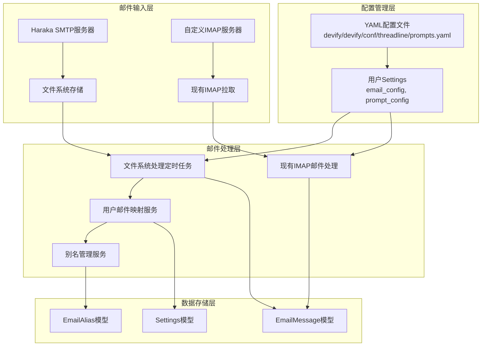

# Haraka 邮件模式切换功能设计文档

## 概述

本设计文档基于已确认的需求文档，详细描述了Haraka邮件模式切换功能的技术架构、组件设计和实现方案。该功能将为Devify系统添加两种邮件处理模式：自动分配模式和自定义IMAP模式，同时支持多语言场景化的提示词配置管理。

**重要注意**：本系统面向国际用户，必须充分考虑国际化(i18n)需求，支持多语言、多时区、多文化的使用场景。

## 架构设计

### 系统架构图



### 核心组件关系

1. **邮件接收**：Haraka SMTP → 文件系统 / 自定义IMAP → 现有处理
2. **配置管理**：YAML模板 → 用户Settings
3. **邮件处理**：文件系统定时任务 → 用户映射 → 现有处理链路
4. **别名管理**：独立的别名服务管理用户别名

## 国际化设计

### 支持的语言列表
基于当前YAML配置文件，系统支持以下语言：

- **zh-CN**：简体中文
- **en-US**：英语（默认语言）

**语言降级策略**：
- 任何其他语言代码（如ja-JP, ko-KR等）都会自动降级使用英语配置
- 系统通过YAML文件动态检测可用语言，无需硬编码语言列表

### 国际化实现策略

1. **语言检测和降级**
   - 支持完整的语言代码（如zh-CN）
   - 语言降级机制：zh-CN → zh → en-US
   - 默认语言：en-US

2. **YAML配置扩展性**
   - 配置文件支持添加新语言而无需代码修改
   - 模板化的提示词结构便于翻译
   - 场景和语言的矩阵式配置

3. **API国际化支持**
   - Accept-Language头部支持
   - 错误消息的多语言化
   - API响应的本地化

### 环境变量配置

为支持国际化和灵活部署，需要在Docker环境变量中配置以下参数：

```bash
# .env 文件中的环境变量
AUTO_ASSIGN_EMAIL_DOMAIN=aimychats.com           # 自动分配邮箱的域名
DEFAULT_LANGUAGE=en-US                            # 系统默认语言
DEFAULT_SCENE=chat                                # 系统默认场景
THREADLINE_CONFIG_PATH=/opt/devify/conf/threadline  # 配置文件路径
```

**Django settings.py 中的配置**：
```python
# settings/globals.py 或 settings.py
AUTO_ASSIGN_EMAIL_DOMAIN = os.getenv('AUTO_ASSIGN_EMAIL_DOMAIN', 'aimychats.com')
DEFAULT_LANGUAGE = os.getenv('DEFAULT_LANGUAGE', 'en-US')
DEFAULT_SCENE = os.getenv('DEFAULT_SCENE', 'chat')
THREADLINE_CONFIG_PATH = os.getenv('THREADLINE_CONFIG_PATH', '/opt/devify/conf/threadline')
```

**注意**：
- 语言支持通过YAML配置文件动态管理，目前支持zh-CN和en-US
- 其他语言自动降级使用默认语言（DEFAULT_LANGUAGE）
- 场景支持chat和product_issue，默认使用DEFAULT_SCENE
- 配置文件暂时打包在镜像内部，不通过Docker volume映射

## 组件和接口设计

### 1. 配置结构重构

#### 新的email_config结构
```python
# Settings模型中的email_config
{
    "email_mode": "auto_assign",  # 或 "custom_imap"
    "auto_assign_domain": settings.AUTO_ASSIGN_EMAIL_DOMAIN,  # 从Django settings读取
    "custom_imap_config": {
        "imap_host": "imap.example.com",
        "imap_port": 993,
        "username": "user@example.com",
        "password": "password",
        "use_ssl": true,
        "filter_config": {
            "folder": "INBOX",
            "filters": ["unread"],
            "exclude_patterns": ["spam", "newsletter"],
            "max_age_days": 7
        }
    }
}
```

#### 新的prompt_config结构
```python
# Settings模型中的prompt_config
{
    "language": "zh-CN",  # 用户语言偏好
    "scene": "chat",  # 用户当前场景
    "email_content_prompt": "...",
    "ocr_prompt": "...",
    "summary_prompt": "...",
    "summary_title_prompt": "..."
}
```

### 2. 文件系统邮件处理服务

#### EmailProcessor统一处理器
**文件位置**：`threadline/utils/email_processor.py`

```python
# threadline/utils/email_processor.py
class EmailProcessor:
    """
    Unified email processor supporting multiple sources and parsers.

    Features:
    - Multiple email sources: IMAP or file system
    - Multiple parsers: legacy EmailParser or enhanced EmailFlankerParser
    - Database integration for file-based processing
    - Flexible configuration through parameters
    """

    def __init__(self, source=EmailSource.IMAP, parser_type=ParserType.FLANKER,
                 email_config=None, file_config=None):
        # 支持多种邮件源：IMAP、文件系统
        # 支持多种解析器：legacy、flanker
        pass

    def process_emails(self):
        """处理邮件的主方法，支持多种源"""
        pass
```

#### 文件系统处理定时任务
```python
# threadline/tasks/scheduler.py
@shared_task(bind=True, max_retries=3)
def process_file_emails_task(self):
    """
    Celery task to process file-based emails from Haraka
    Processes emails from inbox directory and moves them to appropriate folders
    """
    processor = EmailProcessor(
        source=EmailSource.FILE,
        parser_type='flanker'
    )
    # 处理文件系统中的邮件
    pass

@shared_task
def schedule_user_email_scanning():
    """
    Schedule email scanning for all users based on their configuration
    """
    # 根据用户配置自动检测邮件源并处理
    pass
```

#### 邮件源自动检测
```python
# threadline/management/commands/process_emails.py
def _detect_email_source(self, email_config):
    """
    Auto-detect email source based on user configuration.

    Returns:
        EmailSource enum (IMAP or FILE)
    """
    mode = email_config.get('mode', 'custom_imap')

    if mode == 'auto_assign':
        # Auto-assign mode uses file system processing
        return EmailSource.FILE
    elif mode == 'custom_imap':
        # Custom IMAP mode uses IMAP server processing
        return EmailSource.IMAP
    # 支持向后兼容的检测逻辑
    pass
```

### 3. 多语言配置管理服务

#### PromptConfigManager类
**文件位置**：`threadline/utils/prompt_config_manager.py`

```python
# threadline/utils/prompt_config_manager.py
import os
from django.conf import settings

class PromptConfigManager:
    def __init__(self):
        config_dir = getattr(settings, 'THREADLINE_CONFIG_PATH', '/opt/devify/conf/threadline')
        self.config_path = os.path.join(config_dir, 'prompts.yaml')
        self.yaml_config = self._load_yaml_config()
        self.default_config = self._load_default_config()

    def load_yaml_config(self):
        """加载YAML配置文件"""
        pass

    def get_scene_config(self, scene, language):
        """获取特定场景和语言的配置（支持语言降级）"""
        # 尝试完整语言代码，然后降级，最后使用英语
        pass

    def get_prompt_config(self, scene, language):
        """获取特定场景和语言的提示词配置（支持国际化）"""
        # 支持语言降级机制：zh-CN → zh → en-US
        pass

    def _normalize_language(self, language):
        """标准化语言代码并处理降级（基于YAML文件中的可用语言）"""
        # 检查YAML配置中是否存在该语言
        if self.yaml_config and 'scene_prompt_config' in self.yaml_config:
            # 检查任一场景中是否有该语言配置
            for scene_config in self.yaml_config['scene_prompt_config'].values():
                if language in scene_config:
                    return language

        # 如果是中文相关语言，尝试降级到zh-CN
        if language.startswith('zh'):
            if self._language_exists_in_yaml('zh-CN'):
                return 'zh-CN'

        # 最终降级到默认语言
        from django.conf import settings
        return getattr(settings, 'DEFAULT_LANGUAGE', 'en-US')

    def _language_exists_in_yaml(self, language):
        """检查YAML配置中是否存在指定语言"""
        if not self.yaml_config or 'scene_prompt_config' not in self.yaml_config:
            return False

        for scene_config in self.yaml_config['scene_prompt_config'].values():
            if language in scene_config:
                return True
        return False

    def generate_user_config(self, language, scene):
        """为用户生成配置（支持国际化）"""
        normalized_language = self._normalize_language(language)
        return self.get_prompt_config(scene, normalized_language)

    def _load_default_config(self):
        """加载内置默认配置（英语）"""
        pass
```

### 4. 邮件别名管理服务

#### EmailAlias数据模型
```python
class EmailAlias(models.Model):
    user = models.ForeignKey(User, on_delete=models.CASCADE)
    alias = models.CharField(max_length=255, unique=True)
    domain = models.CharField(max_length=255, default="aimychats.com")
    created_at = models.DateTimeField(auto_now_add=True)
    updated_at = models.DateTimeField(auto_now=True)

    class Meta:
        unique_together = ['alias', 'domain']

    def full_email_address(self):
        return f"{self.alias}@{self.domain}"
```

#### EmailAlias模型方法
```python
class EmailAlias(models.Model):
    # ... 字段定义

    @classmethod
    def validate_alias_uniqueness(cls, alias, domain=None):
        """验证别名唯一性"""
        if domain is None:
            from django.conf import settings
            domain = getattr(settings, 'AUTO_ASSIGN_EMAIL_DOMAIN', 'aimychats.com')
        return not cls.objects.filter(alias=alias, domain=domain).exists()

    @classmethod
    def find_user_by_email(cls, email_address):
        """根据邮件地址查找用户（支持别名）"""
        try:
            alias_name, domain = email_address.split('@')
            alias_obj = cls.objects.get(alias=alias_name, domain=domain, is_active=True)
            return alias_obj.user
        except (cls.DoesNotExist, ValueError):
            return None

    def full_email_address(self):
        """返回完整邮箱地址"""
        return f"{self.alias}@{self.domain}"
```

#### API接口设计

**路由组织**：
- **语言和场景配置**：复用现有Settings接口 `/api/settings/`
- **邮件别名管理**：放在settings路由下 `/api/settings/email-aliases/`

```python
# threadline/views.py
from rest_framework.views import APIView
from rest_framework.permissions import IsAuthenticated
from drf_spectacular.utils import extend_schema

class EmailAliasAPIView(APIView):
    """邮件别名管理API - 路由: /api/settings/email-aliases/"""
    permission_classes = [IsAuthenticated]

    @extend_schema(
        summary="获取用户别名列表",
        description="获取当前用户的所有邮件别名"
    )
    def get(self, request):
        """获取用户别名列表（自动过滤当前用户的数据）"""
        aliases = EmailAlias.objects.filter(user=request.user, is_active=True)
        # 返回序列化后的别名列表
        pass

    @extend_schema(
        summary="创建新别名",
        description="为当前用户创建新的邮件别名，包含唯一性验证"
    )
    def post(self, request):
        """创建新别名（自动设置当前用户）"""
        # 验证别名唯一性
        # 创建别名并关联到request.user
        pass

class EmailAliasDetailAPIView(APIView):
    """单个别名管理API - 路由: /api/settings/email-aliases/{id}/"""
    permission_classes = [IsAuthenticated]

    @extend_schema(
        summary="更新别名",
        description="更新用户的邮件别名"
    )
    def put(self, request, alias_id):
        """更新别名（只能更新自己的别名）"""
        pass

    @extend_schema(
        summary="删除别名",
        description="删除用户的邮件别名"
    )
    def delete(self, request, alias_id):
        """删除别名（只能删除自己的别名）"""
        pass

class EmailAliasValidationAPIView(APIView):
    """别名唯一性验证API - 路由: /api/settings/email-aliases/validate/"""
    permission_classes = [IsAuthenticated]

    @extend_schema(
        summary="验证别名唯一性",
        description="检查别名是否已被其他用户使用"
    )
    def post(self, request):
        """验证别名唯一性的专用端点"""
        pass
```

#### 路由配置示例
```python
# threadline/urls.py 或相应的路由文件
urlpatterns = [
    # 复用现有Settings接口
    path('api/settings/', SettingsAPIView.as_view(), name='settings'),

    # 邮件别名管理接口（放在settings下）
    path('api/settings/email-aliases/', EmailAliasAPIView.as_view(), name='email-aliases'),
    path('api/settings/email-aliases/<int:alias_id>/', EmailAliasDetailAPIView.as_view(), name='email-alias-detail'),
    path('api/settings/email-aliases/validate/', EmailAliasValidationAPIView.as_view(), name='email-alias-validate'),
]
```

### 5. 用户注册API扩展

#### 自定义用户注册APIView
**文件位置**：`accounts/views.py`（扩展现有accounts应用）

```python
# accounts/views.py
from dj_rest_auth.registration.views import RegisterView
from django.db import transaction

class CustomRegisterView(RegisterView):
    """自定义用户注册API（扩展dj_rest_auth的RegisterView）"""

    @transaction.atomic
    def create(self, request, *args, **kwargs):
        """重写create方法，添加邮件配置初始化"""
        # 调用父类的注册逻辑
        response = super().create(request, *args, **kwargs)

        if response.status_code == 201:  # 注册成功
            # 获取新创建的用户
            user = self.user

            # 新增：邮件配置初始化（支持国际化）
            from django.conf import settings
            language = request.data.get('language', settings.DEFAULT_LANGUAGE)
            scene = request.data.get('scene', settings.DEFAULT_SCENE)

            # 验证语言代码的有效性
            if not self._is_supported_language(language):
                language = settings.DEFAULT_LANGUAGE  # 降级到默认语言

            self._initialize_email_config(user, language, scene)

        return response

    def _is_supported_language(self, language):
        """检查语言是否受支持（基于YAML配置）"""
        from threadline.utils.prompt_config_manager import PromptConfigManager
        config_manager = PromptConfigManager()
        return config_manager._language_exists_in_yaml(language)

    def _initialize_email_config(self, user, language, scene):
        """初始化用户邮件配置的辅助方法"""
        # 创建email_config
        from django.conf import settings
        email_config = {
            "email_mode": "auto_assign",
            "auto_assign_domain": getattr(settings, 'AUTO_ASSIGN_EMAIL_DOMAIN', 'aimychats.com')
        }
        Settings.objects.create(
            user=user,
            key="email_config",
            value=email_config
        )

        # 创建prompt_config（支持国际化）
        from threadline.utils.prompt_config_manager import PromptConfigManager
        config_manager = PromptConfigManager()
        template_config = config_manager.get_prompt_config(scene, language)

        prompt_config = {
            "language": language,
            "scene": scene
        }
        prompt_config.update(template_config)

        Settings.objects.create(
            user=user,
            key="prompt_config",
            value=prompt_config
        )
```

#### URL配置更新
```python
# auth/urls.py 中需要更新注册路由
from .views import CustomRegisterView

urlpatterns = [
    # ... 其他路由

    # 替换原有的RegisterView
    path(
        'api/v1/auth/registration',
        CustomRegisterView.as_view(),  # 使用自定义的注册视图
        name='rest_register'
    ),

    # ... 其他路由
]
```

## 数据模型设计

### 1. Settings模型扩展
现有Settings模型无需修改，但需要支持新的配置结构：

```python
# 新的配置键值对
email_config = {
    "email_mode": "auto_assign|custom_imap",
    "auto_assign_domain": "aimychats.com",
    "custom_imap_config": {...}
}

prompt_config = {
    "language": "zh-CN|en-US",  # 同时用作output_language
    "scene": "chat|product_issue",
    "email_content_prompt": "...",
    "ocr_prompt": "...",
    "summary_prompt": "...",
    "summary_title_prompt": "..."
}
```

### 2. EmailAlias模型
```python
class EmailAlias(models.Model):
    user = models.ForeignKey(User, on_delete=models.CASCADE, related_name='email_aliases')
    alias = models.CharField(max_length=255)
    domain = models.CharField(max_length=255)  # 不设置default，在save时从settings读取
    is_active = models.BooleanField(default=True)
    created_at = models.DateTimeField(auto_now_add=True)
    updated_at = models.DateTimeField(auto_now=True)

    class Meta:
        unique_together = ['alias', 'domain']
        indexes = [
            models.Index(fields=['alias', 'domain']),
            models.Index(fields=['user', 'is_active']),
        ]

    def save(self, *args, **kwargs):
        """保存时设置默认domain"""
        if not self.domain:
            from django.conf import settings
            self.domain = getattr(settings, 'AUTO_ASSIGN_EMAIL_DOMAIN', 'aimychats.com')
        super().save(*args, **kwargs)
```

## 错误处理策略

### 1. 配置重构错误处理
- 代码重构过程中的兼容性检查
- 新配置格式的验证机制
- 配置访问失败的降级处理

### 2. Haraka队列处理错误处理
- Redis连接失败的重试机制
- 邮件数据格式错误的跳过逻辑
- 用户映射失败的日志记录

### 3. YAML配置错误处理
- 配置文件缺失的内置默认配置
- YAML格式错误的降级机制
- 语言/场景缺失的默认值处理

### 4. 别名管理错误处理
- 别名唯一性冲突的错误提示
- 别名格式验证的错误信息
- 别名删除确认的安全机制

## 测试策略

### 1. 单元测试
- 配置结构转换逻辑测试
- 邮件地址解析和用户映射测试
- YAML配置加载和解析测试
- 别名唯一性验证测试

### 2. 集成测试
- Haraka到Redis到处理的完整流程测试
- 不同邮件模式的端到端测试
- 多语言配置的集成测试
- 别名管理的完整流程测试

### 3. 性能测试
- 大量邮件处理的性能测试
- Redis队列的并发处理测试
- YAML配置加载的性能测试

### 4. 错误场景测试
- 配置文件缺失场景测试
- 网络连接失败场景测试
- 数据格式错误场景测试
- 并发别名创建冲突测试
