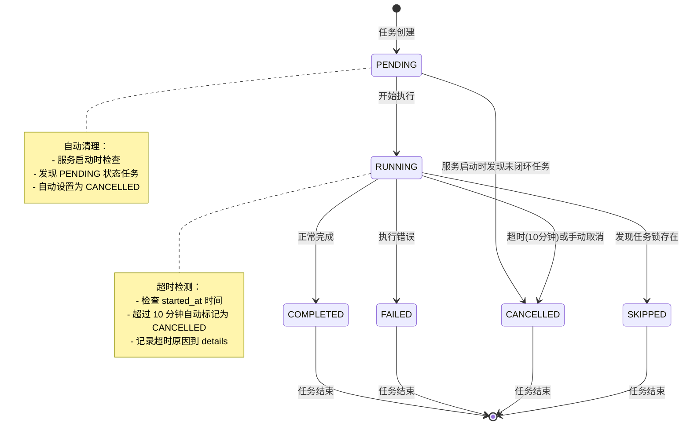
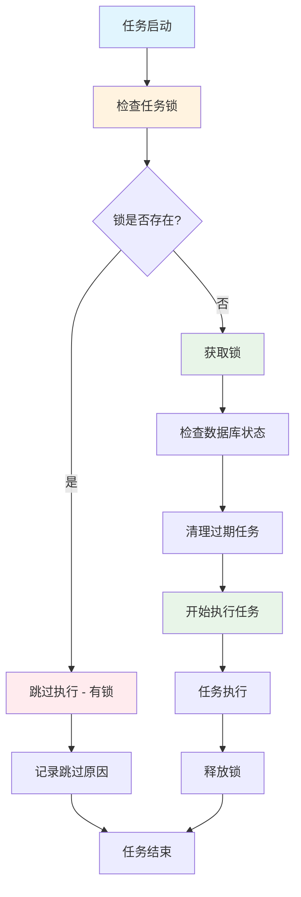
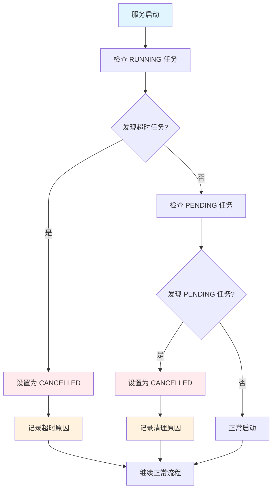

# 邮件收取架构优化设计

## 系统架构设计

### 1. 整体架构图

```mermaid
graph TB
    subgraph "调度层"
        A[schedule_email_fetch]
        A1[创建任务记录]
        A2[任务锁机制]
        A3[状态管理]
        A4[错误处理]
        A --> A1
        A --> A2
        A --> A3
        A --> A4
    end

    subgraph "任务层"
        B[imap_email_fetch_task]
        B1[遍历用户]
        B2[收取邮件]
        B3[更新统计]
        B4[保存邮件]

        C[haraka_email_fetch_task]
        C1[收取邮件]
        C2[找到用户]
        C3[更新统计]
        C4[保存邮件]

        B --> B1
        B --> B2
        B --> B3
        B --> B4

        C --> C1
        C --> C2
        C --> C3
        C --> C4
    end

    subgraph "业务层"
        D[EmailSaveService]
        D1[save_email]
        D2[process_attachments]
        D3[find_user]
        D4[handle_error]

        D --> D1
        D --> D2
        D --> D3
        D --> D4
    end

    subgraph "工具层"
        E[EmailConfigManager]
        E1[detect_email_source]
        E2[get_email_config]
        E3[validate_config]

        E --> E1
        E --> E2
        E --> E3
    end

    subgraph "处理层"
        E[EmailParser]
        E1[parse_bytes]
        E2[parse_string]
        E3[validate_email]
        E4[extract_attachments]

        E --> E1
        E --> E2
        E --> E3
        E --> E4
    end

    subgraph "数据源层"
        F[IMAPClient]
        F1[connect]
        F2[scan_emails]
        F3[disconnect]

        G[FileSystem]
        G1[scan_inbox]
        G2[load_data]
        G3[move_files]

        F --> F1
        F --> F2
        F --> F3

        G --> G1
        G --> G2
        G --> G3
    end

    subgraph "数据层"
        H[EmailTask]
        H1[状态跟踪]
        H2[执行记录]
        H3[状态管理]
        H4[超时检测]

        I[EmailMessage]
        I1[邮件存储]
        I2[用户关联]
        I3[附件关联]

        H --> H1
        H --> H2
        H --> H3
        H --> H4

        I --> I1
        I --> I2
        I --> I3
    end

    A --> B
    A --> C
    B --> D
    C --> D
    D --> E
    E --> F
    E --> G
    B --> H
    C --> H
    D --> I
    F --> I
    G --> I

    style A fill:#e1f5fe
    style B fill:#f3e5f5
    style C fill:#f3e5f5
    style D fill:#e8f5e8
    style E fill:#fff3e0
    style F fill:#fce4ec
    style G fill:#fce4ec
    style H fill:#f1f8e9
    style I fill:#f1f8e9
```



### 1.1 任务状态机流程图



### 1.2 任务启动流程



### 1.3 超时检测和清理机制



### 2. 核心组件设计

#### 2.1 基于现有 EmailTask 模型的扩展

现有的 `EmailTask` 模型已经包含了基本功能，需要扩展以下字段：

```python
# 现有 EmailTask 模型字段：
# - user: 用户关联
# - status: 任务状态 (PENDING, RUNNING, COMPLETED, FAILED, CANCELLED)
# - started_at: 开始时间
# - completed_at: 完成时间
# - emails_processed: 处理的邮件数量
# - emails_created_issues: 创建的工单数量
# - error_message: 错误信息
# - created_at: 创建时间

# 需要添加的字段：
class EmailTaskExtension:
    """
    扩展 EmailTask 模型功能
    """

    # 任务标识
    task_id = models.CharField(max_length=255, unique=True, help_text="Celery task ID")
    email_source = models.CharField(max_length=20, choices=[
        ('IMAP_EMAIL_FETCH', 'IMAP Email Fetch'),
        ('HARAKA_EMAIL_FETCH', 'Haraka Email Fetch'),
    ], help_text="Email source type")

    # 超时管理
    timeout_at = models.DateTimeField(null=True, blank=True, help_text="Task timeout time")

    # 执行统计
    emails_fetched = models.IntegerField(default=0, help_text="Number of emails fetched")
    emails_saved = models.IntegerField(default=0, help_text="Number of emails saved")
    emails_failed = models.IntegerField(default=0, help_text="Number of emails failed")

    # Execution details
    details = models.JSONField(default=dict, help_text="Execution details and logs")
    error_message = models.TextField(blank=True, help_text="Error message")

    # Timeout management
    timeout_seconds = models.IntegerField(default=600, help_text="Timeout in seconds")

    class Meta:
        db_table = 'email_tasks'
        ordering = ['-created_at']
        indexes = [
            models.Index(fields=['status']),
            models.Index(fields=['email_source']),
            models.Index(fields=['created_at']),
        ]

    def __str__(self):
        return f"EmailTask({self.id}): {self.email_source}-{self.status}"

    def update_status(self, status: str, details: dict = None):
        """Update task status"""
        self.status = status
        if details:
            self.details.update(details)

        if status == 'RUNNING' and not self.started_at:
            self.started_at = timezone.now()
        elif status in ['COMPLETED', 'FAILED', 'CANCELLED', 'SKIPPED']:
            self.completed_at = timezone.now()

        self.save(update_fields=['status', 'details', 'started_at', 'completed_at'])

    def is_timeout(self) -> bool:
        """Check if task is timeout"""
        if not self.started_at or self.status in ['COMPLETED', 'FAILED', 'CANCELLED', 'SKIPPED']:
            return False

        timeout_delta = timedelta(seconds=self.timeout_seconds)
        return timezone.now() - self.started_at > timeout_delta

    def add_execution_log(self, step: str, message: str, level: str = 'INFO'):
        """Add execution log"""
        if 'execution_logs' not in self.details:
            self.details['execution_logs'] = []

        self.details['execution_logs'].append({
            'timestamp': timezone.now().isoformat(),
            'step': step,
            'message': message,
            'level': level
        })
        self.save(update_fields=['details'])

def cleanup_stale_tasks():
    """
    Clean up expired tasks

    Functions:
    1. Clean up timed out RUNNING tasks
    2. Clean up PENDING status tasks
    3. Automatically set to CANCELLED status
    4. Record cleanup reasons

    Note: Redis locks expire automatically, no manual cleanup needed
    """
    now = timezone.now()
    timeout_threshold = now - timedelta(minutes=10)

    # 1. Clean up timed out RUNNING tasks
    running_tasks = EmailTask.objects.filter(
        status='RUNNING',
        started_at__lt=timeout_threshold
    )

    for task in running_tasks:
        task.update_status('CANCELLED', {
            'reason': 'Task timeout auto-cancelled',
            'timeout_seconds': 600,
            'execution_logs': [{
                'timestamp': now.isoformat(),
                'step': 'TIMEOUT_CLEANUP',
                'message': f'Task timeout auto-cancelled, running time exceeded 10 minutes',
                'level': 'WARNING'
            }]
        })
        logger.warning(f"Task {task.id} cancelled due to timeout")

    # 2. Clean up PENDING status tasks
    pending_tasks = EmailTask.objects.filter(status='PENDING')

    for task in pending_tasks:
        task.update_status('CANCELLED', {
            'reason': 'Unclosed task found on service startup',
            'execution_logs': [{
                'timestamp': now.isoformat(),
                'step': 'STARTUP_CLEANUP',
                'message': 'PENDING status task found on service startup, auto-cancelled',
                'level': 'INFO'
            }]
        })
        logger.info(f"Task {task.id} cancelled due to pending status on startup")

    # Record cleanup statistics
    cleaned_count = running_tasks.count() + pending_tasks.count()
    if cleaned_count > 0:
        logger.info(f"Cleaned up {cleaned_count} stale tasks")

def release_task_lock_by_task(task):
    """
    Release corresponding lock based on task type

    Args:
        task: EmailTask instance
    """
    try:
        if task.email_source == 'IMAP_EMAIL_FETCH':
            release_task_lock('imap_email_fetch_task')
        elif task.email_source == 'HARAKA_EMAIL_FETCH':
            release_task_lock('haraka_email_fetch_task')

        logger.info(f"Released lock for task {task.id} ({task.email_source})")
    except Exception as exc:
        logger.error(f"Failed to release lock for task {task.id}: {exc}")


def acquire_task_lock(lock_name: str, timeout: int = 600) -> bool:
    """
    Acquire task lock

    Args:
        lock_name: Lock name
        timeout: Timeout in seconds

    Returns:
        bool: Whether lock was acquired successfully
    """
    from django.core.cache import cache

    lock_key = f"email_fetch_lock:{lock_name}"
    lock_value = f"{timezone.now().isoformat()}:{os.getpid()}"

    # Try to acquire lock with expiration time
    acquired = cache.add(lock_key, lock_value, timeout)

    if acquired:
        logger.info(f"Acquired task lock: {lock_name}")
    else:
        logger.warning(f"Failed to acquire task lock: {lock_name}")

    return acquired

def release_task_lock(lock_name: str):
    """
    Release task lock

    Args:
        lock_name: Lock name
    """
    from django.core.cache import cache

    lock_key = f"email_fetch_lock:{lock_name}"
    cache.delete(lock_key)
    logger.info(f"Released task lock: {lock_name}")
```

#### 2.2 调度器设计

```python
@shared_task
@prevent_duplicate_task("email_fetch", timeout=600)
def schedule_email_fetch():
    """
    邮件收取调度器

    功能：
    1. 检查任务锁
    2. 清理过期任务
    3. 同时调度 IMAP 邮件收取任务和 Haraka 邮件收取任务
    4. 任务锁机制（10分钟超时）
    5. 错误处理和监控
    """
    # Scheduler doesn't need EmailTask record

    try:
        logger.info("Starting email fetch scheduling")

        # Scheduler doesn't need EmailTask record
        # It only coordinates other handlers

        # Check task lock (before checking database status)
        if not acquire_task_lock('email_fetch', timeout=600):
            logger.warning("Task lock exists, skipping execution")
            return {'status': 'skipped', 'reason': 'task_lock_exists'}

        # Check unclosed state machines
        cleanup_stale_tasks()

        # Schedule both email fetch tasks
        imap_result = imap_email_fetch_task.delay()
        haraka_result = haraka_email_fetch_task.delay()

        logger.info(f"IMAP email fetch task started: {imap_result.id}")
        logger.info(f"Haraka email fetch task started: {haraka_result.id}")

        return {
            'imap_email_fetch_task_id': imap_result.id,
            'haraka_email_fetch_task_id': haraka_result.id,
            'status': 'scheduled'
        }

    except Exception as exc:
        logger.error(f"Email fetch scheduling failed: {exc}")
        raise
    finally:
        # Release task lock
        release_task_lock('email_fetch')

#### 2.3 定期清理任务设计

```python
@shared_task
def cleanup_tasks():
    """
    定期清理邮件任务记录

    功能：
    1. 清理超过1天的已完成任务
    2. 保留必要的审计日志和统计信息
    3. 清理失败任务但保留错误信息
    4. 释放相关锁和资源
    """
    try:
        logger.info("Starting tasks cleanup")

        # Calculate cleanup time threshold
        cleanup_threshold = timezone.now() - timedelta(days=1)

        # Clean up completed normal tasks
        completed_tasks = EmailTask.objects.filter(
            status='COMPLETED',
            completed_at__lt=cleanup_threshold
        )

        completed_count = completed_tasks.count()
        if completed_count > 0:
            # Preserve statistics to audit log
            for task in completed_tasks:
                audit_log = {
                    'task_id': task.task_id,
                    'email_source': task.email_source,
                    'emails_processed': task.emails_processed,
                    'execution_time': (task.completed_at - task.started_at).total_seconds() if task.started_at and task.completed_at else 0,
                    'cleaned_at': timezone.now().isoformat()
                }

                # Save to audit log table (if exists)
                # AuditLog.objects.create(
                #     action='EMAIL_TASK_CLEANUP',
                #     details=audit_log
                # )

                logger.info(f"Audit log created for completed task {task.id}")

            # Delete completed task records
            completed_tasks.delete()
            logger.info(f"Cleaned up {completed_count} completed tasks")

        # Clean up timed out failed tasks (preserve error information)
        failed_tasks = EmailTask.objects.filter(
            status='FAILED',
            completed_at__lt=cleanup_threshold
        )

        failed_count = failed_tasks.count()
        if failed_count > 0:
            # Preserve error information to audit log
            for task in failed_tasks:
                error_audit = {
                    'task_id': task.task_id,
                    'email_source': task.email_source,
                    'error_message': task.error_message,
                    'details': task.details,
                    'cleaned_at': timezone.now().isoformat()
                }

                # Save error audit log
                # ErrorAuditLog.objects.create(
                #     action='EMAIL_TASK_ERROR_CLEANUP',
                #     details=error_audit
                # )

                logger.info(f"Error audit log created for failed task {task.id}")

            failed_tasks.delete()
            logger.info(f"Cleaned up {failed_count} failed tasks")

        # Clean up cancelled tasks
        cancelled_tasks = EmailTask.objects.filter(
            status__in=['CANCELLED', 'SKIPPED'],
            completed_at__lt=cleanup_threshold
        )

        cancelled_count = cancelled_tasks.count()
        if cancelled_count > 0:
            cancelled_tasks.delete()
            logger.info(f"Cleaned up {cancelled_count} cancelled/skipped tasks")

        total_cleaned = completed_count + failed_count + cancelled_count
        logger.info(f"Tasks cleanup completed: {total_cleaned} tasks cleaned")

        return {
            'completed_cleaned': completed_count,
            'failed_cleaned': failed_count,
            'cancelled_cleaned': cancelled_count,
            'total_cleaned': total_cleaned,
            'status': 'completed'
        }

    except Exception as exc:
        logger.error(f"Tasks cleanup failed: {exc}")
        raise

@shared_task
def startup_cleanup():
    """
    服务启动时的任务清理

    功能：
    1. 清理因服务重启导致的未完成任务
    2. 记录清理原因到系统日志
    3. 释放相关锁和资源
    """
    try:
        logger.info("Starting startup task cleanup")

        # Clean up all incomplete tasks
        incomplete_tasks = EmailTask.objects.filter(
            status__in=['PENDING', 'RUNNING']
        )

        cleaned_count = 0
        for task in incomplete_tasks:
            task.update_status('CANCELLED', {
                'reason': 'Task cleanup due to service restart',
                'execution_logs': [{
                    'timestamp': timezone.now().isoformat(),
                    'step': 'STARTUP_CLEANUP',
                    'message': 'Incomplete task found on service restart, auto-cancelled',
                    'level': 'INFO'
                }]
            })
            cleaned_count += 1
            logger.info(f"Task {task.id} cancelled due to service restart")

        # Release all possible locks
        force_release_all_locks()

        logger.info(f"Startup cleanup completed: {cleaned_count} tasks cleaned")

        return {
            'cleaned_tasks': cleaned_count,
            'status': 'completed'
        }

    except Exception as exc:
        logger.error(f"Startup cleanup failed: {exc}")
        raise

def force_release_all_locks():
    """
    强制释放所有任务锁

    功能：
    1. 清理所有可能的任务锁
    2. 记录清理统计
    3. 确保系统可以正常启动
    """
    try:
        from django.core.cache import cache

        # Define all possible lock keys
        all_lock_keys = [
            'email_fetch_lock:email_fetch',
            'email_fetch_lock:imap_email_fetch_task',
            'email_fetch_lock:haraka_email_fetch_task'
        ]

        # Batch delete all locks
        deleted_count = cache.delete_many(all_lock_keys)

        logger.info(f"Force released {deleted_count} locks during startup cleanup")

    except Exception as exc:
        logger.error(f"Failed to force release locks: {exc}")
```

#### 2.4 IMAP 邮件收取任务设计

```python
@shared_task
@prevent_duplicate_task("imap_email_fetch_task", timeout=600)
def imap_email_fetch_task():
    """
    IMAP 邮件收取任务

    功能：
    1. 遍历所有活跃用户的 IMAP 配置
    2. 为每个用户收取邮件
    3. 更新 EmailTask 统计信息
    4. 使用邮件保存服务
    5. 独立的错误处理和监控
    """
    # IMAP email fetch task creates its own EmailTask record
    handler_task = None

    try:
        logger.info("Starting IMAP email fetch task")

        # Create email fetch task record
        handler_task = EmailTask.objects.create(
            task_id=imap_email_fetch_task.request.id,
            email_source='IMAP_EMAIL_FETCH',
            status='PENDING',
            timeout_seconds=600  # 10 minutes timeout
        )
        handler_task.add_execution_log('INIT', 'IMAP email fetch task started')

        # Update status to running
        handler_task.update_status('RUNNING')

        # Get all active users
        active_users = User.objects.filter(is_active=True)
        processed_count = 0
        error_count = 0
        emails_processed = 0

        for user in active_users:
            try:
                handler_task.add_execution_log('USER_PROCESS', f'Starting to process user {user.id}')

                # Check if user has IMAP config
                from threadline.utils.email_config import EmailConfigManager
                email_config = EmailConfigManager.get_email_config(user.id)
                if not email_config or 'imap_config' not in email_config:
                    logger.debug(f"User {user.id} has no IMAP config, skipping")
                    handler_task.add_execution_log('USER_SKIP', f'User {user.id} has no IMAP config, skipping')
                    continue

                # Fetch emails for each user
                result = fetch_imap_emails_for_user(user.id)
                processed_count += 1
                emails_processed += result.get('emails_processed', 0)

                handler_task.add_execution_log('USER_SUCCESS', f'User {user.id} processing completed: {result}')
                logger.info(f"IMAP fetch completed for user {user.id}: {result}")

            except Exception as exc:
                error_count += 1
                handler_task.add_execution_log('USER_ERROR', f'User {user.id} processing failed: {str(exc)}', 'ERROR')
                logger.error(f"IMAP fetch failed for user {user.id}: {exc}")

        # Update statistics
        handler_task.emails_processed = emails_processed
        handler_task.save(update_fields=['emails_processed'])

        # Statistics are handled by handler_task itself

        # Update status to completed
        handler_task.update_status('COMPLETED', {
            'execution_logs': [{
                'timestamp': timezone.now().isoformat(),
                'step': 'COMPLETE',
                'message': f'IMAP Handler completed: {processed_count} users processed, {error_count} errors',
                'level': 'INFO'
            }]
        })

        handler_task.add_execution_log('COMPLETE', f'IMAP Handler completed: {processed_count} users processed, {error_count} errors')
        logger.info(f"IMAP handler completed: {processed_count} users processed, {error_count} errors")

        return {
            'processed_users': processed_count,
            'emails_processed': emails_processed,
            'errors': error_count,
            'status': 'completed'
        }

    except Exception as exc:
        logger.error(f"IMAP handler failed: {exc}")
        if handler_task:
            handler_task.update_status('FAILED', {
                'error_message': str(exc),
                'execution_logs': [{
                    'timestamp': timezone.now().isoformat(),
                    'step': 'ERROR',
                    'message': f'IMAP Handler失败: {str(exc)}',
                    'level': 'ERROR'
                }]
            })
        raise
```

#### 2.3 Haraka 邮件收取任务设计

```python
@shared_task
@prevent_duplicate_task("haraka_email_fetch_task", timeout=600)
def haraka_email_fetch_task():
    """
    Haraka 邮件收取任务

    功能：
    1. 收取所有 Haraka 邮件
    2. 根据邮件内容过滤和分配给用户
    3. 使用邮件保存服务
    4. 独立的错误处理和监控
    """
    try:
        logger.info("Starting Haraka email fetch task")

        # Create email save service
        save_service = EmailSaveService()

        # 使用现有的 EmailProcessor 处理 Haraka 邮件
        from threadline.utils.email_processor import EmailProcessor
        processor = EmailProcessor(
            source='file',
            parser_type='flanker',
            file_config={'email_directory': '/path/to/haraka/emails'}
        )

        processed_count = 0
        error_count = 0

        # Process all Haraka emails (全局处理，自动分配用户)
        for email_data in processor.process_emails():
            try:
                # 根据邮件收件人信息自动找到对应用户
                user = save_service.find_user_by_recipient(email_data)
                if not user:
                    logger.warning(f"No user found for email recipient: {email_data.get('recipients')}")
                    continue

                # 直接保存邮件到相应用户
                email_msg = save_service.save_email(user.id, email_data)
                processed_count += 1

                logger.info(f"Haraka email saved: {email_msg.id} for user {user.id}")

            except Exception as exc:
                error_count += 1
                logger.error(f"Failed to process Haraka email: {exc}")

        logger.info(f"Haraka handler completed: {processed_count} emails processed, {error_count} errors")

        return {
            'emails_processed': processed_count,
            'errors': error_count,
            'status': 'completed'
        }

    except Exception as exc:
        logger.error(f"Haraka handler failed: {exc}")
        raise
```

#### 2.4 邮件保存服务设计

```python
class EmailSaveService:
    """
    邮件保存服务

    职责：
    1. 邮件保存逻辑
    2. 附件处理逻辑
    3. 用户分配逻辑
    4. 错误处理
    """

    def __init__(self):
        pass

    def save_email_to_database(self, user: User, email_data: Dict) -> EmailMessage:
        """
        保存邮件到数据库

        Args:
            user: 用户对象
            email_data: 解析后的邮件数据

        Returns:
            EmailMessage instance
        """
        try:
        # Create EmailMessage record (without task field)
        email_msg = EmailMessage.objects.create(
            user=user,
            subject=email_data['subject'],
            sender=email_data['sender'],
            recipients=email_data['recipients'],
            received_at=email_data['received_at'],
            raw_content=email_data['raw_content'],
            html_content=email_data.get('html_content', ''),
            text_content=email_data.get('text_content', ''),
            message_id=email_data['message_id'],
            status=EmailStatus.FETCHED.value,
        )

            # Process attachments
            attachments = email_data.get('attachments', [])
            if attachments:
                self.process_attachments(user, email_msg, attachments)

            return email_msg

        except Exception as exc:
            logger.error(f"Failed to save email to database: {exc}")
            raise

    def __init__(self):
        # Cache user email mappings to avoid repeated queries
        self._user_email_cache = {}
        self._alias_cache = {}
        self._cache_loaded = False

    def _load_user_cache(self):
        """Load user email and alias cache"""
        if self._cache_loaded:
            return

        logger.info("Loading user email cache...")

        # Batch load all user emails
        users = User.objects.filter(is_active=True).values('id', 'email')
        for user in users:
            if user['email']:
                self._user_email_cache[user['email']] = user['id']

        # Batch load all email aliases
        from threadline.models import EmailAlias
        aliases = EmailAlias.objects.filter(is_active=True).values('email_address', 'user_id')
        for alias in aliases:
            self._alias_cache[alias['email_address']] = alias['user_id']

        self._cache_loaded = True
        logger.info(f"User cache loaded: {len(self._user_email_cache)} emails, {len(self._alias_cache)} aliases")

    def refresh_cache(self):
        """Refresh user cache"""
        self._cache_loaded = False
        self._user_email_cache.clear()
        self._alias_cache.clear()
        self._load_user_cache()

    def find_user_by_recipient(self, email_data: Dict) -> Optional[User]:
        """
        Find user based on email recipient addresses (optimized version)

        Args:
            email_data: Parsed email data

        Returns:
            User instance or None if no user found
        """
        try:
            # Ensure cache is loaded
            self._load_user_cache()

            # Find user based on recipient addresses
            recipients = email_data.get('recipients', [])
            if not recipients:
                logger.warning("No recipients found in email")
                return None

            # Find matching users in cache
            for recipient in recipients:
                # 1. First check user email cache
                user_id = self._user_email_cache.get(recipient)
                if user_id:
                    user = User.objects.get(id=user_id)
                    logger.debug(f"Found user by email: {user.username}")
                    return user

                # 2. Check alias cache
                user_id = self._alias_cache.get(recipient)
                if user_id:
                    user = User.objects.get(id=user_id)
                    logger.debug(f"Found user by alias: {user.username}")
                    return user

            logger.warning(f"No user found for recipients: {recipients}")
            return None

        except Exception as exc:
            logger.error(f"Failed to find user: {exc}")
            return None

    def process_attachments(self, email_msg: EmailMessage, attachments: List[Dict]) -> List[EmailAttachment]:
        """
        处理邮件附件

        Args:
            email_msg: EmailMessage instance
            attachments: List of attachment data

        Returns:
            List of EmailAttachment instances
        """
        try:
            created_attachments = []
            message_id = email_msg.message_id

            # 创建附件目录
            attachment_dir = os.path.join(
                settings.EMAIL_ATTACHMENT_STORAGE_PATH,
                message_id
            )
            os.makedirs(attachment_dir, exist_ok=True)

            for att in attachments:
                # 移动附件文件
                old_path = att.get('file_path', '')
                filename = os.path.basename(old_path)
                new_path = os.path.join(attachment_dir, filename)

                if old_path and os.path.exists(old_path):
                    shutil.move(old_path, new_path)
                    att['file_path'] = new_path

                # 创建 EmailAttachment 记录
                email_att = EmailAttachment.objects.create(
                    user=self.user,
                    email_message=email_msg,
                    filename=att.get('filename', 'unknown'),
                    safe_filename=att.get('safe_filename', ''),
                    content_type=att.get('content_type', ''),
                    file_size=att.get('file_size', 0),
                    file_path=att['file_path'],
                    is_image=att.get('is_image', False),
                )

                created_attachments.append(email_att)

            return created_attachments

        except Exception as exc:
            logger.error(f"Failed to process attachments: {exc}")
            raise

    def _email_exists(self, message_id: str) -> bool:
        """检查邮件是否已存在"""
        return EmailMessage.objects.filter(
            user=self.user,
            message_id=message_id
        ).exists()

    def _update_fetch_config(self, new_emails: List[Dict]):
        """更新收取配置"""
        try:
            if self.email_source == EmailSource.IMAP:
                # 更新最后收取时间
                max_received = max(mail['received_at'] for mail in new_emails)
                self.email_config['filter_config']['last_email_fetch_time'] = max_received.isoformat()

                # 保存配置
                Settings.objects.filter(
                    user_id=self.user_id,
                    key='email_config',
                    is_active=True
                ).update(value=self.email_config)

        except Exception as exc:
            logger.error(f"Failed to update fetch config: {exc}")

    @staticmethod
    def validate_imap_config(config: Dict) -> bool:
        """
        验证 IMAP 配置

        Args:
            config: IMAP 配置字典

        Returns:
            配置是否有效
        """
        required_fields = ['host', 'port', 'username', 'password']
        imap_config = config.get('imap_config', {})

        for field in required_fields:
            if not imap_config.get(field):
                logger.warning(f"Missing required IMAP field: {field}")
                return False

        # 验证端口号
        port = imap_config.get('port')
        if not isinstance(port, int) or port <= 0 or port > 65535:
            logger.warning(f"Invalid IMAP port: {port}")
            return False

        return True

    @staticmethod
    def update_fetch_config(user_id: int, config: Dict) -> bool:
        """
        更新收取配置

        Args:
            user_id: 用户ID
            config: 新配置

        Returns:
            更新是否成功
        """
        try:
            # 验证配置
            if not EmailConfigManager.validate_imap_config(config):
                return False

            # 更新配置
            Settings.objects.filter(
                user_id=user_id,
                key='email_config',
                is_active=True
            ).update(value=config)

            logger.info(f"Email config updated for user {user_id}")
            return True

        except Exception as exc:
            logger.error(f"Failed to update fetch config: {exc}")
            return False
```

#### 2.3 邮件配置工具类设计

```python
# 文件位置：devify/threadline/utils/email_config.py
class EmailConfigManager:
    """
    邮件配置管理器 (工具类)

    位置：devify/threadline/utils/email_config.py

    职责：
    1. 配置检测
    2. 配置验证
    3. 配置更新
    """

    @staticmethod
    def detect_email_source(user_id: int) -> EmailSource:
        """
        检测用户邮件源类型

        Args:
            user_id: 用户ID

        Returns:
            EmailSource enum value
        """
        try:
            from threadline.utils.email_config import EmailConfigManager
            email_config = EmailConfigManager.get_email_config(user_id)

            # 检查是否有 imap_config
            if 'imap_config' in email_config:
                return EmailSource.IMAP
            # 检查是否有 file_config 或 auto_assign 模式
            elif 'file_config' in email_config or email_config.get('mode') == 'auto_assign':
                return EmailSource.FILE
            else:
                # 默认使用 IMAP 模式（向后兼容）
                return EmailSource.IMAP

        except Exception as exc:
            logger.error(f"Failed to detect email source for user {user_id}: {exc}")
            return EmailSource.IMAP

    @staticmethod
    def get_email_config(user_id: int) -> Dict:
        """
        获取用户邮件配置

        Args:
            user_id: 用户ID

        Returns:
            Email configuration dictionary
        """
        try:
            email_setting = Settings.objects.get(
                user_id=user_id,
                key='email_config',
                is_active=True
            )
            return email_setting.value

        except Settings.DoesNotExist:
            logger.warning(f"No email_config found for user {user_id}")
            return {}

    @staticmethod
    def update_fetch_time(user_id: int, last_fetch_time: datetime):
        """
        更新最后收取时间

        Args:
            user_id: 用户ID
            last_fetch_time: 最后收取时间
        """
        try:
            from threadline.utils.email_config import EmailConfigManager
            email_config = EmailConfigManager.get_email_config(user_id)
            if email_config:
                email_config['filter_config']['last_email_fetch_time'] = last_fetch_time.isoformat()

                Settings.objects.filter(
                    user_id=user_id,
                    key='email_config',
                    is_active=True
                ).update(value=email_config)

        except Exception as exc:
            logger.error(f"Failed to update fetch time for user {user_id}: {exc}")
```

#### 2.4 简化的 EmailParser 设计

```python
class EmailParser:
    """
    简化的邮件处理器

    职责：
    1. 邮件解析和内容提取
    2. 附件处理
    3. 邮件验证
    4. 不包含数据库操作
    """

    def __init__(
        self,
        source: Union[EmailSource, str] = EmailSource.IMAP,
        parser_type: Union[ParserType, str] = ParserType.FLANKER,
        email_config: Optional[Dict] = None,
        attachment_storage_path: str = '/tmp/attachments',
        file_config: Optional[Dict] = None
    ):
        # 初始化逻辑保持不变
        pass

    def process_emails(self) -> Generator[Dict, None, None]:
        """
        处理邮件（不包含数据库操作）

        Returns:
            Generator of parsed email data dictionaries
        """
        if self.source == EmailSource.IMAP:
            yield from self._process_imap_emails()
        elif self.source == EmailSource.FILE:
            yield from self._process_file_emails()
        else:
            raise ValueError(f"Unsupported email source: {self.source}")

    # 其他方法保持不变，但移除数据库操作相关代码
```

### 3. 任务设计

#### 3.1 IMAP 邮件收取任务

```python
@shared_task
@prevent_duplicate_task("fetch_imap_emails", user_id_param="user_id", timeout=300)
def fetch_imap_emails_for_user(user_id: int):
    """
    为指定用户收取 IMAP 邮件

    Args:
        user_id: 用户ID
    """
    try:
        from threadline.utils.email_config import EmailConfigManager
        from threadline.utils.email_processor import EmailProcessor
        from threadline.utils.email_save_service import EmailSaveService

        # 获取用户邮件配置
        email_config = EmailConfigManager.get_email_config(user_id)
        if not email_config or 'imap_config' not in email_config:
            logger.warning(f"User {user_id} has no IMAP config")
            return {'status': 'skipped', 'reason': 'no_imap_config'}

        # 使用现有的 EmailProcessor 处理邮件
        processor = EmailProcessor(
            source='imap',
            parser_type='flanker',
            email_config=email_config['imap_config']
        )

        save_service = EmailSaveService()
        processed_count = 0
        error_count = 0

        # 处理邮件
        for email_data in processor.process_emails():
            try:
                # 保存邮件到数据库
                save_service.save_email(user_id, email_data)
                processed_count += 1
            except Exception as exc:
                error_count += 1
                logger.error(f"Failed to save email: {exc}")

        result = {
            'emails_processed': processed_count,
            'errors': error_count,
            'status': 'completed'
        }

        logger.info(f"IMAP email fetch completed for user {user_id}: {result}")
        return result

    except Exception as exc:
        logger.error(f"IMAP email fetch failed for user {user_id}: {exc}")
        raise
```

#### 3.2 Haraka 邮件处理逻辑

Haraka 邮件处理不需要按用户分别处理，因为：

1. **全局处理**：Haraka 邮件文件是全局的，包含所有用户的邮件
2. **自动分配**：每封邮件都包含收件人信息，可以自动分配到相应用户
3. **统一处理**：在 `haraka_email_fetch_task` 中直接处理所有邮件并分配到用户

```python
# 在 haraka_email_fetch_task 中的处理逻辑
def process_haraka_emails():
    """
    处理所有 Haraka 邮件文件

    流程：
    1. 扫描 Haraka 邮件目录
    2. 解析每封邮件文件
    3. 提取收件人信息
    4. 根据收件人找到对应用户
    5. 保存邮件到相应用户
    """
    # 这个逻辑已经在 haraka_email_fetch_task 中实现
    pass
```

### 4. 数据库设计

#### 4.1 EmailTask 模型设计

```python
# 数据库迁移文件示例
from django.db import migrations, models
import django.db.models.deletion
from django.conf import settings

class Migration(migrations.Migration):
    dependencies = [
        migrations.swappable_dependency(settings.AUTH_USER_MODEL),
    ]

    operations = [
        migrations.CreateModel(
            name='EmailTask',
            fields=[
                ('id', models.AutoField(primary_key=True)),
                ('created_at', models.DateTimeField(auto_now_add=True)),
                ('updated_at', models.DateTimeField(auto_now=True)),
                ('task_id', models.CharField(max_length=255, unique=True, help_text="Celery任务ID")),
                ('email_source', models.CharField(max_length=20, choices=[
                    ('IMAP_EMAIL_FETCH', 'IMAP Email Fetch'),
                    ('HARAKA_EMAIL_FETCH', 'Haraka Email Fetch'),
                ], help_text="Email source type")),
                ('status', models.CharField(max_length=20, choices=[
                    ('PENDING', '待执行'),
                    ('RUNNING', '执行中'),
                    ('COMPLETED', '已完成'),
                    ('FAILED', '失败'),
                    ('CANCELLED', '已取消'),
                    ('SKIPPED', '已跳过'),
                ], default='PENDING', help_text="任务状态")),
                ('started_at', models.DateTimeField(null=True, blank=True, help_text="开始时间")),
                ('completed_at', models.DateTimeField(null=True, blank=True, help_text="完成时间")),
                ('emails_processed', models.IntegerField(default=0, help_text="处理邮件数量")),
                ('details', models.JSONField(default=dict, help_text="执行详情和日志")),
                ('error_message', models.TextField(blank=True, help_text="错误信息")),
                ('timeout_seconds', models.IntegerField(default=600, help_text="超时时间（秒）")),
            ],
            options={
                'db_table': 'email_tasks',
                'ordering': ['-created_at'],
            },
        ),
        migrations.AddIndex(
            model_name='emailtask',
            index=models.Index(fields=['status'], name='email_tasks_status_idx'),
        ),
        migrations.AddIndex(
            model_name='emailtask',
            index=models.Index(fields=['email_source'], name='email_tasks_source_idx'),
        ),
        migrations.AddIndex(
            model_name='emailtask',
            index=models.Index(fields=['created_at'], name='email_tasks_created_idx'),
        ),
    ]
```

#### 4.2 保持现有模型
- `EmailMessage` 模型保持不变
- `EmailAttachment` 模型保持不变
- `Settings` 模型保持不变

#### 4.3 数据库索引优化

```python
# 为 EmailTask 模型添加复合索引
class EmailTask(models.Model):
    # ... 字段定义 ...

    class Meta:
        db_table = 'email_tasks'
        ordering = ['-created_at']
        indexes = [
            models.Index(fields=['status']),
            models.Index(fields=['email_source']),
            models.Index(fields=['created_at']),
            models.Index(fields=['status', 'created_at']),  # 复合索引
            models.Index(fields=['email_source', 'status']),  # 复合索引
            models.Index(fields=['started_at']),  # 超时检测索引
            models.Index(fields=['completed_at']),  # 清理任务索引
        ]
```

#### 4.4 数据清理策略

```python
# 定期清理任务配置
CLEANUP_CONFIG = {
    'completed_tasks_retention_days': 1,  # 已完成任务保留1天
    'failed_tasks_retention_days': 7,     # 失败任务保留7天
    'cancelled_tasks_retention_days': 1,  # 取消任务保留1天
    'cleanup_batch_size': 1000,           # 批量清理大小
    'cleanup_frequency_hours': 24,        # 清理频率：24小时
}
```

### 5. 错误处理设计

#### 5.1 异常分类

```python
class EmailFetchError(Exception):
    """邮件收取基础异常"""
    pass

class EmailConfigError(EmailFetchError):
    """邮件配置错误"""
    pass

class EmailParseError(EmailFetchError):
    """邮件解析错误"""
    pass

class EmailSaveError(EmailFetchError):
    """邮件保存错误"""
    pass
```

#### 5.2 错误处理

```python
def handle_email_fetch_error(exc: Exception, user_id: int, context: str = ""):
    """
    错误处理

    Args:
        exc: 异常对象
        user_id: 用户ID
        context: 错误上下文
    """
    error_msg = f"Email fetch error for user {user_id}"
    if context:
        error_msg += f" in {context}"
    error_msg += f": {str(exc)}"

    logger.error(error_msg)

    # 根据异常类型进行不同处理
    if isinstance(exc, EmailConfigError):
        # 配置错误，记录但不重试
        logger.warning(f"Configuration error for user {user_id}, skipping")
    elif isinstance(exc, EmailParseError):
        # 解析错误，记录并可能重试
        logger.error(f"Parse error for user {user_id}, may retry")
    else:
        # 其他错误，记录并重试
        logger.error(f"Unexpected error for user {user_id}, will retry")
```

### 6. 监控和日志设计

#### 6.1 日志格式

```python
# 成功日志
logger.info(f"Email fetch completed: user={user_id}, source={source}, count={count}")

# 错误日志
logger.error(f"Email fetch failed: user={user_id}, source={source}, error={error}")

# 调试日志
logger.debug(f"Processing email: user={user_id}, message_id={message_id}")

# 任务状态日志
logger.info(f"EmailTask {task_id} status changed: {old_status} -> {new_status}")

# 超时检测日志
logger.warning(f"EmailTask {task_id} timeout detected, cancelling task")
```

#### 6.2 基于现有 EmailTask 的监控

现有的 `EmailTask` 表已经包含了足够的监控信息，无需额外的监控指标：

```python
def get_task_metrics():
    """
    基于现有 EmailTask 表获取监控指标
    """
    now = timezone.now()

    # 基本统计
    total_tasks = EmailTask.objects.count()
    running_tasks = EmailTask.objects.filter(status='RUNNING').count()
    completed_tasks = EmailTask.objects.filter(status='COMPLETED').count()
    failed_tasks = EmailTask.objects.filter(status='FAILED').count()

    # 超时任务检测（运行超过10分钟）
    timeout_threshold = now - timedelta(minutes=10)
    timeout_tasks = EmailTask.objects.filter(
        status='RUNNING',
        started_at__lt=timeout_threshold
    ).count()

    # 最近1小时的失败任务
    recent_failed = EmailTask.objects.filter(
        status='FAILED',
        created_at__gte=now - timedelta(hours=1)
    ).count()

    return {
        'total_tasks': total_tasks,
        'running_tasks': running_tasks,
        'completed_tasks': completed_tasks,
        'failed_tasks': failed_tasks,
        'timeout_tasks': timeout_tasks,
        'recent_failed_tasks': recent_failed
    }
```

## 实施步骤

### 阶段 1：扩展现有 EmailTask 模型功能
1. 扩展现有 `EmailTask` 模型，添加必要的字段和方法
2. 实现任务状态机管理方法
3. 实现超时检测和清理机制
4. 添加单元测试

### 阶段 2：创建调度器
1. 创建 `schedule_email_fetch` 任务
2. 实现任务锁机制
3. 实现状态机闭环管理
4. 添加集成测试

### 阶段 3：创建邮件收取任务
1. 创建 `imap_email_fetch_task` 任务
2. 创建 `haraka_email_fetch_task` 任务
3. 实现 EmailTask 统计更新
4. 添加任务测试

### 阶段 4：创建工具类和服务
1. 创建 `EmailConfigManager` 工具类 (utils/email_config.py)
2. 创建 `EmailSaveService` 类
3. 实现邮件保存逻辑
4. 实现附件处理逻辑
5. 添加服务测试

### 阶段 5：创建清理任务
1. 创建 `cleanup_tasks` 任务
2. 创建 `startup_cleanup` 任务
3. 实现数据清理策略
4. 添加清理测试

### 阶段 6：监控和配置管理
1. 实现基于现有 EmailTask 的监控功能
2. 添加监控测试
3. 实现配置管理功能
4. 添加配置验证和更新机制

### 阶段 7：迁移和清理
1. 更新现有调用代码
2. 移除旧的调度任务
3. 清理重复代码
4. 更新文档

## 测试策略

### 1. 单元测试
- `EmailTask` 模型扩展测试
- 状态机管理测试
- 超时检测测试
- 清理机制测试
- `EmailConfigManager` 工具类测试
- `EmailSaveService` 测试
- 监控功能测试

### 2. 集成测试
- 端到端邮件收取测试
- 任务状态转换测试
- 超时处理测试
- 清理任务测试
- 错误处理测试

### 3. 性能测试
- 大量邮件处理测试
- 并发任务处理测试
- 内存使用测试
- 数据库性能测试

### 4. 压力测试
- 高并发任务创建测试
- 长时间运行稳定性测试
- 资源泄漏测试

## 风险评估

### 1. 高风险
- EmailTask 模型扩展影响现有功能
- 任务状态机逻辑复杂性
- 超时检测机制准确性

### 2. 中风险
- 任务锁机制可靠性
- 清理任务数据安全性
- 监控功能准确性

### 3. 低风险
- 日志格式变更
- 监控指标添加
- 文档更新

## 回滚策略

### 1. 代码回滚
- 保留原有调度任务
- 逐步切换新任务
- 支持快速回滚到旧版本
- 保留 EmailTask 模型但禁用相关功能

### 2. 数据回滚
- EmailTask 表扩展字段可独立回滚
- 不影响现有 EmailMessage 数据
- 支持数据迁移和恢复

### 3. 配置回滚
- 保留原有配置格式
- 支持配置兼容性
- 提供配置迁移工具

## 监控和运维

### 1. 关键指标监控
- 任务执行成功率
- 任务超时率
- 邮件处理性能
- 系统资源使用率

### 2. 基于现有数据的监控
- 基于 EmailTask 表的任务状态监控
- 失败率统计
- 系统资源告警
- 数据清理异常告警

### 3. 运维工具
- 任务状态查询工具
- 手动任务清理工具
- 健康检查接口
- 性能分析工具
